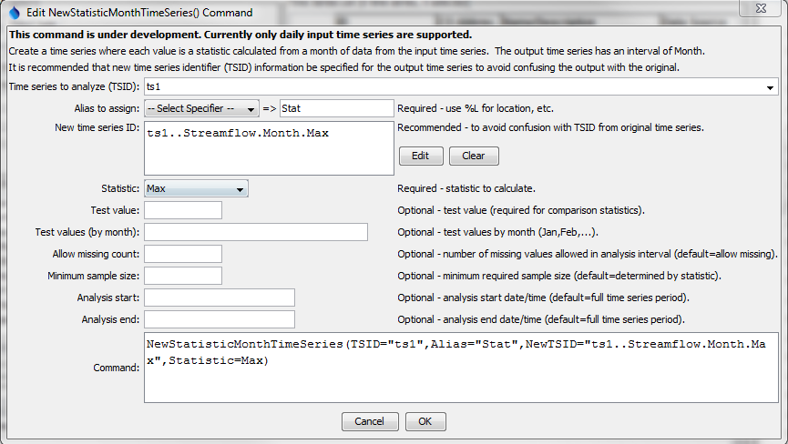
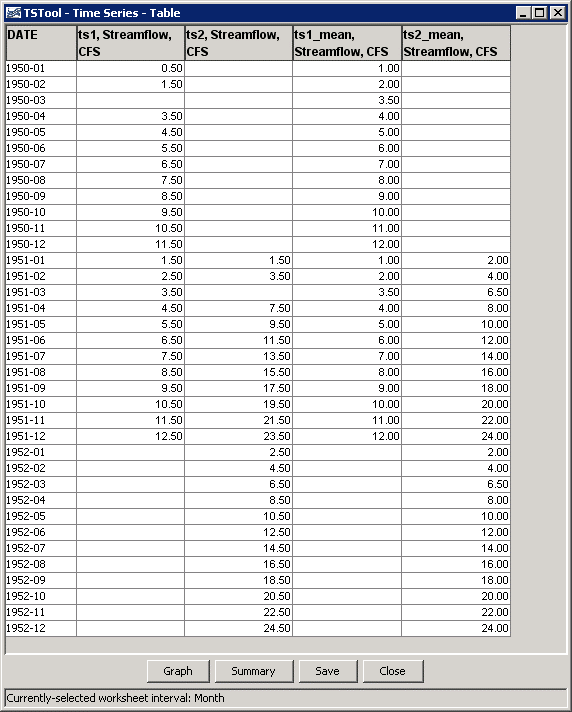

# TSTool / Command / NewStatisticTimeSeries #

* [Overview](#overview)
* [Command Editor](#command-editor)
* [Command Syntax](#command-syntax)
* [Examples](#examples)
* [Troubleshooting](#troubleshooting)
* [See Also](#see-also)

-------------------------

## Overview ##

The `NewStatisticTimeSeries` command uses data from a time series to calculate a statistic
for each interval in the year, and assigns the statistic value to each
corresponding interval for the full period.
For example, for a statistic of Mean calculated from a daily time series,
all January 1 values are averaged and the resulting January 1 values for the
entire time series are set to the mean value.  Similarly, if monthly data are analyzed,
all January values in the result will be set to the mean of the
January values in the original time series.
This command is useful for superimposing the long-term historical statistic on the
original time series or real-time conditions.
Leap year statistics are computed from Feb 29 values and are visible only in leap years of the output time series.
Missing data in the original time series will by default still result in the statistic being computed,
but the `AllowMissingCount` and `MinimumSampleSize` parameters control the impacts of missing values.

See also the [Statistic Examples](../../examples/examples.md#statistic-examples) for a list of commands that calculate statistics.

## Command Editor ##

The following dialog is used to edit the command and illustrates the syntax of the command.

**<p style="text-align: center;">

</p>**

**<p style="text-align: center;">
`NewStatisticTimeSeries` Command Editor (<a href="../NewStatisticTimeSeries.png">see also the full-size image</a>)
</p>**

## Command Syntax ##

The command syntax is as follows:

```text
NewStatisticTimeSeries(Parameter="Value",...)
```
The following older command syntax is updated to the above syntax when a command file is read:

```
TS Alias = NewStatisticTimeSeries(Parameter=value,...)
```

**<p style="text-align: center;">
Command Parameters
</p>**

|**Parameter**&nbsp;&nbsp;&nbsp;&nbsp;&nbsp;&nbsp;&nbsp;&nbsp;&nbsp;&nbsp;&nbsp;&nbsp;&nbsp;&nbsp;&nbsp;&nbsp;&nbsp;&nbsp;&nbsp;|**Description**|**Default**&nbsp;&nbsp;&nbsp;&nbsp;&nbsp;&nbsp;&nbsp;&nbsp;&nbsp;&nbsp;&nbsp;&nbsp;&nbsp;&nbsp;&nbsp;&nbsp;&nbsp;&nbsp;&nbsp;&nbsp;&nbsp;&nbsp;&nbsp;&nbsp;&nbsp;&nbsp;&nbsp;|
|--------------|-----------------|-----------------|
|`TSID`<br>**required**|The time series identifier (or alias) of the time series to analyze.|None – must be specified.|
|`Alias`<br>**required**|The alias to assign to the time series, as a literal string or using the special formatting characters listed by the command editor.  The alias is a short identifier used by other commands to locate time series for processing, as an alternative to the time series identifier (`TSID`).|None – must be specified.|
|`NewTSID`|The time series identifier to be assigned to the new time series, which is needed to avoid confusion with the original time series.|Use the same identifier as the original time series with the statistic appended to the scenario.|
|`Statistic`<br>**required**|See the Available Statistics table below.|None – must be specified.|
|`AllowMissingCount`|The number of missing values allowed in the source interval(s) in order to produce a result.  This capability should be used with care because it may result in data that are not representative of actual conditions.|Allow any number of missing values.|
|`MinimumSampleSize`|The minimum number of values required in the sample to compute the statistic.  If the minimum sample size is not available, the result will be set to missing.|Minimum sample size is defined by the statistic.|
|`AnalysisStart`|The date/time for the analysis start, using a precision that matches the original time series.  This controls the sample size.|Analyze the full period.|
|`AnalysisEnd`|The date/time for the analysis start, using a precision that matches the original time series.    This controls the sample size.|Analyze the full period.|
|`OutputStart`|The date/time for the output start, using a precision that matches the original time series.  The repeating statistic will fill this period.|Output the full period.|
|`OutputEnd`|The date/time for the analysis start, using a precision that matches the original time series.  The repeating statistic will fill this period.|Output the full period.|

**<p style="text-align: center;">
Available Statistics
</p>**

|**Statistic**&nbsp;&nbsp;&nbsp;&nbsp;&nbsp;&nbsp;&nbsp;&nbsp;&nbsp;&nbsp;&nbsp;&nbsp;&nbsp;&nbsp;&nbsp;&nbsp;&nbsp;&nbsp;&nbsp;&nbsp;&nbsp;&nbsp;&nbsp;&nbsp;&nbsp;&nbsp;&nbsp;|**Description**|**Limitations**&nbsp;&nbsp;&nbsp;&nbsp;&nbsp;&nbsp;&nbsp;&nbsp;&nbsp;&nbsp;&nbsp;&nbsp;&nbsp;&nbsp;&nbsp;&nbsp;&nbsp;&nbsp;&nbsp;&nbsp;&nbsp;&nbsp;&nbsp;&nbsp;&nbsp;&nbsp;&nbsp;|
|--------------|-----------------|-----------------|
|`GeometricMean`|Geometric mean of all values in the sample.|All values must be >= 0.|
|`Max`|Maximum of all values in the sample.|None.|
|`Mean`|Arithmetic mean of all values in the sample.|None.|
|`Median`|Median of all values in the sample.|None.|
|`Min`|Minimum of all values in the sample.|None.|

## Examples ##

See the [automated tests](https://github.com/OpenCDSS/cdss-app-tstool-test/tree/master/test/regression/commands/general/NewStatisticTimeSeries).

The following example command file illustrates how to generate test data and a corresponding statistics time series:

```
# Test of computing a statistic time series for monthly data, 
# Assign 2 months of data so that the mean is different from any month
NewPatternTimeSeries(Alias=”ts1”,NewTSID="ts1..Streamflow.Month",Description="Test data",SetStart="1950-01",SetEnd="1951-12",Units="CFS",PatternValues=".5,1.5,,3.5,4.5,5.5,6.5,7.5,8.5,9.5,10.5,11.5,1.5,2.5,3.5,4.5,5.5,6.5,7.5,8.5,9.5,10.5,11.5,12.5")
# Double the above
NewPatternTimeSeries(Alias=”ts2”,NewTSID="ts2..Streamflow.Month",Description="Test data",SetStart="1951-01",SetEnd="1952-12",Units="CFS",PatternValues="1.5,3.5,,7.5,9.5,11.5,13.5,15.5,17.5,19.5,21.5,23.5,2.5,4.5,6.5,8.5,10.5,12.5,14.5,16.5,18.5,20.5,22.5,24.5")
NewStatisticTimeSeries(TSID="ts1",Alias=”ts1_mean”,NewTSID="ts1..Streamflow.Month.Mean",Statistic=Mean)
NewStatisticTimeSeries(TSID="ts2",Alias=”ts2_mean”,NewTSID="ts2..Streamflow.Month.Mean",Statistic=Mean)
WriteDateValue(OutputFile="Results\Test_NewStatisticTimeSeries_Month_Mean_out.dv")
```

The following figure illustrates the results.
Note that by default the statistic is computed even if missing values exist in the sample.
This can be controlled by the `AllowMissingCount` and `MinimumSampleSize` parameters.

**<p style="text-align: center;">

</p>**

## Troubleshooting ##

## See Also ##

* [`RunningStatisticTimeSeries`](../RunningStatisticTimeSeries/RunningStatisticTimeSeries.md) command
