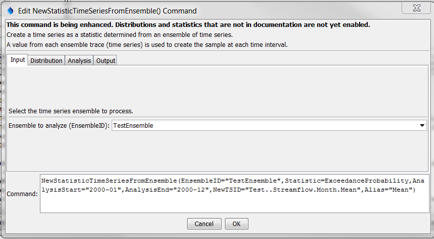
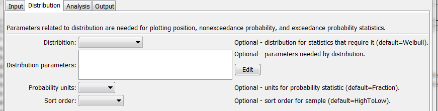
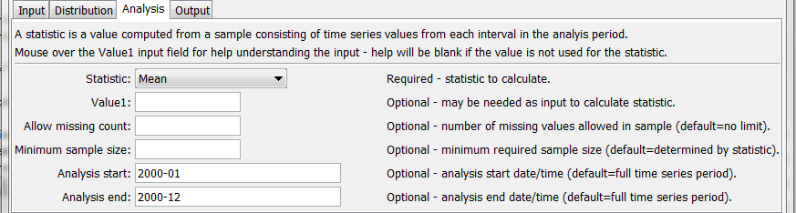
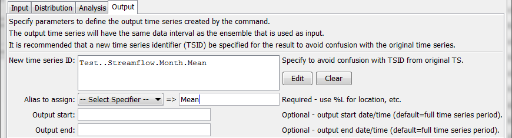
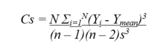
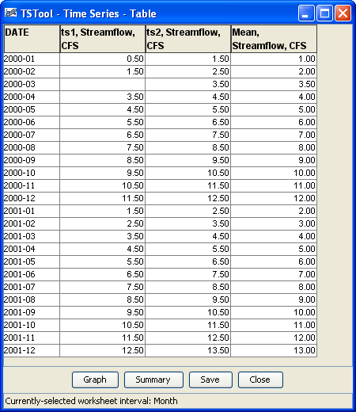

# TSTool / Command / NewStatisticTimeSeriesFromEnsemble #

* [Overview](#overview)
* [Command Editor](#command-editor)
* [Command Syntax](#command-syntax)
* [Examples](#examples)
* [Troubleshooting](#troubleshooting)
* [See Also](#see-also)

-------------------------

## Overview ##

Work in progress is indicated below with **[DEV]**, in some cases because
software needs to be enhanced and in other cases because automated tests need written.

The `NewStatisticTimeSeriesFromEnsemble` command uses data from time series in an
ensemble to calculate a statistic for each interval in the ensemble,
and assigns the statistic value to the corresponding interval in the result.
For example, for a statistic of `Mean` applied to a daily time series,
all January 1, 1970 values will be used for the sample and the mean value will be assigned to
January 1, 1970 in the output time series.
Leap year values will be included if they are included in the period of the ensemble.

See also the [Statistic Examples](../../examples/examples.md#statistic-examples) for a list of commands that calculate statistics.

## Command Editor ##

The following dialog is used to edit the command and illustrates the syntax for the command.

**<p style="text-align: center;">

</p>**

**<p style="text-align: center;">
`NewStatisticTimeSeriesFromEnsemble` Command Editor for Input Parameters (<a href="../NewStatisticTimeSeriesFromEnsemble_Input.png">see also the full-size image</a>)
</p>**

**<p style="text-align: center;">

</p>**

**<p style="text-align: center;">
`NewStatisticTimeSeriesFromEnsemble` Command Editor for Distribution Parameters (<a href="../NewStatisticTimeSeriesFromEnsemble_Distribution.png">see also the full-size image</a>)
</p>**

**<p style="text-align: center;">

</p>**

**<p style="text-align: center;">
`NewStatisticTimeSeriesFromEnsemble` Command Editor for Analysis Parameters (<a href="../NewStatisticTimeSeriesFromEnsemble_Analysis.png">see also the full-size image</a>)
</p>**

**<p style="text-align: center;">

</p>**

**<p style="text-align: center;">
`NewStatisticTimeSeriesFromEnsemble` Command Editor for Output Parameters (<a href="../NewStatisticTimeSeriesFromEnsemble_Output.png">see also the full-size image</a>)
</p>**

## Command Syntax ##

The command syntax is as follows:

```text
NewStatisticTimeSeriesFromEnsemble(Parameter="Value",...)
```

The following older command syntax is updated to the above syntax when a command file is read:

```text
TS Alias = NewStatisticTimeSeriesFromEnsemble(Parameter=Value,...)
```

**<p style="text-align: center;">
Command Parameters
</p>**

|**Parameter**&nbsp;&nbsp;&nbsp;&nbsp;&nbsp;&nbsp;&nbsp;&nbsp;&nbsp;&nbsp;&nbsp;&nbsp;&nbsp;&nbsp;&nbsp;&nbsp;&nbsp;&nbsp;&nbsp;&nbsp;&nbsp;&nbsp;&nbsp;&nbsp;&nbsp;&nbsp;&nbsp;&nbsp;&nbsp;|**Description**|**Default**&nbsp;&nbsp;&nbsp;&nbsp;&nbsp;&nbsp;&nbsp;&nbsp;&nbsp;&nbsp;&nbsp;&nbsp;&nbsp;&nbsp;&nbsp;&nbsp;&nbsp;&nbsp;&nbsp;&nbsp;&nbsp;&nbsp;&nbsp;&nbsp;&nbsp;&nbsp;&nbsp;|
|--------------|-----------------|-----------------|
| `EnsembleID` | The identifier for the ensemble to analyze.  Can be specified using `${Property}` notation. | None – must be specified. |
| `Distribution`<br>**[DEV]** | Indicates the distribution, needed for certain statistics (see **Statistics Summary** table below for indication or statistics that need distribution information).  See the **Distribution Summary** table below for information about distributions. |
| `DistributionParameters`<br>**[DEV]** | Additional parameters needed to specify a distribution.  See the **Distribution Summary** table below. |
| `ProbabilityUnits`<br>**[DEV]** | Units to use for calculated probability statistics:<ul><li>`Fraction`</li><li>`Percent` or `%`</li></ul> | `Fraction` (0 – 1). |
| `Statistic` | The statistic to compute.  See the Available Statistics table below. | None – must be specified. |
| `Value1`<br>**[DEV]** | Input data required by the statistic.  Currently the command editor does not check the value for correctness – it is checked when the statistic is computed. | See **Statistic Details** table below. |
| `AllowMissingCount` | The number of missing values allowed in the sample of values in order to produce a result.  This capability should be used with care because it may result in data that are not representative of actual conditions. | Missing values are ignored in the sample used to compute the statistic. |
| `MinimumSample Size` | The minimum number of values in the sample that are required to compute the statistic. | Use the sample with no restrictions, although some statistics may have requirements. |
| `AnalysisStart` | The date/time for the analysis start, using a precision that matches the original time series.  Can be specified using `${Property}` notation. | Analyze the full period. |
| `AnalysisEnd` | The date/time for the analysis start, using a precision that matches the original time series.  Can be specified using `${Property}` notation. | Analyze the full period. |
| `NewTSID` | The time series identifier to be assigned to the new time series, which is useful to avoid confusion with the original time series.  This parameter may be required in the future.  Can be specified using `${Property}` notation. | None – use the same identifier as the original time series. |
| `Alias` | The alias to assign to the time series, as a literal string or using the special formatting characters listed by the command editor.  The alias is a short identifier used by other commands to locate time series for processing, as an alternative to the time series identifier (TSID). | None – must be specified. |
| `Description`<br>**[DEV]** | Description to assign to output time series.  Can be specified using `${Property}` and `${ts:Property}` notation. | Time series description with statistic, or ensemble name with statistic, as available. |
| `OutputStart` | The date/time for the output start, using a precision that matches the original time series.  An output period longer than the analysis period will result in missing values in output.  Can be specified using `${Property}` notation. | Output the full period. |
| `OutputEnd` | The date/time for the output start, using a precision that matches the original time series.  An output period longer than the analysis period will result in missing values in output.  Can be specified using `${Property}` notation. | Output the full period. |

**<p style="text-align: center;">
Available Statistics
</p>**

|**Statistic**&nbsp;&nbsp;&nbsp;&nbsp;&nbsp;&nbsp;&nbsp;&nbsp;&nbsp;&nbsp;&nbsp;&nbsp;&nbsp;&nbsp;&nbsp;&nbsp;&nbsp;&nbsp;&nbsp;&nbsp;&nbsp;&nbsp;&nbsp;&nbsp;&nbsp;&nbsp;&nbsp;&nbsp;&nbsp;&nbsp;&nbsp;&nbsp;&nbsp;&nbsp;&nbsp;&nbsp;&nbsp;&nbsp;&nbsp;&nbsp;&nbsp;&nbsp;&nbsp;|**Description**|**Limitations**&nbsp;&nbsp;&nbsp;&nbsp;&nbsp;&nbsp;&nbsp;&nbsp;&nbsp;&nbsp;&nbsp;&nbsp;&nbsp;&nbsp;&nbsp;&nbsp;&nbsp;&nbsp;&nbsp;&nbsp;&nbsp;&nbsp;&nbsp;&nbsp;&nbsp;&nbsp;&nbsp;|
|--------------|-----------------|-----------------|
| `ExceedanceProbability`<br>**[DEV]** | The data value corresponding to an N% chance of value being exceeded.  Specify the probability as a fraction using `Value1`. | Small sample size will impact – see statistic details. |
| `ExceedanceProbability10` | The data value corresponding to a 10% chance of value being exceeded. | Small sample size will impact – see statistic details. |
| `ExceedanceProbability30` | The data value corresponding to a 30% chance of value being exceeded. | Small sample size will impact – see statistic details. |
| `ExceedanceProbability50` | The data value corresponding to a 50% chance of value being exceeded. | Small sample size will impact – see statistic details. |
| `ExceedanceProbability70` | The data value corresponding to a 70% chance of value being exceeded. | Small sample size will impact – see statistic details. |
| `ExceedanceProbability90` | The data value corresponding to a 90% chance of value being exceeded. | Small sample size will impact – see statistic details. |
| `GECount`<br>**[DEV]** | Count of values greater than or equal to `Value1`.  None. |
| `GTCount`<br>**[DEV]** | Count of values greater than `Value1`.  None. |
| `GeometricMean` | Geometric mean of all values in the sample. | All values must be >= 0. |
| `LECount`<br>**[DEV]** | Count of values less than or equal to `Value1`. | None. |
| `LTCount`<br>**[DEV]** | Count of values less than `Value1`. | None. |
| `Max` | Maximum of all values in the sample. | None. |
| `Mean` | Arithmetic mean of all values in the sample. | None. |
| `Median` | Median of all values in the sample. | None. |
| `Min` | Minimum of all values in the sample. | None. |
| `MissingCount` | The count of values that are missing. | This statistic will be computed regardless of `AllowMissingCount` and `MinimumSampleSize`. |
| `MissingPercent` | The percent of values that are missing. | See above. |
| `NonexceedanceProbability`<br>**[DEV]** | The data value corresponding to an N% chance of value being less.  Specify the probability as a fraction using `Value1`. | Small sample size will impact – see statistic details. |
| `NonexceedanceProbability10`<br>**[DEV]** | The data value corresponding to a 10% chance of value being less than. | Small sample size will impact – see statistic details. |
| `NonexceedanceProbability30`<br>**[DEV]** | The data value corresponding to a 30% chance of value being less than. | Small sample size will impact – see statistic details. |
| `NonexceedanceProbability50`<br>**[DEV]** | The data value corresponding to a 50% chance of value being less than. | Small sample size will impact – see statistic details. |
| `NonexceedanceProbability70`<br>**[DEV]** | The data value corresponding to a 70% chance of value being less than. | Small sample size will impact – see statistic details. |
| `NonexceedanceProbability90`<br>**[DEV]** | The data value corresponding to a 90% chance of value being less than. | Small sample size will impact – see statistic details. |
| `NonmissingCount` | The count of values that are not missing. | See above. |
| `NonmissingPercent` | The percent of values that are not missing. | See above. |
| `RankAscending`<br>**[DEV]** | Rank based on ascending sort order.  Duplicate values are each assigned a rank that is the average of the ranks for the duplicate values.  This is necessary because selecting one of the ranks would be arbitrary.  A new command parameter may be added to allow control of this behavior. | None. |
| `RankDescending`<br>**[DEV]** | Rank based on descending sort order.  See `RankAscending` for discussion of duplicates. | None. |
| `Skew`<br>**[DEV]** | Skew coefficient, as follows:<br> <br>where *s* = standard deviation. | None. |
| `StdDev`<br>**[DEV]** | Sample standard deviation. | None. |
| `Total` | Total of values in the sample. | None. |

**<p style="text-align: center;">
Statistic Details
</p>**

|**Statistic**&nbsp;&nbsp;&nbsp;&nbsp;&nbsp;&nbsp;&nbsp;&nbsp;&nbsp;&nbsp;&nbsp;&nbsp;&nbsp;&nbsp;&nbsp;&nbsp;&nbsp;&nbsp;&nbsp;&nbsp;&nbsp;&nbsp;&nbsp;&nbsp;&nbsp;&nbsp;&nbsp;&nbsp;&nbsp;&nbsp;&nbsp;&nbsp;&nbsp;|**Description**|
|--------------|-----------------|
| `Statistic` | Description |
| `ExceedanceProbability*` | The statistic for each time step in the analysis period is computed as follows:<ol><li> The data values are extracted for each trace with missing values being ignored.  The sample size is *n*.</li><li> The data values are sorted into ascending order.</li><li> Exceedance probabilities are computed for the number of sample values according to distribution (Weibull by default) plotting positions as follows (for *i=1,...,n*):<ol><li>If *n = 1*, the exceedance probability *Pi=1.0*.  This is an extreme case due to small sample size.</li><li>Otherwise, *Pi=(n –( i – 1))/(n + 1)*.  Therefore, when *i=1*, *Pi=n/(n+1)* and when *i=n*, *Pi=1/(n+1)*.  The probabilities will be listed from high to low value (the opposite order of the sorted data values).</li></ol><li> The data value corresponding to the requested probability is calculated by iterating over the probabilities  until the calculated probability for a value is less than the requested probability:<ol><li>If the first probability satisfies the condition, the computed value is set to the minimum value in the sample (no extrapolating past the end).</li><li>Otherwise, the value is interpolated from the previous and current sample values.</li>If no calculated probability is less than the requested probability, the computed value is set to the maximum value in the sample (no extrapolating past the end).</ol><br>To create an exceedance probability plot, use several commands with different exceedance probability levels (listed low to high).  Graphing the time series in a bar graph with `BarOverlap=True` will draw the bars on top of each other to give the desired appearance. The edges of the colors will represent the specific exceedance probabilities and the colored areas will represent ranges of exceedance probabilities. |

## Examples ##

See the [automated tests](https://github.com/OpenCDSS/cdss-app-tstool-test/tree/master/test/regression/commands/general/NewStatisticTimeSeriesFromEnsemble).

The following example command file illustrates how to compute the mean statistic for one monthly data:

```
# Test computing a statistic time series for Month data where Statistic=Mean
StartLog(LogFile="Results/Test_NewStatisticTimeSeriesFromEnsemble_Month_Mean.TSTool.log")
# Define 2 years of data that when averaged equal even numbers
# The 2nd time series is shifted by 1 from the first.
# Include missing values in the first time series but not the second.
NewPatternTimeSeries(Alias=”ts1”,NewTSID="ts1..Streamflow.Month",Description="test data 1",SetStart="2000-01",SetEnd="2001-12",Units="CFS",PatternValues=".5,1.5,,3.5,4.5,5.5,6.5,7.5,8.5,9.5,10.5,11.5,1.5,2.5,3.5,4.5,5.5,6.5,7.5,8.5,9.5,10.5,11.5,12.5")
NewPatternTimeSeries(Alias=”ts2”,NewTSID="ts2..Streamflow.Month",Description="test data 2",SetStart="2000-01",SetEnd="2001-12",Units="CFS",PatternValues="1.5,2.5,3.5,4.5,5.5,6.5,7.5,8.5,9.5,10.5,11.5,12.5,2.5,3.5,4.5,5.5,6.5,7.5,8.5,9.5,10.5,11.5,12.5,13.5")
# Create an ensemble to hold the above time series
NewEnsemble(TSList=AllTS,NewEnsembleID="TestEnsemble",NewEnsembleName="Test Ensemble")
# Compute the statistic
NewStatisticTimeSeriesFromEnsemble(Alias=”Mean”,EnsembleID="TestEnsemble",NewTSID="Test..Streamflow.Month.Mean",Statistic=Mean)
```

The following figure illustrates the results:

**<p style="text-align: center;">

</p>**

**<p style="text-align: center;">
`NewStatisticTimeSeriesFromEnsemble` Command Editor Results (<a href="../NewStatisticTimeSeriesFromEnsemble_Table.png">see also the full-size image</a>)
</p>**

## Troubleshooting ##

## See Also ##

* [Statistic Examples](../../examples/examples.md#statistic-examples)
* [`NewStatisticEnsemble`](../NewStatisticEnsemble/NewStatisticEnsemble.md) command
