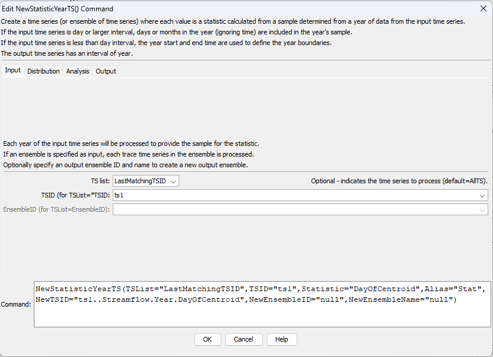
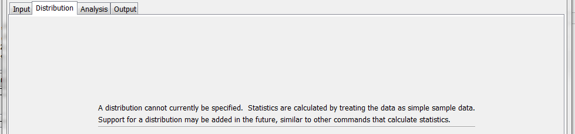
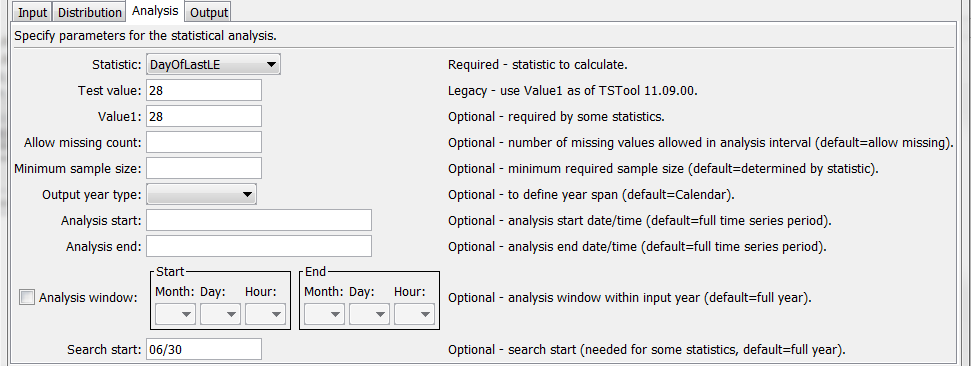
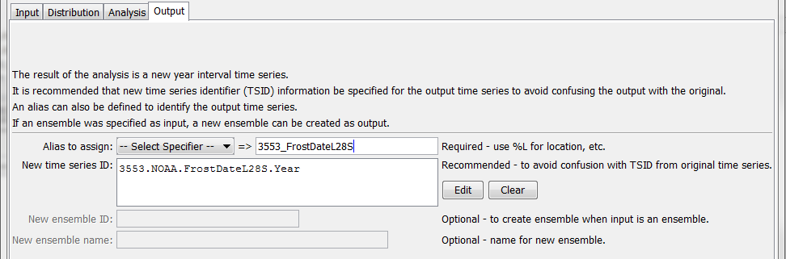

# TSTool / Command / NewStatisticYearTS #

*   [Overview](#overview)
*   [Command Editor](#command-editor)
*   [Command Syntax](#command-syntax)
    +   [Available Statistics](#available-statistics)
*   [Examples](#examples)
*   [Troubleshooting](#troubleshooting)
*   [See Also](#see-also)

-------------------------

## Overview ##

The `NewStatisticYearTS` command creates a new year-interval time series,
where each yearly value in the output time series contains a statistic
calculated from the sample of values from the corresponding input time series year.
The output year type is calendar by default but can be defined as another year type using the `OutputYearType` parameter.
The sample is determined as follows:

*   Interval is day or longer (does not include time):
    +   All values in the year are used, without considering time.
        For example, for calendar year:
        -   For day interval input time series, January 1 through December 31 are included.
        -   For month interval input time series, January through December are included.
    +   The optional `AnalysisWindowStart`, `AnalysisWindowEnd`, and `SearchStart` parameters can be used to
        indicate an analysis window within the year.
*   Interval is less than day (includes time):
    +   The `YearStartTime` and `YearEndTime` parameters indicate
        how the boundary of the year is defined based on how midnight is handled,
        required because hours have the range 0 to 23.
    +   By default, values are considered to be in the year if > midnight at the start
        and <= midnight at the end.
    +   The optional `AnalysisWindowStart`, `AnalysisWindowEnd`, and `SearchStart` parameters can be used to
        indicate an analysis window within the year.

See also the [Statistic Examples](../../examples/examples.md#statistic-examples) documentation
for a list of commands that calculate statistics.

## Command Editor ##

The command is available in the following TSTool menu:

*   ***Commands / Create Time Series***

The following dialog is used to edit the command and illustrates the syntax of the command for input parameters.

**<p style="text-align: center;">

</p>**

**<p style="text-align: center;">
`NewStatisticYearTS` Command Editor (<a href="../NewStatisticYearTS.png">see full-size image</a>)
</p>**

The following dialog is used to edit the command and illustrates the syntax of the command for distribution parameters.

**<p style="text-align: center;">

</p>**

**<p style="text-align: center;">
`NewStatisticYearTS` Command Editor for Distribution Parameters (<a href="../NewStatisticYearTS_Distribution.png">see full-size image</a>)
</p>**

The following dialog is used to edit the command and illustrates the syntax of the command for analysis parameters.

**<p style="text-align: center;">

</p>**

**<p style="text-align: center;">
`NewStatisticYearTS` Command Editor for Analysis Parameters (<a href="../NewStatisticYearTS_Analysis.png">see full-size image</a>)
</p>**

The following dialog is used to edit the command and illustrates the syntax of the command for output parameters.

**<p style="text-align: center;">

</p>**

**<p style="text-align: center;">
`NewStatisticYearTS` Command Editor for Output Parameters (<a href="../NewStatisticYearTS_Output.png">see full-size image</a>)
</p>**

## Command Syntax ##

The command syntax is as follows:

```text
NewStatisticYearTS(Parameter="Value",...)
```
The following older command syntax is updated to the above syntax when a command file is read:

```
TS Alias = NewStatisticYearTS (Parameter=value,…)
```

**<p style="text-align: center;">
Command Parameters
</p>**

|**Tab**|**Parameter**&nbsp;&nbsp;&nbsp;&nbsp;&nbsp;&nbsp;&nbsp;&nbsp;&nbsp;&nbsp;&nbsp;&nbsp;&nbsp;&nbsp;&nbsp;&nbsp;&nbsp;&nbsp;&nbsp;&nbsp;&nbsp;&nbsp;&nbsp;&nbsp;|**Description**|**Default**&nbsp;&nbsp;&nbsp;&nbsp;&nbsp;&nbsp;&nbsp;&nbsp;&nbsp;&nbsp;&nbsp;&nbsp;&nbsp;&nbsp;&nbsp;&nbsp;&nbsp;&nbsp;&nbsp;&nbsp;&nbsp;&nbsp;&nbsp;&nbsp;&nbsp;&nbsp;&nbsp;|
|--|--------------|-----------------|-----------------|
|**Input**|`TSList`|Indicates the list of time series to be processed, one of:<br><ul><li>`AllMatchingTSID` – all time series that match the TSID (single TSID or TSID with wildcards) will be processed.</li><li>`AllTS` – all time series before the command.</li><li>`EnsembleID` – all time series in the ensemble will be processed (see the `EnsembleID` parameter).</li><li>`FirstMatchingTSID` – the first time series that matches the TSID (single TSID or TSID with wildcards) will be processed.</li><li>`LastMatchingTSID` – the last time series that matches the TSID (single TSID or TSID with wildcards) will be processed.</li><li>`SelectedTS` – the time series are those selected with the [`SelectTimeSeries`](../SelectTimeSeries/SelectTimeSeries.md) command.</li></ul> | `AllTS` |
||`TSID`|The time series identifier or alias for the time series to be processed, using the `*` wildcard character to match multiple time series.  Can be specified using `${Property}`.|Required if `TSList=*TSID`|
||`EnsembleID`|The ensemble to be processed, if processing an ensemble. Can be specified using `${Property}`.|Required if `TSList=*EnsembleID`|
|**Analysis**|`Statistic`<br>**required**|See the **Available Statistics** table below.|None – must be specified.|
||`Value1`|Value needed by statistic, for example needed to compute `DayOfFirstGE` statistic. .|See the statistics table below.|
||`AllowMissingCount`|The number of missing values allowed in the source interval(s) in order to produce a result.  If an analysis window is specified (default is to analyze full years), then missing values outside of the analysis window are not considered as missing.  Gaps at the end of the time series will be considered missing if within the analysis window. This parameter is ignored if the input time series has an irregular interval. |Allow any number of missing values.|
||`MinimumSampleSize`|The minimum sample size in order to compute the statistic. This parameter is considered for regular and irregular interval input time series. |No minimum, although the statistic may have requirements.|
||`OutputYearType`|The output year type.  For example, an output year type of `NovToOctYear` spans November of the previous calendar year to October of the current calendar year.  All other parameters should still be specified in calendar year and the `AnalysisWindowStart` can have a month that is prior to the `AnalysisWindowEnd` month.  See the [`SetOutputYearType`](../SetOutputYearType/SetOutputYearType.md) command for more information. |`Calendar`|
||`YearStartTime`|Define the starting boundary for input time series intervals that include time:<ul><li>`AfterMidnight` - for example, for calendar year, a date/time of `2023-01-01 00:00:00` (midnight) **will not** be included in the sample for 2023 (because it is included in 2022). If set, `YearEndTime=Midnight` should normally be used.</li><li>`Midnight` - for example, for calendar year, a date/time of `2023-01-01 00:00:00` (midnight) **will** be included in the sample for 2023.  If set, `YearEndTime=BeforeMidnight` should normally be used.</li></ul> | `AfterMidnight` |
||`YearEndTime`|Define the ending boundary for input time series intervals that include time:<ul><li>`BeforeMidnight` - for example, for calendar year, a date/time of `2023-01-01 00:00:00` (midnight) **will not** be included in the sample for 2022 (because it is included in 2023).  If set, `YearStartTime=Midnight` should normally be used.</li><li>`Midnight` - for example, for calendar year, a date/time of `2023-01-01 00:00:00` (midnight) **will** be included in the sample for 2022.  If set, `YearStartTime=AfterMidnight` should normally be used.</li></ul> | `Midnight` |
||`AnalysisStart`|The starting date/time for the analysis using calendar dates (e.g., `2001-01-01`), with precision consistent with the input time series interval.  This will limit the data being analyzed at the ends of the time series and controls the length of the output time series.  The analysis period is typically set to align with years consistent with the output year type.  Can specify using processor `${Property}`.|Analyze the full period, extending the period to include full years based on `OutputYearType`.|
||`AnalysisEnd`|The ending date/time for the analysis using calendar date (e.g., `2001-12-31`) , with precision consistent with the input time series interval.  This will limit the data being analyzed at the ends of the time series and controls the length of the output time series.  The analysis period is typically set to align with years consistent with the output year type.  Can specify using processor `${Property}`. If time is considered, make sure to include midnight appropriately. |Analyze the full period, extending the period to include full years based on `OutputYearType`.|
||`AnalysisWindowStart`|The calendar date/time for the analysis start within each year (minute and second are assumed to be zero).  Specify using the format `MM`, `MM-DD`, `MM-DD hh`, or `MM-DD hh:mm`, consistent with the time series interval precision.  If the input time series interval includes time, the `YearStartTime` and `YearEndTime` parameters will control how midnight is handled.  A year of 2000 will be used internally to parse the date/time.  Use this parameter to limit data processing within the year, for example to analyze only a season.   Data will be considered missing only if missing within this analysis window.  If specifying for other than calendar year, the analysis window start month may be greater than the analysis window end month. The `YearStartTime` and `YearEndTime` indicate how time is handled at the ends. |Analyze the full year. |
||`AnalysisWindowEnd`|Specify date/time for the analysis end within each year.  See `AnalysisWindowStart` additional for details. Specify only to day precision to allow automatic handling of midnight. | Analyze the full year.|
||`SearchStart`|Within the analysis window, this indicates the starting date/time for the search.  Specify using the format `MM`, `MM-DD`, `MM-DD hh`, or `MM-DD hh:mm`, consistent with the time series interval precision.  A year of 2000 will be used internally to parse the date/time.  This parameter is useful in cases where the processing considers seasonal aspects of the analysis window; for example, use when determining frost dates (when temperature is less than or equal to freezing) to ensure that the search starts from the middle of the normal growing season.  Searches move forward in time except for the following statistics, in which case `SearchStart` will be the start of the search window, but will be the last value checked because values are processed from the end of the year:  `DayOfLast*`, `MonthOfLast*`.|Use the analysis window start and end.  Search forward for most statistics.  Search backward for `DayOfLast*` and `MonthOfLast*` statistics.|
|**Output**|`Alias`<br>**required**|The alias to assign to the time series, as a literal string or using the special formatting characters listed by the command editor.  The alias is a short identifier used by other commands to locate time series for processing, as an alternative to the time series identifier (`TSID`).  Can specify using processor `${Property}`.|None – must be specified.|
||`NewTSID`|The time series identifier to be assigned to the new time series, which is useful to avoid confusion with the original time series.  Can specify using processor `${Property}`.|Use the same identifier as the original time series, with an interval of Year and a scenario matching the statistic.|
||`NewEnsembleID`|New ensemble identifier for results.|Ensemble is not output.|
||`NewEnsembleName`|Name for new ensemble.|Ensemble is not output.|

### Available Statistics ###

The following statistics are computed from a sample determined using the analysis window.
If no analysis window is specified, then the default is to analyze complete years,
where the years correspond to the `OutputYearType`.
The parameters in the ***Analysis*** tab control the statistic calculations.

**<p style="text-align: center;">
Available Statistics
</p>**

|**Statistic**&nbsp;&nbsp;&nbsp;&nbsp;&nbsp;&nbsp;&nbsp;&nbsp;&nbsp;&nbsp;&nbsp;&nbsp;&nbsp;&nbsp;&nbsp;&nbsp;&nbsp;&nbsp;&nbsp;&nbsp;&nbsp;&nbsp;&nbsp;&nbsp;|**Description**|**Limitations**|
|--|--|--|
|`DayOfCentroid`|The day of the year (1-366) that is the centroid of the values, computed as sum(`DayOfYear*`value)/sum(values).|Input time series must be daily or smaller interval.|
|`DayOfFirstGE`|Julian day of the year (1-366, relative to the start of the `OutputYearType`) for the first data value >= `Value1`.  Searches start at the start of the analysis window and move forward.|Input time series must be daily or smaller interval.|
|`DayOfFirstGT`|Similar to `DayOfFirstGE`, for values > `Value1`.|Input time series must be daily or smaller interval.|
|`DayOfFirstLE`|Similar to `DayOfFirstGE`, for values <= `Value1`.|Input time series must be daily or smaller interval.|
|`DayOfFirstLT`|Similar to `DayOfFirstGE`, for values < `Value1`.|Input time series must be daily or smaller interval.|
|`DayOfLastGE`|Julian day of the year (1-366, relative to the start of the `OutputYearType`) for the last data value >= `Value1`.  Searches start at the start of the analysis window and move backward.|Input time series must be daily or smaller interval.|
|`DayOfLastGT`|Similar to `DayOfLastGE`, for values > `Value1`.|Input time series must be daily or smaller interval.|
|`DayOfLastLE`|Similar to `DayOfLastGE`, for values <= `Value1`.|Input time series must be daily or smaller interval.|
|`DayOfLastLT`|Similar to `DayOfLastGE`, for values < `Value1`.|Input time series must be daily or smaller interval.|
|`DayOfMax`|Julian day of the year (1-366, relative to the start of the `OutputYearType`) for the first maximum value in the time series.|Input time series must be daily or smaller interval.|
|`DayOfMin`|Julian day of the year (1-366, relative to the start of the `OutputYearType`) for the first minimum value in the time series.|Input time series must be daily or smaller interval.|
|`GECount`|Count of values in a year >= `Value1`.||
|`GEPercent`|Percent of values in a year >= `Value1`, based on the total number of points in the year.||
|`GTCount`|Count of values in a year > `Value1`.||
|`GTPercent`|Percent of values in a year > `Value1`, based on the total number of points in the year.||
|`LECount`|Count of values in a year <= `Value1`.||
|`LEPercent`|Percent of values in a year <= `Value1`, based on the total number of points in the year.||
|`LTCount`|Count of values in a year < `Value1`.||
|`LTPercent`|Percent of values in a year < `Value1`, based on the total number of points in the year.||
|`Max`|Maximum value in a year.||
|`Mean`|Mean of values in a year.||
|`Min`|Minimum value in a year.||
|`MissingCount`|Number of missing values in a year.||
|`MissingPercent`|Percent of missing values in a year.||
|`MonthOfCentroid`|The month of the year (`1`-`12`) that is the centroid of the values, computed as sum(`MonthOfYear*` value)/sum(values).|Input time series must be monthly or smaller interval.|
|`MonthOfFirstGE`|Month the year (`1`-`12`, relative to the start of the `OutputYearType`) for the first data value >= `Value1`.  Searches start at the start of the analysis window and move forward.|Input time series must be monthly or smaller interval.|
|`MonthOfFirstGT`|Similar to `DayOfFirstGE`, for values > `Value1`.|Input time series must be monthly or smaller interval.|
|`MonthOfFirstLE`|Similar to `DayOfFirstGE`, for values <= `Value1`.|Input time series must be monthly or smaller interval.|
|`MonthOfFirstLT`|Similar to `DayOfFirstGE`, for values < `Value1`.|Input time series must be monthly or smaller interval.|
|`MonthOfLastGE`|Month of the year (`1`-`12`, relative to the start of the `OutputYearType`) for the last data value >= `Value1`.  Searches start at the end of the analysis window and move backward.|Input time series must be monthly or smaller interval.|
|`MonthOfLastGT`|Similar to `DayOfLastGE`, for values > `Value1`.|Input time series must be monthly or smaller interval.|
|`MonthOfLastLE`|Similar to `DayOfLastGE`, for values <= `Value1`.|Input time series must be monthly or smaller interval.|
|`MonthOfLastLT`|Similar to `DayOfLastGE`, for values < `Value1`.|Input time series must be monthly or smaller interval.|
|`MonthOfMax`|Month of the year (`1`-`12`, relative to the start of the `OutputYearType`) for the first maximum value in the time series.|Input time series must be monthly or smaller interval.|
|`MonthOfMin`|Month of the year (`1`-`12`, relative to the start of the `OutputYearType`) for the first minimum value in the time series.|Input time series must be monthly or smaller interval.|
|`NonMissingCount`|Number of non-missing values in a year.||
|`NonMissingPercent`|Percent of non-missing values in a year.||
|`Total`|Total of values in a year.||

## Examples ##

See the [automated tests](https://github.com/OpenCDSS/cdss-app-tstool-test/tree/master/test/commands/NewStatisticYearTS).

The following example commands file computes the last spring frost date for
28 degrees and 32 degrees, searching backwards from June 30 each year,
and the first fall frost date for 32 and 28 degrees, searching forwards from July 1 each year:

```text
StartLog(LogFile="FrostDates_HydroBase.log")
SetOutputPeriod(OutputStart="1950-01",OutputEnd="2004-12")
# 3553 - GREELEY UNC
3553.NOAA.TempMin.Day~HydroBase
NewStatisticYearTS(TSID="3553.NOAA.TempMin.Day",Alias=”3553_FrostDateL28S”,NewTSID="3553.NOAA.FrostDateL28S.Year",Statistic=DayOfLastLE,Value1=28,SearchStart="06/30")
NewStatisticYearTS(TSID="3553.NOAA.TempMin.Day",Alias=” FrostDateL32S”,NewTSID="3553.NOAA.FrostDateL32S.Year",Statistic=DayOfLastLE,Value1=32,SearchStart="06/30")
NewStatisticYearTS(TSID="3553.NOAA.TempMin.Day",Alias=”3553_FrostDateF32F”,NewTSID="3553.NOAA.FrostDateF32F.Year",Statistic=DayOfFirstLE,Value1=32,SearchStart="07/01")
NewStatisticYearTS(TSID="3553.NOAA.TempMin.Day",Alias=”3553_FrostDateF28F”,NewTSID="3553.NOAA.FrostDateF28F.Year",Statistic=DayOfFirstLE,Value1=28,SearchStart="07/01")
Free(TSID="*.*.TempMin.*")
WriteStateCU(OutputFile="Results/Test.FrostDates")
```

## Troubleshooting ##

See the main [TSTool Troubleshooting](../../troubleshooting/troubleshooting.md) documentation.

## See Also ##

*   [Statistic Examples](../../examples/examples.md#statistic-examples)
*   [`CalculateTimeSeriesStatistic`](../CalculateTimeSeriesStatistic/CalculateTimeSeriesStatistic.md) command
*   [`ChangeInterval`](../ChangeInterval/ChangeInterval.md) command
*   [`CheckTimeSeries`](../CheckTimeSeries/CheckTimeSeries.md) commands.
*   [`NewStatisticMonthTimeSeries`](../NewStatisticMonthTimeSeries/NewStatisticMonthTimeSeries.md) command
*   [`NewStatisticTimeSeries`](../NewStatisticTimeSeries/NewStatisticTimeSeries.md) command
*   [`NewStatisticTimeSeriesFromEnsemble`](../NewStatisticTimeSeriesFromEnsemble/NewStatisticTimeSeriesFromEnsemble.md) command
*   [`SelectTimeSeries`](../SelectTimeSeries/SelectTimeSeries.md) command
*   [`SetOutputYearType`](../SetOutputYearType/SetOutputYearType.md) command
