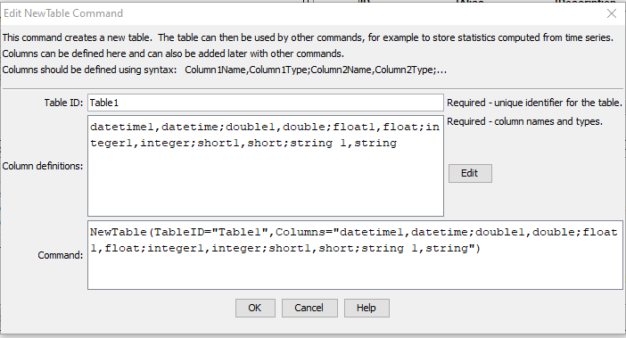

# TSTool / Command / NewTable #

*   [Overview](#overview)
*   [Command Editor](#command-editor)
*   [Command Syntax](#command-syntax)
*   [Examples](#examples)
*   [Troubleshooting](#troubleshooting)
*   [See Also](#see-also)

-------------------------

## Overview ##

The `NewTable` command creates a table with named columns,
each of which contains data of a specified data type.
Common uses for tables are:

*   hold tabular data from files, databases, web services
*   facilitate conversion of data between tables and time series
*   hold analysis results information such as statistics for time series and data check warnings
    +   commands like [`CalculateTimeSeriesStatistic`](../CalculateTimeSeriesStatistic/CalculateTimeSeriesStatistic.md)
    can add information to tables.
*   simple "flat" data representation that can be output be written as final data products or artifacts of processing

Characteristics of the table are as follows:

*   Each column can only contain a single data type
    +   special values such as null and `NaN` are generically handled
    +   arrays of a data type can also be stored in columns, although full support is limited
*   The default precision for numbers for display and output is 2 digits after the
    decimal – additional formatting features may be available in write commands and may be added later
*   Tables are referenced using the `TableID` parameter
*   Cells in tables are referenced using the column name and cell values that identify rows
    (such as location or time series identifiers)

## Command Editor ##

The command is available in the following TSTool menu:

*   ***Commands(Table) / Create, Copy, Free Table***

The following dialog is used to edit the command and illustrates the command syntax.

**<p style="text-align: center;">

</p>**

**<p style="text-align: center;">
`NewTable` Command Editor (<a href="../NewTable.png">see also the full-size image</a>)
</p>**

## Command Syntax ##

The command syntax is as follows:

```text
NewTable(Parameter="Value",...)
```
**<p style="text-align: center;">
Command Parameters
</p>**

| **Parameter**&nbsp;&nbsp;&nbsp;&nbsp;&nbsp;&nbsp;&nbsp;&nbsp;&nbsp;&nbsp;&nbsp;&nbsp; | **Description** | **Default**&nbsp;&nbsp;&nbsp;&nbsp;&nbsp;&nbsp;&nbsp;&nbsp;&nbsp;&nbsp; |
| --------------|-----------------|----------------- |
|`TableID`<br>**required**|Identifier for the table – should be unique among tables that are defined.  Can be specified using processor `${Property}`.|None – must be specified.|
|`Columns`|The column names and data types are defined using the format `ColumnName1,DataType1;ColumnName2,DataType2`.  Column names can contain spaces; however, simple short names without spaces are generally handled better by display features and minimize errors in referencing the columns.  Data types are specified using the following strings:<ul><li>`boolean` - holds `true` or `false`</li><li>`datetime` – date and optionally time, consistent with TSTool date/time</li><li>`double` – double precision number (max value `1.7976931348623157E308`)</li><li>`float` – single precision number (`-2E63` to `2E63 - 1`)</li><li>`integer` – integer (`-2147483648` to `2147483647`)</li><li>`long` - long integer (`-9,223,372,036,854,775,808` to `9,223,372,036,854,775,807`)<li>`short` – short integer (`-32768` to `32767`)</li><li>`string` – Unicode string</li></ul><br>If arrays are used, indicate the data type in square brackets, for example `ColumnName1,[double]`.|No columns will be defined.|

## Examples ##

See the [automated tests](https://github.com/OpenCDSS/cdss-app-tstool-test/tree/master/test/commands/NewTable).

## Troubleshooting ##

See the main [TSTool Troubleshooting](../../troubleshooting/troubleshooting.md) documentation.

## See Also ##

*   [`FreeTable`](../FreeTable/FreeTable.md) command
