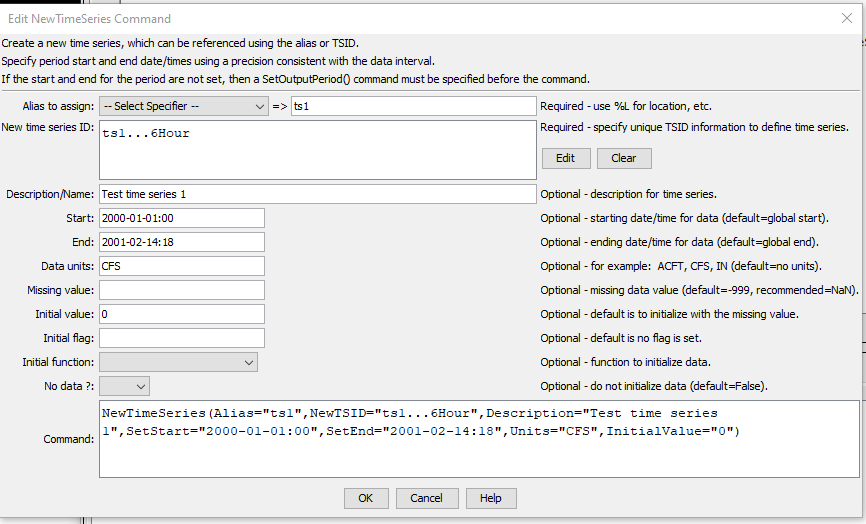

# TSTool / Command / NewTimeSeries #

*   [Overview](#overview)
*   [Command Editor](#command-editor)
*   [Command Syntax](#command-syntax)
*   [Examples](#examples)
*   [Troubleshooting](#troubleshooting)
*   [See Also](#see-also)

-------------------------

## Overview ##

The `NewTimeSeries` command creates a new time series and assigns it an alias.
The command is useful, for example, to create a new time series to
receive the results of a series of manipulations,
rather than having the results accumulate in the first time series.
See also the
[`NewPatternTimeSeries`](../NewPatternTimeSeries/NewPatternTimeSeries.md) command,
which initializes a time series with a repeating pattern of values.
Subsequent manipulation of the time series may require use of the
[`SetTimeSeriesProperty`](../SetTimeSeriesProperty/SetTimeSeriesProperty.md) and
other commands to ensure that the new time series properties are as desired.  

## Command Editor ##

The command is available in the following TSTool menu:

*   ***Commands / Create Time Series***

The following dialog is used to edit the command and illustrates the syntax for the command.
The new time series identifier, which provides critical information including the data interval,
is edited by pressing the ***Edit*** button.

**<p style="text-align: center;">

</p>**

**<p style="text-align: center;">
`NewTimeSeries` Command Editor (<a href="../NewTimeSeries.png">see also the full-size image</a>)
</p>**

## Command Syntax ##

The command syntax is as follows:

```text
NewTimeSeries(Parameter="Value",...)
```
The following older command syntax is updated to the above syntax when a command file is read:

```
TS Alias = NewTimeSeries(Parameter=Value,…)
```

**<p style="text-align: center;">
Command Parameters
</p>**

|**Parameter**&nbsp;&nbsp;&nbsp;&nbsp;&nbsp;&nbsp;&nbsp;&nbsp;&nbsp;&nbsp;&nbsp;&nbsp;&nbsp;&nbsp;&nbsp;|**Description**|**Default**&nbsp;&nbsp;&nbsp;&nbsp;&nbsp;&nbsp;&nbsp;&nbsp;&nbsp;&nbsp;&nbsp;&nbsp;&nbsp;&nbsp;&nbsp;&nbsp;&nbsp;&nbsp;&nbsp;&nbsp;&nbsp;&nbsp;&nbsp;&nbsp;&nbsp;&nbsp;&nbsp;|
|--------------|-----------------|-----------------|
|`Alias`<br>**required**|The alias to assign to the time series, as a literal string or using the special formatting characters listed by the command editor.  The alias is a short identifier used by other commands to locate time series for processing, as an alternative to the time series identifier (`TSID`).  Can be specified using processor `${Property}`.|None – must be specified.|
|`NewTSID`<br>**required**|The time series identifier of the new time series.  The editor dialog formats the identifier from its parts.  Can be specified using processor `${Property}`.|None – must be specified with at least minimal information (location, data type, and interval).|
|`Description`|The description for the time series, used in output.  Can be specified using processor `${Property}`.|Blank|
|`SetStart`|The start of the time series data period.  Can be specified using processor `${Property}`.|Use the start from [`SetOutputPeriod`](../SetOutputPeriod/SetOutputPeriod.md).|
|`SetEnd`|The end of the time series data period.  Can be specified using processor `${Property}`.|Use the end from [`SetOutputPeriod`](../SetOutputPeriod/SetOutputPeriod.md).|
|`Units`|Data units for the time series.  Can be specified using processor `${Property}`.|Blank.|
|`MissingValue`|Value for missing data values.  `-999` is the default for historical reasons; however, `NaN` (not a number) is being phased in and should be specified if possible.  Can be specified using processor `${Property}`.|`-999`|
|`InitialValue`|The value to initialize the time series.  Can be specified using processor `${Property}`.|Initialize the time series to missing data.|
|`InitialFlag`|The initial flag value to initialize the time series.  Can be specified using processor `${Property}`.|No flag is set.|
|`InitialFunction`|The function to use to initialize time series data values.  This parameter can be used to generate data for testing to simplify visual inspection of results.</ul><li>`DATE_YYYY` – 4-digit year</li><li>`DATE_YYYYMM` – and month</li><li>`DATE_YYYYMMDD` – year, month, and day</li><li>`DATE_YYYYMMDD_hh` – year, month, and day, with decimal as hour</li><li>`DATE_YYYYMMDD_hhmm` – year, month, and day, with decimal as hour and minute</li><li>`RANDOM_0_1` – random number >= 0 and < 1</li><li>`RANDOM_0_1000` – random number >= 0 and < 1000</li></ul>|Initialize the time series to missing data.|

## Examples ##

See the [automated tests](https://github.com/OpenCDSS/cdss-app-tstool-test/tree/master/test/commands/NewTimeSeries).

The example command file shown below creates a new time series and
initializes it to a constant of 20 CFS.
Uncommenting the first command would allow the `SetStart` and `SetEnd`
parameters to be removed from the `NewTimeSeries` command.

```
#SetOutputPeriod(OutputStart="1950-01",OutputEnd="2002-12")
NewTimeSeries(Alias=”station1”,NewTSID="Station1.MyModel.Streamflow.Month",Description="Example Description",SetStart="1950-01",SetEnd="2002-12",Units="CFS",InitialValue=20)
```

## Troubleshooting ##

See the main [TSTool Troubleshooting](../../troubleshooting/troubleshooting.md) documentation.

## See Also ##

*   [`NewPatternTimeSeries`](../NewPatternTimeSeries/NewPatternTimeSeries.md) command
*   [`SetOutputPeriod`](../SetOutputPeriod/SetOutputPeriod.md) command
*   [`SetTimeSeriesProperty`](../SetTimeSeriesProperty/SetTimeSeriesProperty.md) command
