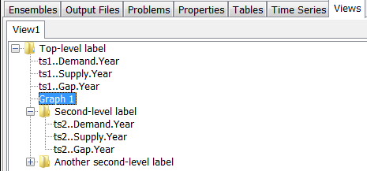
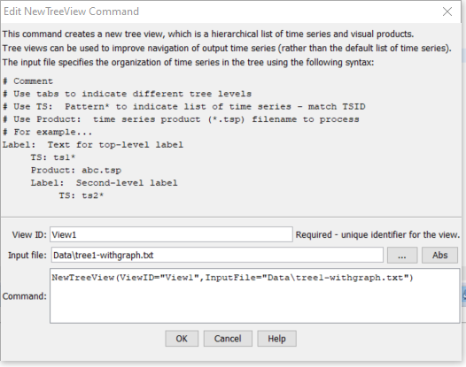

# TSTool / Command / NewTreeView #

*   [Overview](#overview)
*   [Command Editor](#command-editor)
*   [Command Syntax](#command-syntax)
*   [Examples](#examples)
*   [Troubleshooting](#troubleshooting)
*   [See Also](#see-also)

-------------------------

## Overview ##

The `NewTreeView` command creates a tree view, which is a hierarchical listing of time series and graph products.
This is helpful to organize output rather than the default
list of time series in the order they were created by processing commands.
The resulting view is displayed in the Views section of the TSTool ***Results***
area and provides interactive access to data.  The view is defined using a simple text file, as shown in command editor.

Tree view definition files have the following characteristics:

*   Comments are indicated by lines starting with `#`.
*   Indentations indicate the level (branch) in the tree:
    +   Use the tab character to indicate indentation
    +   The indentation on one row cannot be more than 1 greater than the previous row
*   The content for the tree is indicated by keywords:
    +   `Label`:  indicates that the string following the colon will be used to label a branch.
        - A single top-level label is required
    +   `TS`:  indicates that a time series identifier pattern will be used to identify time series in the tree.
    Wildcard conventions follow rules consistent with the `TSList=AllMatchingTSID` ,`TSID=...` command parameters.
    The time series can be graphed by right-clicking on one or more selected time series and graphing.
    +   `TSProduct`:  specify the path to a time series product file as processed by the
    [`ProcessTSProduct`](../ProcessTSProduct/ProcessTSProduct) command.
    The path can be specified relative to the command file.
    All time listed in the file must be found in the results of processing the command file.
    **Currently functionality is not implemented to re-use the time series product file as a template.**

The following figure illustrates the resulting view that is displayed in TSTool for the above example, using contrived data.
 One or more time series in the tree view can be selected and right-click used to create a generic graph.
Or, right-click on time series product nodes in the tree to process the product.
Consequently, the view allows the results of processing to be presented in a way that is more customized than a simple list.
It is envisioned that additional functionality will be implemented, for example to output the view as HTML with navigation links.

**<p style="text-align: center;">

</p>**

**<p style="text-align: center;">
Example of Tree View in TSTool Results
</p>**

## Command Editor ##

The command is available in the following TSTool menu:

*   ***Commands / Visualization Processing***

The following dialog is used to edit the command and illustrates the syntax of the command.

**<p style="text-align: center;">

</p>**

**<p style="text-align: center;">
`NewTreeView` Command Editor (<a href="../NewTreeView.png">see also the full-size image</a>)
</p>**

## Command Syntax ##

The command syntax is as follows:

```text
NewTreeView(Parameter="Value",...)
```
**<p style="text-align: center;">
Command Parameters
</p>**

|**Parameter**&nbsp;&nbsp;&nbsp;&nbsp;&nbsp;&nbsp;&nbsp;&nbsp;&nbsp;&nbsp;&nbsp;|**Description**|**Default**&nbsp;&nbsp;&nbsp;&nbsp;&nbsp;&nbsp;&nbsp;&nbsp;&nbsp;&nbsp;&nbsp;&nbsp;&nbsp;&nbsp;&nbsp;&nbsp;&nbsp;&nbsp;&nbsp;&nbsp;&nbsp;&nbsp;&nbsp;&nbsp;&nbsp;&nbsp;&nbsp;|
|--------------|-----------------|-----------------|
|`ViewID`<br>**required**|Identifier to assign to the view, which allows the view to be used with other commands.  Can be specified with `${Property}` notation.|None – must be specified.|
|`InputFile`<br>**required**|The name of the view definition file to read, as an absolute path or relative to the command file location.  Can be specified with `${Property}` notation.|None – must be specified.|

## Examples ##

See the [automated tests](https://github.com/OpenCDSS/cdss-app-tstool-test/tree/master/test/commands/NewTreeView).

## Troubleshooting ##

## See Also ##

*   [`ProcessTSProduct`](../ProcessTSProduct/ProcessTSProduct.md) command
