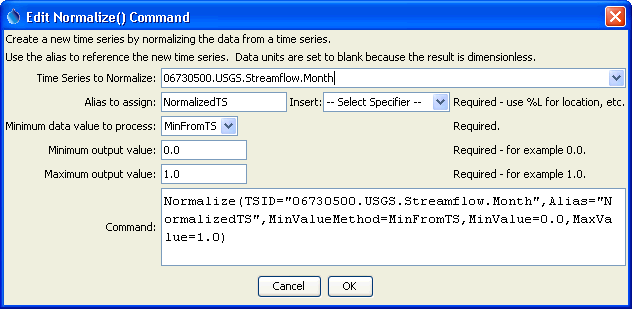
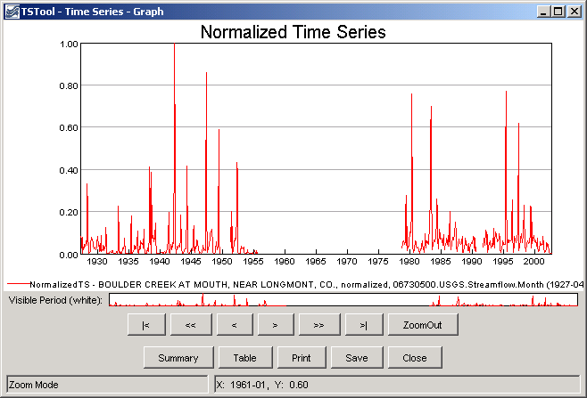

# TSTool / Command / Normalize #

* [Overview](#overview)
* [Command Editor](#command-editor)
* [Command Syntax](#command-syntax)
* [Examples](#examples)
* [Troubleshooting](#troubleshooting)
* [See Also](#see-also)

-------------------------

## Overview ##

The `Normalize` command creates a new normalized time series from an existing time series,
assigning an alias to the result.
Normalized time series are useful for analyzing trends and relationships and for
allowing time series with different units to be plotted or analyzed together.
For example, the range of data values can be normalized to the range 0 to 1.
The alias that is assigned to the time series can be referenced by other commands.

## Command Editor ##

The following dialog is used to edit the command and illustrates the syntax of the command.



**<p style="text-align: center;">
`Normalize` Command Editor (<a href="../Normalize.png">see also the full-size image</a>)
</p>**

## Command Syntax ##

The command syntax is as follows:

```text
Normalize(Parameter="Value",...)
```
**<p style="text-align: center;">
Command Parameters
</p>**

|**Parameter**&nbsp;&nbsp;&nbsp;&nbsp;&nbsp;&nbsp;&nbsp;&nbsp;&nbsp;&nbsp;&nbsp;&nbsp;&nbsp;|**Description**|**Default**&nbsp;&nbsp;&nbsp;&nbsp;&nbsp;&nbsp;&nbsp;&nbsp;&nbsp;&nbsp;&nbsp;&nbsp;&nbsp;&nbsp;&nbsp;&nbsp;&nbsp;&nbsp;&nbsp;&nbsp;&nbsp;&nbsp;&nbsp;&nbsp;&nbsp;&nbsp;&nbsp;|
|--------------|-----------------|-----------------|
|`TSID`<br>**required**|The time series identifier or alias for the time series to be normalized.|None – must be specified.|
|`Alias`<br>**required**|The alias to assign to the time series, as a literal string or using the special formatting characters listed by the command editor.  The alias is a short identifier used by other commands to locate time series for processing, as an alternative to the time series identifier (`TSID`).|None – must be specified.|
|`MinValueMethod`<br>**required**|Indicates how to determine the minimum data value to process, one of:<ul><li>`MinFromTS` – get the minimum value from the time series (typical)</li><li>`MinZero` – use zero (e.g., if negative values are to be ignored)</li></ul>|None – must be specified.|
|`MinValue`<br>**required**|The minimum normalized value (e.g., `0`).|None – must be specified.|
|`MaxValue`<br>**required**|The maximum normalized value (e.g., `1`).|None – must be specified.|

## Examples ##

See the [automated tests](https://github.com/OpenCDSS/cdss-app-tstool-test/tree/master/test/regression/commands/general/Normalize).

A sample command file to process a time series from the [State of Colorado’s HydroBase database](../../datastore-ref/CO-HydroBase/CO-HydroBase.md)
is as follows:

```text
# 06730500 - BOULDER CREEK AT MOUTH, NEAR LONGMONT, CO.
06730500.USGS.Streamflow.Month~HydroBase
Normalize(TSID="06730500.USGS.Streamflow.Month",Alias=”NormalizedTS”,MinValueMethod=MinFromTS,MinValue=0.0,MaxValue=1.0)
```
The results are as follows.



**<p style="text-align: center;">
Results of `Normalize` Command (<a href="../Normalize_Graph.png">see also the full-size image</a>)
</p>**

## Troubleshooting ##

## See Also ##

* [`RelativeDiff`](../RelativeDiff/RelativeDiff.md) command
* [`SelectTimeSeries`](../SelectTimeSeries/SelectTimeSeries.md) command
