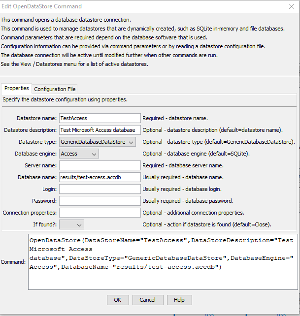

# TSTool / Command / OpenDataStore #

* [Overview](#overview)
* [Command Editor](#command-editor)
* [Command Syntax](#command-syntax)
* [Examples](#examples)
* [Troubleshooting](#troubleshooting)
* [See Also](#see-also)

-------------------------

## Overview ##

The `OpenDataStore` command dynamically opens a database datastore.
This command is useful for a dynamic database connection that does not need to be open
throughout a TSTool session, such as when working with file databases that do not require server software.
If a matching open datastore exists, it will by default be closed before the datastore is reopened.
See also the
[`CloseDataStore`](../CloseDataStore/CloseDataStore.md) command.
**This command has been fully enabled for Microsoft Access and SQLite databases.
Other datastores should use configuration files that are processed when TSTool starts.**

Datastores that are needed throughout a TSTool session should be configured with a datastore
configuration file to connect at startup,
which allows TSTool to initialize main user interface query filters.

The status of datastores can be shown in TSTool using the ***View / Datastores***
menu as shown in the following figure (the Status ***Message*** column on the far right,
not visible in the figure, provides additional information about the datastore):

**<p style="text-align: center;">

</p>**

**<p style="text-align: center;">
Datastore Information from *View / Datastores* (<a href="../View_Datastores.png">see also the full-size image</a>)
</p>**

## Command Editor ##

The following dialog is used to edit the command and illustrates the syntax of the command.
The database engine (database software) dictates which datastore properties are used.
Refer to the [`GenericDatabaseDataStore`](../../datastore-ref/GenericDatabase/GenericDatabase.md) documentation for information.

**<p style="text-align: center;">

</p>**

**<p style="text-align: center;">
`OpenDataStore` Command Editor using Properties (<a href="../OpenDataStore.png">see also the full-size image</a>)
</p>**

**<p style="text-align: center;">

</p>**

**<p style="text-align: center;">
`OpenDataStore` Command Editor using Configuration File (<a href="../OpenDataStore-config.png">see also the full-size image</a>)
</p>**

## Command Syntax ##

The command syntax is as follows:

```text
OpenDataStore(Parameter="Value",...)
```
**<p style="text-align: center;">
Command Parameters
</p>**

|**Parameter**&nbsp;&nbsp;&nbsp;&nbsp;&nbsp;&nbsp;&nbsp;&nbsp;&nbsp;&nbsp;&nbsp;&nbsp;&nbsp;&nbsp;&nbsp;&nbsp;&nbsp;&nbsp;&nbsp;&nbsp;&nbsp;&nbsp;&nbsp;&nbsp;&nbsp;&nbsp;&nbsp;&nbsp;&nbsp;&nbsp;&nbsp;&nbsp;&nbsp;&nbsp;&nbsp;|**Description**|**Default**&nbsp;&nbsp;&nbsp;&nbsp;&nbsp;&nbsp;&nbsp;&nbsp;&nbsp;&nbsp;&nbsp;&nbsp;&nbsp;&nbsp;&nbsp;&nbsp;&nbsp;&nbsp;&nbsp;&nbsp;&nbsp;&nbsp;&nbsp;&nbsp;&nbsp;&nbsp;&nbsp;|
|--------------|-----------------|-----------------|
|`DataStoreName`|The name of the database datastore to open.| None – must be specified.|
|`DataStoreDescription`|The description of the database datastore to open.| `DataStoreName`|
|`DataStoreType`|The datastore type, which indicates the software interface to use for the database, currently limited to: <ul><li>`GenericDatabaseDataStore`</li></ul>|`GenericDatabaseDataStore`|
|`DatabaseEngine`|The database software:<ul><li>`Access` - Microsoft Access</li><li>`Derby` - Java built-in database</li><li>`MySQL`</li><li>`Oracle`</li><li>`PostgreSQL`</li><li>`SQLite`</li><li>`SQLServer`</li></</ul>|`SQLite`|
|`ServerName`|Database server name as recognized name on network or IP address.  Additional details for `DatabaseEngine` are:  <ul><li>`Access` - not currently used (may be used in the future for remote database access)</li><li>`SQLite` - specify the relative or absolute path to the existing database file</li></ul>| None - must be specified |
|`DatabaseName`|Database name.  Additional details for `DatabaseEngine` are:<ul><li>`Access` - specify the relative or absolute path to the existing database file</li><li>`SQLite` - not used</li></ul> | |
|`Login`|Login for account used to connect to the database, may be a shared service account.  Additional details for `DatabaseEngine` are:<ul><li>`SQLite` - not used unless database is locked</li></ul>||
|`Password`|Password for account used to connect to the database, may be a shared service account.  Additional details for `DatabaseEngine` are:<ul><li>`SQLite` - not used unless database is locked</li></ul>||
|`ConnectionProperties` | Connection properties in addition to the above standard properties.  This is specified as a string to append to the end of the connection URL, for example:<br><br>`?property1=value1&property2=value2`<br><br>Consult the datatabase software's JDBC connection string documentation. | |
|`IfFound`|Action to be taken if an open datastore is found:<ul><li>`Close`- close the datastore before reopening</li><li>`Warn` - generate a warning message and do not reopen</li><li>`Fail` - generate a failure message and do not reopen</li></ul>| `Close` |

## Examples ##

See the [automated tests](https://github.com/OpenCDSS/cdss-app-tstool-test/tree/master/test/commands/OpenDataStore).

## Troubleshooting ##

### MicroSoft Access Datastore Out of Memory ###

By default, the UCanAccess driver will read the entire database into memory,
which is done to increase performance for relatively small databases.
However, this can significantly slow down TSTool startup and may lead to an out of memory error.
The `OpenDataStore` command reopens the datastore each time the commands are run and will be slow each time.
To avoid loading the database into memory at the initial connection,
use the parameter: `ConnectionProperties=;memory=false`.
If the database is read into memory at startup, initial queries may be slow; however,
the speed generally incresaes as more queries occur.

See the [UCanAccess documentation](http://ucanaccess.sourceforge.net/site.html#examples)
for other connection string properties.

If it is desired to load the full database at startup and TSTool runs out of memory,
it may be necessary to increase the maximum memory used by TSTool.
See the [Troubleshooting](../../troubleshooting/troubleshooting.md#issue-6-out-of-memory-error) documentation.

## See Also ##

* [`CloseDataStore`](../CloseDataStore/CloseDataStore.md) command
* [`NewAccessDatabase`](../NewAccessDatabase/NewAccessDatabase.md) command
* [`NewSQLiteDatabase`](../NewSQLiteDatabase/NewSQLiteDatabase.md) command
