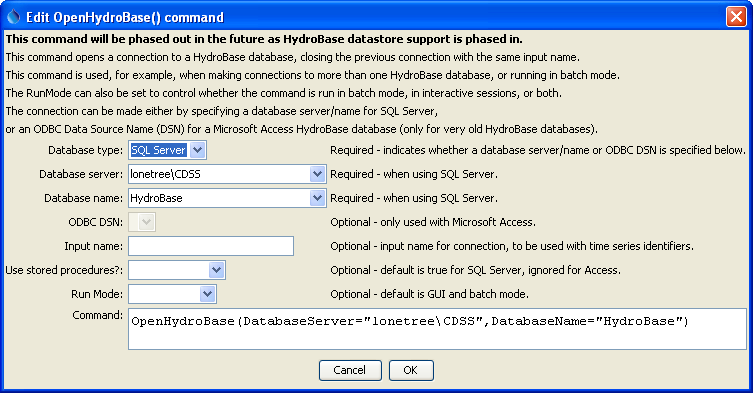

# TSTool / Command / OpenHydroBase #

* [Overview](#overview)
* [Command Editor](#command-editor)
* [Command Syntax](#command-syntax)
* [Examples](#examples)
* [Troubleshooting](#troubleshooting)
* [See Also](#see-also)

-------------------------

## Overview ##

**This command will be phased out in the future.
Instead, define HydroBase datastores (see the [HydroBase Datastore appendix](../../datastore-ref/CO-HydroBase/CO-HydroBase.md)),
where the datastore name is equivalent to the InputName parameter.**

The `OpenHydroBase` command opens a connection to a HydroBase database,
allowing data to be read from the database (e.g., with
[`ReadHydroBase`](../ReadHydroBase/ReadHydroBase.md) commands and time series identifiers that have `~HydroBase` input types).
This command is not typically used for interactive sessions but may be
inserted to run in batch only mode to allow a specific database and commands files to be distributed.
It may also be used in cases where time series are read from different HydroBase databases,
perhaps to compare the contents of the databases – in this case two `OpenHydroBase` commands can be used.
When connecting to a SQL Server database, a connection will be tried for SQL Server (Express) and older MSDE databases.
If both fail, a warning will be shown.

## Command Editor ##

The following dialog is used to edit this command and illustrates the command syntax.

**<p style="text-align: center;">

</p>**

**<p style="text-align: center;">
`OpenHydroBase` Command Editor (<a href="../OpenHydroBase.png">see also the full-size image</a>)
</p>**

## Command Syntax ##

The command syntax is as follows:

```text
OpenHydroBase(Parameter="Value",...)
```

**<p style="text-align: center;">
Command Parameters
</p>**

|**Parameter**&nbsp;&nbsp;&nbsp;&nbsp;&nbsp;&nbsp;&nbsp;&nbsp;&nbsp;&nbsp;&nbsp;&nbsp;&nbsp;&nbsp;&nbsp;&nbsp;&nbsp;&nbsp;&nbsp;&nbsp;&nbsp;&nbsp;&nbsp;&nbsp;&nbsp;&nbsp;&nbsp;&nbsp;&nbsp;&nbsp;&nbsp;&nbsp;&nbsp;&nbsp;|**Description**|**Default**&nbsp;&nbsp;&nbsp;&nbsp;&nbsp;&nbsp;&nbsp;&nbsp;&nbsp;&nbsp;&nbsp;&nbsp;&nbsp;&nbsp;&nbsp;&nbsp;&nbsp;&nbsp;&nbsp;&nbsp;&nbsp;&nbsp;&nbsp;&nbsp;&nbsp;&nbsp;&nbsp;|
|--------------|-----------------|-----------------|
|`DatabaseServer`|Used with a SQL Server HydroBase.  Specify the SQL Server database machine name.  A list of choices will be shown, corresponding to properties in the `CDSS.cfg` configuration file.  The generic value `DatabaseServer=local` will automatically be translated to the name of the local computer.|Required if a SQL Server database is used.|
|`DatabaseName`|Used with a SQL Server HydroBase.  The name of the database typically follows a pattern similar to: `HydroBase_CO_YYYYMMDD`.  A list of choices will be shown, corresponding to properties in the `CDSS.cfg` configuration file.|`HydroBase`|
|`OdbcDsn`|The ODBC DSN to use for the connection, used only when working with a Microsoft Access database.|Required if a Microsoft Access database is used.|
|`InputName`|The input name corresponding to the `~InputType~InputName` information in time series identifiers.  This is used when more than one HydroBase connection is used in the same commands file.|Blank (no input name).|
|`UseStoredProcedures`|Used with SQL Server, indicating whether stored procedures are used.  Stored procedures are the default and should be used except when testing software.	True (used stored procedures).|
|`RunMode`|Indicates when the command should be run, one of:<ul><li>`BatchOnly` – run the command only in batch mode.</li><li>`GUIOnly` – run the command only in GUI mode.</li><li>`GUIAndBatch` – run the command in batch and GUI mode.</li></ul>|`GUIAndBatch`|

## Examples ##

See the [automated tests](https://github.com/OpenCDSS/cdss-app-tstool-test/tree/master/test/regression/commands/general/OpenHydroBase).

The following example command file illustrates how to connect to a SQL Server database running on a machine named “sopris”:

```text
StartLog(LogFile="Results/Example_OpenHydroBase_DatabaseName.TSTool.log")
OpenHydroBase(DatabaseServer="sopris",DatabaseName="HydroBase_CO_20060816")
ReadHydroBase(TSID="BOXHUDCO.DWR.Streamflow.Month",Alias="ts")
```
The following example command file illustrates how to make two HydroBase database connections,
in this case to test whether the stored procedure and SQL queries return the same results
(the `InputName` parameter is used to tell TSTool which connection to use when reading data based on time series identifiers):

```text
OpenHydroBase(DatabaseServer="hbserver",RunMode=GUIAndBatch,UseStoredProcedures=True,InputName="SP")
OpenHydroBase(DatabaseServer="hbserver",RunMode=GUIAndBatch,UseStoredProcedures=False,InputName="NoSP")
ReadHydroBase(TSID="BOXHUDCO.DWR.Streamflow.Month~HydroBase~SP",Alias="ts_sp")
ReadHydroBase(TSID="BOXHUDCO.DWR.Streamflow.Month~HydroBase~NoSP",Alias="ts_nosp")
```

The following example commands file illustrates how to connect to a Microsoft Access database (although Microsoft Access databases are no longer supported):

```text
OpenHydroBase(RunMode=GUIAndBatch,OdbcDsn="HydroBase_DIV1_20030701")
```

## Troubleshooting ##

## See Also ##

* [`ReadHydroBase`](../ReadHydroBase/ReadHydroBase.md) command
