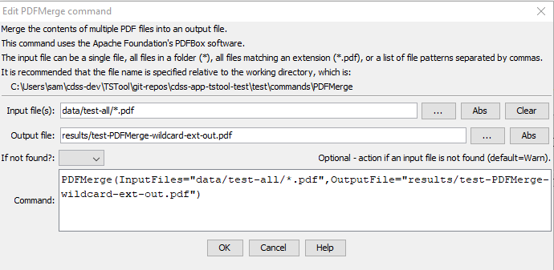

# TSTool / Command / PDFMerge #

*   [Overview](#overview)
*   [Command Editor](#command-editor)
*   [Command Syntax](#command-syntax)
*   [Examples](#examples)
*   [Troubleshooting](#troubleshooting)
*   [See Also](#see-also)

-------------------------

## Overview ##

**This command is under development.  Functionality may be limited.**

The `PDFMerge` command merges multiple PDF files into one output file.

The [Apache PDFBox](https://pdfbox.apache.org/) version 3.0.3 software is used to implement the functionality.
Additional PDF manipulation features may be added in the future.

The list of input files can be specified using a single pattern
or a comma-separated list of patterns, each of which can be specified as:

*   path:
    +   absolute path
    +   a path relative to the command file folder
*   wildcards: 
    +   literal path (no wildcards) that exactly matches a file
    +   wildcards to match one or more files
        (see Java [`PathMatcher`](https://docs.oracle.com/javase/8/docs/api/java/nio/file/FileSystem.html#getPathMatcher-java.lang.String-)):
        -   `*` - match one or more characters at a folder level
        -   `*.pdf` - matches file names with extension `pdf`
        -   `**/*.pdf` - matches file names with extension `pdf` in any folder

## Command Editor ##

The command is available in the following TSTool menu:

*   ***Commands / General - File Handling***

The following dialog is used to edit the command and illustrates the command syntax.

**<p style="text-align: center;">

</p>**

**<p style="text-align: center;">
`PDFMerge` Command Editor (<a href="../PDFMerge.png">see full-size image</a>)
</p>**

## Command Syntax ##

The command syntax is as follows:

```text
PDFMerge(Parameter="Value",...)
```
**<p style="text-align: center;">
Command Parameters
</p>**

|**Parameter**&nbsp;&nbsp;&nbsp;&nbsp;&nbsp;&nbsp;&nbsp;&nbsp;&nbsp;&nbsp;&nbsp;&nbsp;&nbsp;&nbsp;&nbsp;&nbsp;&nbsp;&nbsp;&nbsp;&nbsp;&nbsp;&nbsp;&nbsp;&nbsp;&nbsp;&nbsp; | **Description** | **Default**&nbsp;&nbsp;&nbsp;&nbsp;&nbsp;&nbsp;&nbsp;&nbsp;&nbsp;&nbsp; |
|--------------|-----------------|----------------- |
|`InputFiles`|The name of one or more files to append, specified as file patterns separated by commas:<ul><li>No `*` in filename – match one file</li><li>`*`– match all files in input directory (working directory by default).</li><li>`*.pdf` – match all files with extension</li></ul><br>Can specify using processor `${Property}`.| Specify file pattern(s) or text to append.|
|`OutputFile`<br>**required**|The output file that will be created from input.  The file is created if it does not exist.  Use the [`RemoveFile`](../RemoveFile/RemoveFile.md) command to remove the old file.  Can specify using processor `${Property}`.|None – must be specified.|
|`IfNotFound`|Indicate action if the file is not found, one of:<ul><li>`Ignore` – ignore the missing file (do not warn).</li><li>`Warn` – generate a warning (use this if the file truly is expected and a missing file is a cause for concern).</li><li>`Fail` – generate a failure (use this if the file truly is expected and a missing file is a cause for concern).</li></ul>|`Warn`|

## Examples ##

See the [automated tests](https://github.com/OpenCDSS/cdss-app-tstool-test/tree/master/test/commands/PDFMerge).

## Troubleshooting ##

See the main [TSTool Troubleshooting](../../troubleshooting/troubleshooting.md) documentation.

## See Also ##

*   [`CopyFile`](../CopyFile/CopyFile.md) command
*   [`FormatFile`](../FormatFile/FormatFile.md) command
*   [`RemoveFile`](../RemoveFile/RemoveFile.md) command
