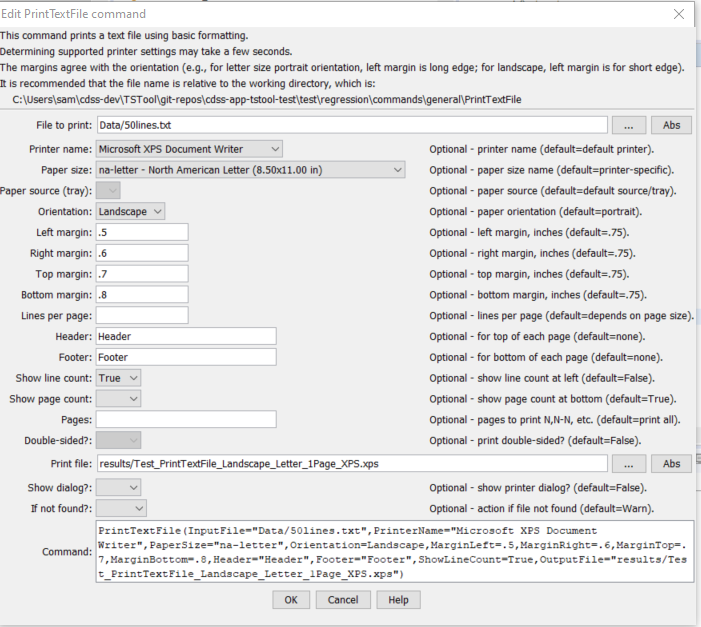
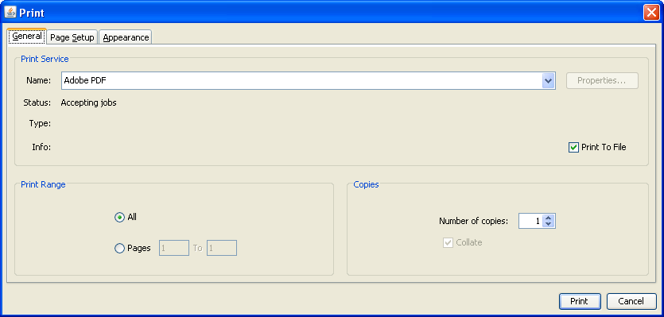
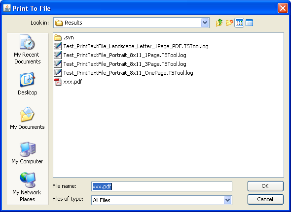
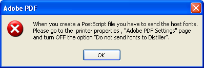

# TSTool / Command / PrintTextFile #

*   [Overview](#overview)
*   [Command Editor](#command-editor)
*   [Command Syntax](#command-syntax)
*   [Examples](#examples)
*   [Troubleshooting](#troubleshooting)
*   [See Also](#see-also)

-------------------------

## Overview ##

The `PrintTextFile` command prints a text file to a physical or virtual (e.g., PDF file) printer.
This command is used in testing to verify print features but also can be used in production to automate printing.
Printing is highly dependent on the features available from a printer.
The command attempts to list printer options to configure command parameters.
However, some options are listed based on what a printer can do,
but this may require physically changing/selecting paper trays, using manual feed, etc.
The command will be enhanced in the future to specify features including tray selection
but currently it is intended for use with common printer settings.
If advanced settings are needed beyond the properties available in the command,
use `ShowDialog=True` (displaying the dialog will pause command execution).

**This command is experimental and could use additional attention to confirm functionality.**

## Command Editor ##

The command is available in the following TSTool menu:

*   ***Commands / General - File Handling***

The following dialog is used to edit the command and illustrates the command syntax (in this case printing to a Microsoft XPS file).

**<p style="text-align: center;">

</p>**

**<p style="text-align: center;">
`PrintTextFile` Command Editor (<a href="../PrintTextFile.png">see also the full-size image</a>)
</p>**

## Command Syntax ##

The command syntax is as follows:

```text
PrintTextFile(Parameter="Value",...)
```
**<p style="text-align: center;">
Command Parameters
</p>**

|**Parameter**&nbsp;&nbsp;&nbsp;&nbsp;&nbsp;&nbsp;&nbsp;&nbsp;&nbsp;&nbsp;&nbsp;&nbsp;&nbsp;&nbsp;&nbsp;&nbsp; | **Description** | **Default**&nbsp;&nbsp;&nbsp;&nbsp;&nbsp;&nbsp;&nbsp;&nbsp;&nbsp;&nbsp; |
|--------------|-----------------|----------------- |
|`InputFile`<br>**required**|The name of the text file to print.|None – must be specified.|
|`PrinterName`|The name of the printer to use (e.g., `\\MyComputer\MyPrinter` or `Adobe PDF`)|The default printer will be used.|
|`PaperSize`|The paper size to print.  Because there are a number of standards for paper, the size is specified as standard-sizename (e.g., `na-letter` for North American Lettter).  [See information on paper sizes](https://en.wikipedia.org/wiki/Paper_size).|The default for the printer will be used.|
|`PaperSource`|The tray for the paper – currently not enabled.  Use `ShowDialog=True` to select.|The `PaperSize` is used.|
|`Orientation`|The paper orientation.|The default for the printer and paper size will be used.|
|`MarginLeft`|The left margin for the orientation, inches.|See above.|
|`MarginRight`|The right margin for the orientation, inches.|See above.|
|`MarginTop`|The top margin for the orientation, inches.|See above.|
|`MarginBottom`|The bottom margin for the orientation, inches.|See above.|
|`LinesPerPage`|The number of lines per page to print.  The font size is chosen accordingly.|An even number is chosen with font size between 7 and 12 points.|
|`Header`|String included in the top left of every page.|No header is shown.|
|`Footer`|String included in the bottom left of every page.|No footer is shown.|
|`ShowLineCount`|Indicate whether the line count should be shown to the left of each line.|`False`|
|`ShowPageCount`|Indicate whether the page count should be shown in the center of the footer.|`True`|
|`DoubleSided`|Indicate whether printing should be double-sided, currently not enabled.  Use `ShowDialog=True` to select.|`False`|
|`OutputFile`|Specify an output file, in cases where the printer name corresponds to a file formatter (such as `Adobe PDF`).|Content is sent to printer device, not a file.|
|`ShowDialog`|Indicate whether to show the printer dialog, which allows review and editing of printer parameters.  This is useful for testing and for selecting advanced printer features not handled in batch mode by this command.|`False`|
|`IfNotFound`|Indicate action if the file is not found, one of:<ul><li>`Ignore` – ignore the missing file (do not warn).</li><li>`Warn` – generate a warning (use this if the file truly is expected and a missing file is a cause for concern).</li><li>`Fail` – generate a failure (use this if the file truly is expected and a missing file is a cause for concern).</li></ul>`Ignore`|

This command can be used to test print features.
For example, use a printer that outputs to a PDF, XPS, or other format file rather than a physical printer.
If `ShowDialog=True` and printing to a file is indicated by specifying the OutputFile parameter (such as with Adobe PDF),
the ***General*** tab on the print dialog will be similar to the following:

**<p style="text-align: center;">

</p>**

**<p style="text-align: center;">
Print Job Dialog General Properties (<a href="../PrintTextFile_DialogGeneral.png">see also the full-size image</a>)
</p>**

Note that Print to File is checked; however, the name of the file may not be displayed.
Instead, the output file is specified by pressing Print, which displays the following dialog,
with the initial choice matching the value of the `OutputFile` parameter:

**<p style="text-align: center;">

</p>**

**<p style="text-align: center;">
Print to File Dialog (<a href="../PrintTextFile_PrintToFile.png">see also the full-size image</a>)
</p>**

If running a command to write a PDF file, the following may be displayed:

**<p style="text-align: center;">

</p>**

**<p style="text-align: center;">
Adobe PDF Error (<a href="../PrintTextFile_DistillerFontError.png">see also the full-size image</a>)
</p>**

Unfortunately, there does not seem to be any way to change the printer setting
from the print dialog and consequently PDF cannot be used.
An alternate approach such as iText may be implemented for PDF.

[If a Microsoft XPS file is printed, the following software may need to be installed,
in particular for Windows XP](https://www.microsoft.com/download/en/details.aspx?displaylang=en&id=11816).

## Examples ##

See the [automated tests](https://github.com/OpenCDSS/cdss-app-tstool-test/tree/master/test/commands/PrintTextFile).

## Troubleshooting ##

## See Also ##
