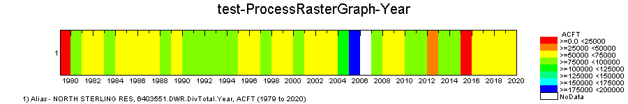
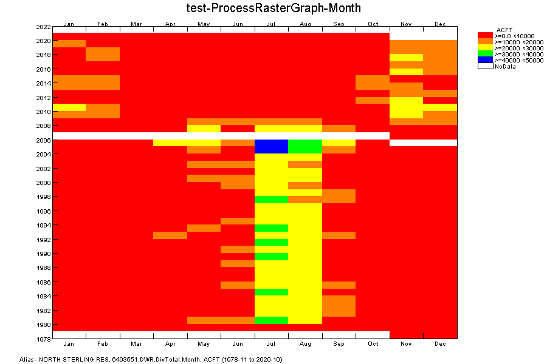
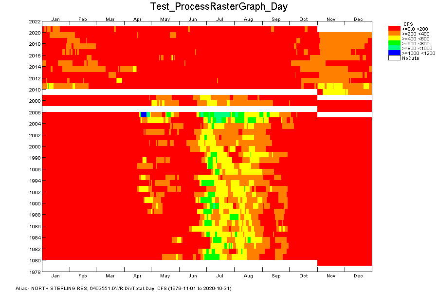
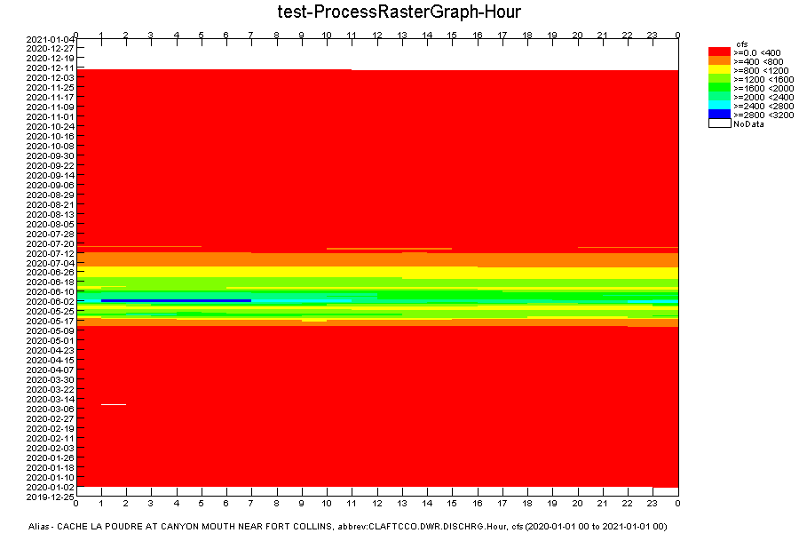
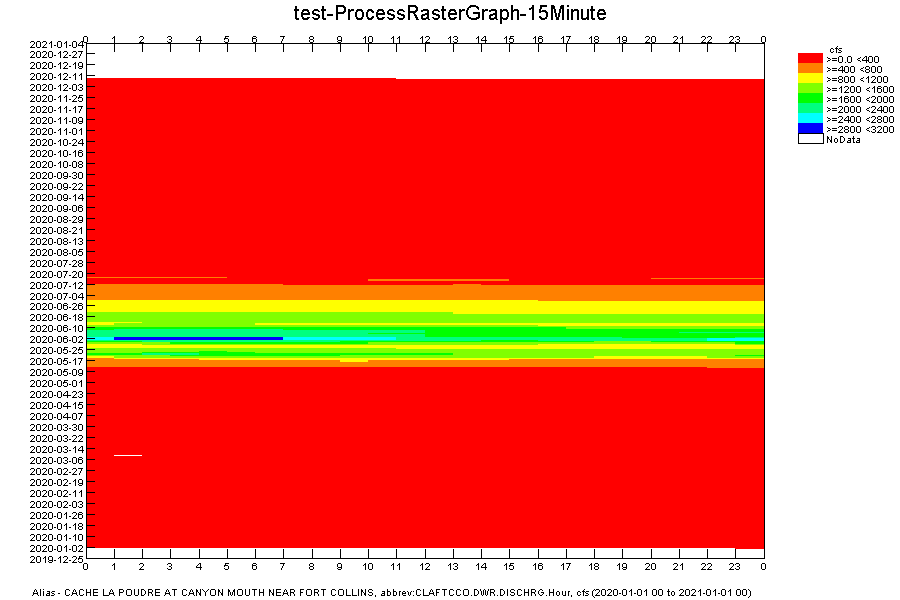
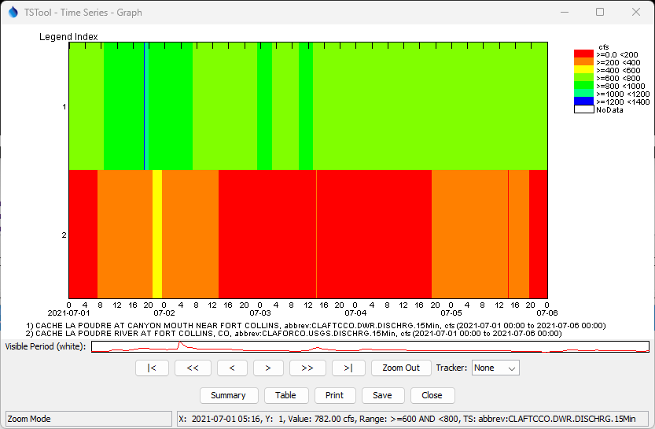

# TSTool / Command / ProcessRasterGraph #

*   [Overview](#overview)
    +   [Single Time Series](#single-time-series)
        -   [Single Year Interval Time Series](#single-year-interval-time-series)
        -   [Single Month Interval Time Series](#single-month-interval-time-series)
        -   [Single Day Interval Time Series](#single-day-interval-time-series)
        -   [Single Hour Interval Time Series](#single-hour-interval-time-series)
        -   [Single Minute Interval Time Series](#single-minute-interval-time-series)
    +   [Multiple Time Series](#multiple-time-series)
*   [Command Editor](#command-editor)
*   [Command Syntax](#command-syntax)
*   [Examples](#examples)
*   [Troubleshooting](#troubleshooting)
*   [See Also](#see-also)

-------------------------

## Overview ##

The `ProcessRasterGraph` command automates creation of a "raster graph",
also called a "heat map".
This command is similar to the [`ProcessTSProduct`](../ProcessTSProduct/ProcessTSProduct.md) command,
but provides features specific to the raster graph format.
See the [`ProcessTSProduct`](../ProcessTSProduct/ProcessTSProduct.md) command
documentation for background on time series product files and editing graphs.

A raster graph is a visual representation of
time series that emphasizes trends and patterns using colored "pixels".
A primary benefit of raster graphs is that the entire period of record (or a significant part of the period)
can be viewed on one page without scrolling or zooming.

The command creates output in two formats depending on whether a single or multiple time series that are processed.

### Single Time Series ###

Viewing a single time series command is enabled for the following intervals:

*  month (see [Single Month Interval Time Series](#single-month-interval-time-series))
*  day (see [Single Day Interval Time Series](#single-day-interval-time-series))
*  1-hour (see [Single Hour Interval Time Series](#single-hour-interval-time-series))
*  N-minute (see [Single Minute Interval Time Series](#single-minute-interval-time-series))

For example, the following figure illustrates a raster graph
for a daily maximum temperature time series.

**<p style="text-align: center;">

</p>**

**<p style="text-align: center;">
Example Raster Graph (<a href="../ProcessRasterGraph_ExampleGraph.png">see full-size image</a>)
</p>**

General concepts for to a single time series raster graph are as follows.
The TSTool design provides custom handling of time series whereas other
software may not handle time series intricacies such as leap year.

*   Display an entire time series in one visible "page" of information,
    which is useful to understand trends, patterns, and extreme values.
*   Because each value is represented as a colored pixel or cell,
    the number of values on an axis at the current view dimensions
    must be large enough to display each time series value as at least 1x1 pixel,
    and larger pixel size is desirable if possible.
    For example, if a time axis is for days in a year, a display size of 365 (or 366) pixels will
    display each value as 1x1 pixel "cell" and a display size of 730 pixels will display each value as 2x2 cell.
    If the interval is large (e.g., `Month`) and the display size is large,
    the raster graph may appear to be overly "blocky"
    because because the displayed cell size is large.
*   The X and Y axes map to a date/time coordinate,
    and the time series data value for the corresponding date/time
    are used to select the color and other information for visualization.
*   The order on the time axis is by default earliest time at the top/left to emphasize recent data.
*   For a time interval of day or less, leap year Feb 29 values require special handling,
    for example:
    -   Omit Feb 29 completely, ensuring alignment of cells.
        This approach is not recommended because some values are not displayed.
    -   Include Feb 29 only in leap years, allowing rows to have different number of pixels (for example 365 and 366),
        with rough edge.  This approach is not recommended because data don't align on time axis.
    -   Always include Feb 29 and use a special pixel color (for example white) for the 3 years that are not leap year.
        This ensures that months align.
        This approach is not recommended because it results in a distracting visual artifact.
    -   Always include Feb 29, using the same color as Feb 28 for visual continuity.
        This ensures that months align.
        **This is the approach currently taken for this command,
        although flexibility may be added in the future.**
        The mouse tracker clearly indicates that the Feb 29 value is not actual.
*   Time series may be displayed using a "year type" as set with
    [`SetOutputYearType`](../SetOutputYearType/SetOutputYearType.md),
    and some commands allow setting the year type for the command.
    This command currently defaults to calendar year.
*   Missing data values should be displayed with a special value, such as white or black.
    This command uses white for missing.
*   Additional information can be added to the raster graph as annotations
    that overlay the raster graph, for example important events.
    This command does not currently support annotations.

#### Single Year Interval Time Series ####

Because single year interval time series have a single time axis (year),
the raster graph defaults the format to a [Multiple Time Series](#multiple-time-series) raster graph.

*   The Y-axis is the number of time series (in this case 1).
*   The X-axis is the year.

The following example illustrates a raster graph
for a year interval reservoir inflow time series using the default color scale.

**<p style="text-align: center;">

</p>**

**<p style="text-align: center;">
Example Raster Graph for a Single Year Interval Time Series (<a href="../ProcessRasterGraph_Example_Year_Graph.png">see full-size image</a>)
</p>**

#### Single Month Interval Time Series ####

Month interval time series can be displayed in a raster graph,
although they may appear to be visually blocky for a single time series.

*   The Y-axis is the year (can support hundreds of years on a typical computer display).
*   The X-axis is the month within the year (12 interval pixels).
*   The full period can be displayed.
*   The output year type controls the month order.

For example, calendar year with most recent year at top:

```
            Jan Feb Mar Apr May Jun Jul Aug Sep Oct Nov Dec
Year3    
Year2    
Year1    
...
```

Water year with most recent year at the bottom (currently not supported):

```
            Oct Nov Dec Jan Feb Mar Apr May Jun Jul Aug Sep
Year1    
Year2    
Year3    
...
```

The following example illustrates a raster graph
for a month interval reservoir inflow time series using the default color scale.

**<p style="text-align: center;">

</p>**

**<p style="text-align: center;">
Example Raster Graph for a Single Month Interval Time Series (<a href="../ProcessRasterGraph_Example_Month_Graph.png">see full-size image</a>)
</p>**

#### Single Day Interval Time Series ####

Day interval time series can be displayed in a raster graph.
The number of data points is typically high enough to result in
smoother pixel transitions than monthly data.

*   The Y-axis is the year (can support hundreds of years on a typical computer display).
*   The X-axis is the day within the year (366 interval pixels).
*   The full period can be displayed.
*   The output year type controls the day order (currently only calendar year is supported).

The following example displays calendar year with most recent year at top.
Each year contains the day of year, with leap year handling as discussed above.

```
            Day001 Day002 ... Day365 Day366
Year3    
Year2    
Year1    
...
```

The following example illustrates a raster graph
for a day interval reservoir inflow time series using the default color scale.

**<p style="text-align: center;">

</p>**

**<p style="text-align: center;">
Example Raster Graph for a Single Day Interval Time Series (<a href="../ProcessRasterGraph_Example_Day_Graph.png">see full-size image</a>)
</p>**

#### Single Hour Interval Time Series ####

Time series with 1-hour interval can be displayed in a raster graph.
The period of record must be short enough to ensure that rendered pixels are visible and don't overwrite each other.
Therefore, the [`SetInputPeriod`](../SetInputPeriod/SetInputPeriod.md) command
or the `VisibleStart` and `VisibleEnd` command parameters may need to be used to control the period.

The following example displays `1Hour` raster graph data:

*   The Y-axis is the day, most recent at the top (requires a minimum of 366 vertical pixels to display a full year).
*   The X-axis is the hour in the day (24 interval pixels).
*   Currently, only 1-hour interval is enabled due to complexities with time zone
    and intervals that may not align with midnight.
*   TSTool uses interval-ending time:
    +   The first interval in a row is therefore for hour > 0 (midnight) and <= 1.
    +   The last hour in a day is stored as hour 0 of the next day due to hours being in the range 0 to 23
        (rather than using hour 24 for midnight).
        The last interval in a row therefore corresponds to time series data with timestamp hour 0 of the next day:
        > 23 and <= 0 (midnight).
        The values for a day are shown in one row, but the last value's timestamp is the next day in the time series.
    +   The mouse tracker shows the time series time coordinates and data value.
        View the time series using the table view to confirm date/time and data values.

```
            0 1 2 3 4 5 6 7 8 9 10 11 12 13 14 15 16 17 18 19 20 21 22 23 0
Day3    
Day2    
Day1    
...
```

The following example illustrates a raster graph
for an hour interval streamflow time series using the default color scale.
Note that the spring runoff occurs over a period of approximately two months.

**<p style="text-align: center;">

</p>**

**<p style="text-align: center;">
Example Raster Graph for a Single Hour Interval Time Series (<a href="../ProcessRasterGraph_Example_Hour_Graph.png">see full-size image</a>)
</p>**

#### Single Minute Interval Time Series ####

Time series with N-minute interval can be displayed in a raster graph.
The period of record must be short enough to ensure that rendered pixels are visible and don't overwrite each other.
Therefore, the [`SetInputPeriod`](../SetInputPeriod/SetInputPeriod.md) command
or the `VisibleStart` and `VisibleEnd` command parameters may need to be used to control the period.

The following example displays `15Minute` raster graph data:

*   The Y-axis is the day, most recent at the top (requires a minimum of 366 vertical pixels to display a full year).
*   The X-axis is the interval in the day (1440/minutes in interval pixels,
    for example 1440/15 = 96 interval pixels for 15-Minute data).
*   Interval data are assumed to align with midnight.
*   TSTool uses interval-ending time, for example for 15-Minute interval:
    +   The first interval in a row is therefore for minute > 0 (midnight) and <= 15.
    +   The last hour in a day is stored as hour and minute 0 of the next day due to hours being in the range 0 to 23
        (rather than using hour 24 for midnight).
        The last interval in a row therefore corresponds to time series data with timestamp hour 0 of the next day:
        > 23:45 and <= 0 (midnight).
        The values for a day are shown in one row, but the last value's timestamp is the next day in the time series.
    +   The mouse tracker shows the time series time coordinates and data value.
        View the time series using the table view to confirm date/time and data values.

```
            0000 0015 0030 0045 0100 0115 0130 0145 ... 2345 0000
Day3    
Day2    
Day1    
...
```

The following example illustrates a raster graph
for a 15-Minute interval streamflow time series using the default color scale.
Note that the spring runoff occurs over a period of approximately two months.
The details of the flow are more refined (granular) than the hourly data.

**<p style="text-align: center;">

</p>**

**<p style="text-align: center;">
Example Raster Graph for a Single 15-Minute Interval Time Series (<a href="../ProcessRasterGraph_Example_15Minute_Graph.png">see full-size image</a>)
</p>**

## Multiple Time Series ##

It is often helpful to visualize multiple time series in a geographic area or a system,
for example, all streamflow along a stream reach, or all precipitation stations in a basin.
In this case, displaying locations on the Y-axis and time on the X-axis is an effective visualization technique.
The time series can be sorted appropriately to control the order on the Y-axis
(see the [`SortTimeSeries`](../SortTimeSeries/SortTimeSeries.md) command).

*   Display period:
    +   The full period can be displayed for larger interval (year, month).
    +   A partial period can be displayed for smaller interval (for example days if 15Minute data).
        Using a long period will cause pixels to be overwritten when drawn.
*   Year type:
    +   If year interval data, the output year type can indicate the months to sum for a year
        (other commands must be used to convert to year interval time series for the output year type).
*   Interval:
    +   Time series values for intervals that include date and time are interval-ending values.
        Therefore, the output start is decremented by one interval for display purposes to show the full time interval.
    +   Time series values for intervals that include only date apply for the full date.
        Therefore, the output end is incremented by one interval for display purposes to show the full date interval.

The following example displays 50 years of monthly data for streams along a reach.

```
            Month1 Month2 Month3 Month4 ... Month50
Location1    
Location2    
Location3    
...
```

The following example displays 7 days of hourly data.

```
            Day1Hour01 Day1Hour02 ... Day7Hour22 Day7Hour23
Location1    
Location2    
Location3    
...
```

The following image illustrates a raster graph for two 15Minute time series
for a short period, where time series 1 is upstream of time series 2,
illustrating how diversions reduce the flow.

**<p style="text-align: center;">

</p>**

**<p style="text-align: center;">
Example Raster Graph for Multiple Time Series (<a href="../ProcessRasterGraph_Multiple_ExampleGraph.png">see full-size image</a>)
</p>**

## Command Editor ##

The command is available in the following TSTool menu:

*   ***Commands / Visualization Processing***

The following dialog is used to edit the command and illustrates the syntax of the command.

**<p style="text-align: center;">

</p>**

**<p style="text-align: center;">
`ProcessRasterGraph` Command Editor (<a href="../ProcessRasterGraph.png">see full-size image</a>)
</p>**

## Command Syntax ##

The command syntax is as follows:

```text
ProcessRasterGraph(Parameter="Value",...)
```

**<p style="text-align: center;">
Command Parameters
</p>**

|**Parameter**&nbsp;&nbsp;&nbsp;&nbsp;&nbsp;&nbsp;&nbsp;&nbsp;&nbsp;&nbsp;&nbsp;|**Description**|**Default**&nbsp;&nbsp;&nbsp;&nbsp;&nbsp;&nbsp;&nbsp;&nbsp;&nbsp;&nbsp;&nbsp;&nbsp;&nbsp;&nbsp;&nbsp;&nbsp;&nbsp;&nbsp;&nbsp;&nbsp;&nbsp;&nbsp;&nbsp;&nbsp;&nbsp;&nbsp;&nbsp;|
|--------------|-----------------|-----------------|
|`TSProductFile`|The time series product file to process.  The path to the file can be absolute or relative to the working directory.  Can be specified with `${Property}`.  The time series product file should define the following properties:<ul><li>`GraphType` - specify as `Raster` for the `[SubProduct #]` property.</li><li>`SymbolTablePath` - specify as a `[SsubProduct #]`property for multiple time series or `[Data #.#]` property for single time series, indicating the path to the color table (see the [Time Series Product File - Symbol Tables](../../appendix-tsview/tsview.md#time-series-product-file-symbol-tables) documentation for the format specification).  The property currently must be manually added to the time series product file after saving from the TSTool graph view.  If not specified in the product file, a default symbol table will be used, which may not be appropriate for optimal data visualization.</li></ul> | None – must be specified.|
|`RunMode`|Indicate the run mode to process the product:<ul><li>`BatchOnly` – indicates that the product should only be processed in batch mode.</li><li>`GUIOnly` – indicates that the product should only be processed when the TSTool GUI is used (useful when Preview is set to Preview).</li><li>`GUIAndBatch` – indicates that the product should be processed in batch and GUI mode.</li></ul>|None – must be specified.|
|`View`|Indicates whether the output should be previewed interactively:<ul><li>`True` – display the graph.</li><li>`False` – do not display the graph (specify the output file instead to automate image creation).</li></ul>|None – must be specified.|
|`OutputFile`|The absolute or relative path to an output file.  Use this parameter with `View=False` to automate image processing.  If the filename ends in “jpg”, a JPEG image file will be produced.  If the filename ends in “png”, a PNG file will be produced (recommended).  Can be specified with `${Property}`. |Graph file will not be created.|
|`VisibleStart`|The starting date/time to zoom for the initial (and image file) graph.|Full period is visible.|
|`VisibleEnd`|The ending date/time to zoom for the initial (and image file) graph.|Full period is visible.|

It is envisioned that in the future, command parameters will implemented to:

*   Create a raster graph without a time series product file,
    as a way of streamlining product generation,
    with parameters for important configuration information such as selecting a time series to plot,
    and specifying the color scale and whether a log transform should be used.
*   Specify an output table containing the colors used for plotting,
    to allow export of the raster plot information to other tools, such as web visualization.
    This will allow TSTool to be used to create the product, and other tools to visualize.
*   Specify the output year type as a command parameter.
*   Specify additional configuration options for controlling the X and Y axes (e.g., allow seasonal or weekly display).

## Examples ##

See the [automated tests](https://github.com/OpenCDSS/cdss-app-tstool-test/tree/master/test/commands/ProcessRasterGraph).

## Troubleshooting ##

See the main [TSTool Troubleshooting](../../troubleshooting/troubleshooting.md) documentation.

## See Also ##

*   [`ProcessTSProduct`](../ProcessTSProduct/ProcessTSProduct.md) command
