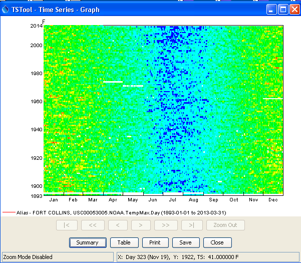
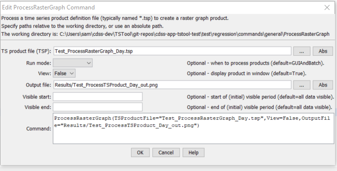

# TSTool / Command / ProcessRasterGraph #

*   [Overview](#overview)
*   [Command Editor](#command-editor)
*   [Command Syntax](#command-syntax)
*   [Examples](#examples)
*   [Troubleshooting](#troubleshooting)
*   [See Also](#see-also)

-------------------------

## Overview ##

The `ProcessRasterGraph` command automates creation of a "raster graph",
also called a "heat map".
This command is similar to the [`ProcessTSProduct`](../ProcessTSProduct/ProcessTSProduct.md) command,
but provides features specific to the raster graph.
See the [`ProcessTSProduct`](../ProcessTSProduct/ProcessTSProduct.md) command
documentation for background on time series product files and editing graphs.

A raster graph is a visual representation of
time series that emphasizes trends and patterns using colored "pixels".
Currently this command is limited to displaying day and month interval time series.
For example, the following figure illustrates a raster graph
for a daily maximum temperature time series.

**<p style="text-align: center;">

</p>**

**<p style="text-align: center;">
Example Raster Graph (<a href="../ProcessRasterGraph_ExampleGraph.png">see also the full-size image</a>)
</p>**

General concepts related to a raster graph are as follows.
These concepts may or may not be handled similarly in other software.
The TSTool design provides custom handling of time series whereas other
time series may not handle time series intricacies such as leap year.

*   Display an entire time series in one visible "page" of information,
    which is useful to understand trends, patterns, and extreme values.
*   Because each value is represented as a colored pixel or cell,
    the number of values on an axis at the current view dimensions
    should be large enough to display each time series value as at least 1x1 pixel,
    and often ideally an even multiple.
    For example, if a time axis is for days in a year, a display size of 365 (or 366) pixels will
    display each value as 1x1 pixel "cell" and a display size of 730 pixels will display each value as 2x2 cell.
    If the interval is large (e.g., `Month`) and the display size is large,
    the raster graph may appear to be overly "blocky"
    because because the displayed cell size is large.
*   The X and Y axes map to the time series data, which is used to select the color and other information.
*   The order on the time axis may be earliest time at top/left or reversed.
*   For time interval of day or less, leap year Feb 29 values require special handling,
    for example:
    -   Omit Feb 29 completely, ensuring alignment of cells.
        This approach is not recommended because some values are not displayed.
    -   Include Feb 29 only in leap years, allowing rows to have different number of pixels (for example 365 and 366),
        with rough edge.  This approach is not recommended because data don't align on time axis.
    -   Always include Feb 29 and use a special pixel color (for example white) for the 3 years that are not leap year.
        This ensures that months align.
        This approach is not recommended because it results in a distracting visual artifact.
    -   Always include Feb 29, using the same color as Feb 28 for visual continuity.
        This ensures that months align.
        **This is the approach currently taken for this command,
        although flexibility may be added in the future.**
        The mouse tracker clearly indicates that the Feb 29 value is not actual.
*   Time series are often displayed using a "year type" as set with
    [`SetOutputYearType`](../SetOutputYearType/SetOutputYearType.md),
    and some commands allow setting the year type for the command.
    For example, calendar year may have 
    This command currently defaults to calendar year.
*   Missing data values should be displayed with a special value, such as white or black.
    This command uses white for missing.
*   Additional information can be added to the raster graph as annotations
    that overlay the raster graph.
    This command does not currently support annotations.

### Raster Graph with Time on Each Axis ###

A raster graph with time on each axis can be used to display an entire time series,
as long as the number of pixels corresponding to data values fits within the resolution of the display.
Depending on data interval, it may be necessary to show a subset of the period.
The following examples illustrate options for different time series data intervals.

#### Year Interval Time Series ####

Year interval time series do not provide enough detail to display as a raster graph.
Using a raster graph with location on one axis and time on the other axis may make sense,
for example:

```
            1950 1951 1952 1953 1953 ...
Location1    
Location2    
Location3    
...
```

#### Month Interval Time Series ####

Month interval time series can be displayed in a raster graph,
although they may appear to be visually blocky for a single time series.

* Full period can be displayed.
* The output year type can indicate the month order.

For example, calendar year with most recent year at top:

```
            Jan Feb Mar Apr May Jun Jul Aug Sep Oct Nov Dec
Year3    
Year2    
Year1    
...
```

Water year with most recent year at the bottom:

```
            Oct Nov Dec Jan Feb Mar Apr May Jun Jul Aug Sep
Year1    
Year2    
Year3    
...
```

#### Day Interval Time Series ####

Day interval time series can be displayed in a raster graph
and the number of data points is high enough to result in
a non-blocky display.

*   Full period can be displayed.
*   The output year type can indicate the month order.

The following example displays calendar year with most recent year at top.
Each year contains the day of year, with leap year handling as discussed above.

```
            Day001 Day002 ... Day365 Day366
Year3    
Year2    
Year1    
...
```

#### Sub-day Interval Time Series ####

Time series with interval less than a day can be displayed in a raster graph.
However, the number of data points may be high enough that only a subset of the period
can be viewed in raster (pixel) form.

*   Only part of period may be displayed.
*   Year type may not be relevant because a short period is shown.

The following example displays recent `15Minute` data, illustrating trends within each day.

```
            0015 0030 0045 0100 0115 0130 0145 ...
Day3    
Day2    
Day1    
...
```

### Raster Graph with Location on Y-axis and Time on X-axis ###

It is often helpful to visualize all of the time series in a geographic area,
for example, all streamflow along a stream reach, or all precipitation stations in a basin.
In this case, displaying locations on the Y-axis and time on the X-axis is an effective
visualization technique.
The time series can be sorted appropriately to control order on the Y-axis.

*   Full period can be displayed for larger interval (year, month)
    *   The output year type can indicate the months to sum for a year.
*   Partial period can be displayed for smaller interval (month if a long period, day, sub-day)

The following example displays 50 years of monthly data for streams along a reach.

```
            Month1 Month2 Month3 Month4 ...
Location1    
Location2    
Location3    
...
```

The following example displays 7 days of hourly data.

```
            Day1Hour01 Day1Hour02 ... Day7Hour22 Day7Hour23
Location1    
Location2    
Location3    
...
```

## Command Editor ##

The command is available in the following TSTool menu:

*   ***Commands / Visualization Processing***

The following dialog is used to edit the command and illustrates the syntax of the command.

**<p style="text-align: center;">

</p>**

**<p style="text-align: center;">
`ProcessRasterGraph` Command Editor (<a href="../ProcessRasterGraph.png">see also the full-size image</a>)
</p>**

## Command Syntax ##

The command syntax is as follows:

```text
ProcessRasterGraph(Parameter="Value",...)
```

**<p style="text-align: center;">
Command Parameters
</p>**

|**Parameter**&nbsp;&nbsp;&nbsp;&nbsp;&nbsp;&nbsp;&nbsp;&nbsp;&nbsp;&nbsp;&nbsp;|**Description**|**Default**&nbsp;&nbsp;&nbsp;&nbsp;&nbsp;&nbsp;&nbsp;&nbsp;&nbsp;&nbsp;&nbsp;&nbsp;&nbsp;&nbsp;&nbsp;&nbsp;&nbsp;&nbsp;&nbsp;&nbsp;&nbsp;&nbsp;&nbsp;&nbsp;&nbsp;&nbsp;&nbsp;|
|--------------|-----------------|-----------------|
|`TSProductFile`|The time series product file to process.  The path to the file can be absolute or relative to the working directory.  Can be specified with `${Property}`.  The graph type for the product should be `Raster`. |None – must be specified.|
|`RunMode`|Indicate the run mode to process the product:<ul><li>`BatchOnly` – indicates that the product should only be processed in batch mode.</li><li>`GUIOnly` – indicates that the product should only be processed when the TSTool GUI is used (useful when Preview is set to Preview).</li><li>`GUIAndBatch` – indicates that the product should be processed in batch and GUI mode.</li></ul>|None – must be specified.|
|`View`|Indicates whether the output should be previewed interactively:<ul><li>`True` – display the graph.</li><li>`False` – do not display the graph (specify the output file instead to automate image creation).</li></ul>|None – must be specified.|
|`OutputFile`|The absolute or relative path to an output file.  Use this parameter with `View=False` to automate image processing.  If the filename ends in “jpg”, a JPEG image file will be produced.  If the filename ends in “png”, a PNG file will be produced (recommended).  Can be specified with `${Property}`. |Graph file will not be created.|
|`VisibleStart`|The starting date/time to zoom for the initial (and image file) graph.|Full period is visible.|
|`VisibleEnd`|The ending date/time to zoom for the initial (and image file) graph.|Full period is visible.|

It is envisioned that in the future, command parameters will implemented to:

*   Create a raster graph without a time series product file,
    as a way of streamlining product generation,
    with parameters for important configuration information such as selecting a time series to plot,
    and specifying the color scale and whether a log transform should be used.
*   Specify an output table containing the colors used for plotting,
    to allow export of the raster plot information to other tools, such as web visualization.
    This will allow TSTool to be used to create the product, and other tools to visualize.
*   Specify whether other than calendar year should be used.
*   Specify additional configuration options for selecting the axis (e.g., allow seasonal or weekly display)
    and location on an axis.

## Examples ##

See the [automated tests](https://github.com/OpenCDSS/cdss-app-tstool-test/tree/master/test/commands/ProcessRasterGraph).

## Troubleshooting ##

## See Also ##

*   [`ProcessTSProduct`](../ProcessTSProduct/ProcessTSProduct.md) command
