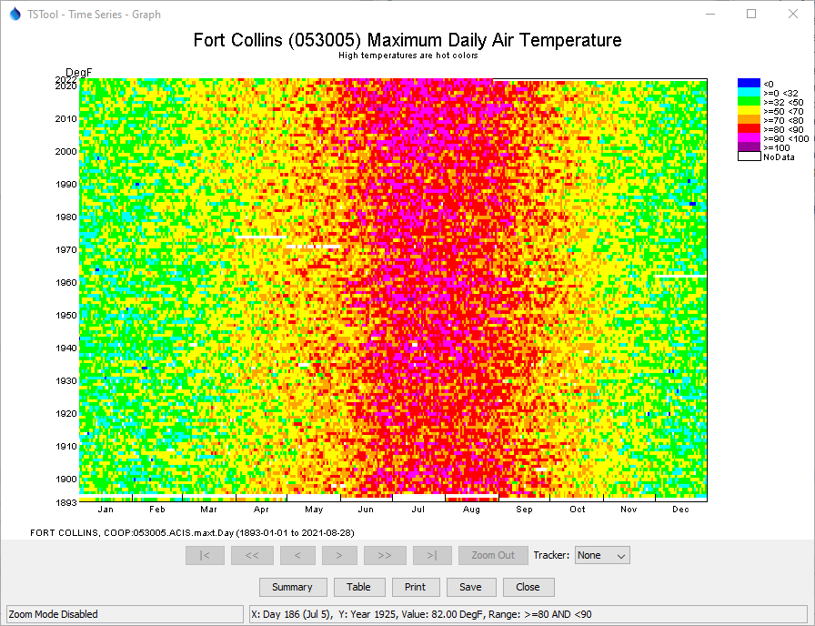

# Learn TSTool / Command / ProcessRasterGraph #

* [Overview](#overview)
* [Command Editor](#command-editor)
* [Command Syntax](#command-syntax)
* [Examples](#examples)
* [Troubleshooting](#troubleshooting)
* [See Also](#see-also)

-------------------------

## Overview ##

The `ProcessRasterGraph` command automates creation of a raster graph.
This command is similar to the [`ProcessTSProduct`](../ProcessTSProduct/ProcessTSProduct) command,
but provides features specific to the raster graph.
See the [`ProcessTSProduct`](../ProcessTSProduct/ProcessTSProduct) command
documentation for background on time series product files and editing graphs.
A raster graph is a visual representation of a single daily or monthly
time series intended to emphasize trends and patterns.
For example, the following figure illustrates a raster graph
for a daily maximum temperature time series.  The concepts related to the graph include:

* Each time series value is represented as a color-coded rectangle,
where x- and y-axes indicate time (in the following example year is
the y-axis and day/month in the year is the x-axis),
and the color corresponds to the time series data value (or other attribute such as data flag).
Consequently there are essentially three plotting axes.
* The overall coloration indicates patterns in the time series data.
* Breaks in the color indicate events of interest
* For daily time series, Feb 29 is included for each year,
using the same color as Feb 28.  This ensures that months align.
The mouse tracker clearly indicates that the Feb 29 value is not actual.
* It is also possible to overlay additional information on the raster graph.
	
It is envisioned that in the future, command parameters will implemented to:

* Create a raster graph without a time series product file,
as a way of streamlining product generation,
with parameters for important configuration information such as selecting a time series to plot,
and specifying the color scale and whether a log transform should be used.
* Specify an output table containing the colors used for plotting,
to allow export of the raster plot information to other tools, such as web visualization.
This will allow TSTool to be used to create the product, and other tools to visualize.
* Specify whether other than calendar year should be used.
* Specify additional configuration options for selecting the axis (e.g., allow seasonal or weekly display).

The following is an example raster graph.
<a href="../ProcessRasterGraph_ExampleGraph.png">See also the full-size image.</a>



**<p style="text-align: center;">
Example Raster Graph
</p>**

## Command Editor ##

The following dialog is used to edit the command and illustrates the syntax of the command.
<a href="../ProcessRasterGraph.png">See also the full-size image.</a>


**<p style="text-align: center;">
`ProcessRasterGraph` Command Editor
</p>**

## Command Syntax ##

The command syntax is as follows:

```text
ProcessRasterGraph(Parameter="Value",...)
```
**<p style="text-align: center;">
Command Parameters
</p>**

|**Parameter**&nbsp;&nbsp;&nbsp;&nbsp;&nbsp;&nbsp;&nbsp;&nbsp;&nbsp;&nbsp;&nbsp;|**Description**|**Default**&nbsp;&nbsp;&nbsp;&nbsp;&nbsp;&nbsp;&nbsp;&nbsp;&nbsp;&nbsp;&nbsp;&nbsp;&nbsp;&nbsp;&nbsp;&nbsp;&nbsp;&nbsp;&nbsp;&nbsp;&nbsp;&nbsp;&nbsp;&nbsp;&nbsp;&nbsp;&nbsp;|
|--------------|-----------------|-----------------|
|`TSProductFile`|The time series product file to process.  The path to the file can be absolute or relative to the working directory.  The Browse button can be used to select the file to write (if a relative path is desired, delete the leading path after the select).  The graph type for the product should be Raster.|None – must be specified.|
|`RunMode`|Indicate the run mode to process the product:<ul><li>`BatchOnly` – indicates that the product should only be processed in batch mode.</li><li>`GUIOnly` – indicates that the product should only be processed when the TSTool GUI is used (useful when Preview is set to Preview).</li><li>`GUIAndBatch` – indicates that the product should be processed in batch and GUI mode.</li></ul>|None – must be specified.|
|`View`|Indicates whether the output should be previewed interactively:<ul><li>`True` – display the graph.</li><li>`False` – do not display the graph (specify the output file instead to automate image creation).</li></ul>|None – must be specified.|
|`OutputFile`|The absolute or relative path to an output file.  Use this parameter with `View=False` to automate image processing.  If the filename ends in “jpg”, a JPEG image file will be produced.  If the filename ends in “png”, a PNG file will be produced (recommended).|Graph file will not be created.|
|`VisibleStart`|The starting date/time to zoom for the initial (and image file) graph.|Full period is visible.|
|`VisibleEnd`|The ending date/time to zoom for the initial (and image file) graph.|Full period is visible.|

## Examples ##

See the [automated tests](https://github.com/OpenWaterFoundation/cdss-app-tstool-test/tree/master/test/regression/commands/general/ProcessRasterGraph).

## Troubleshooting ##

## See Also ##

* [`ProcessTSProduct`](../ProcessTSProduct/ProcessTSProduct) command
