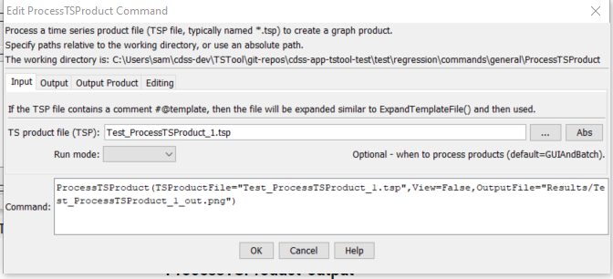
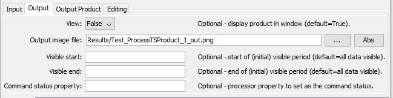
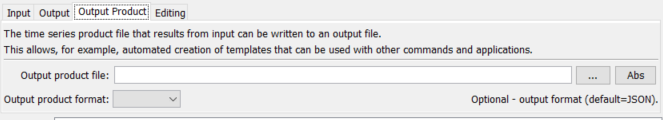
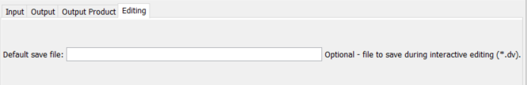

# TSTool / Command / ProcessTSProduct #

*   [Overview](#overview)
*   [Command Editor](#command-editor)
*   [Command Syntax](#command-syntax)
*   [Examples](#examples)
*   [Troubleshooting](#troubleshooting)
*   [See Also](#see-also)

-------------------------

## Overview ##

The `ProcessTSProduct` command automates creation of time series data products.
Products are described in time series product description (`*.tsp`) files,
which are typically created by using the ***Save / Time Series Product*** choice in graph windows
(a future enhancements may allow creation of text products from summary or table views).
See the [**TSView Time Series Viewing Tools**](../../appendix-tsview/tsview.md)
appendix for more information about time series products.
For example, the following sequence of actions can be used to define and use time series product description files:

1.  Use TSTool and interactively select time series using the main window.
    The time series identifiers and/or aliases will be referenced in the time series product.
2.  Interactively view a graph (e.g., ***Results / Graph – Line***) and edit
    its properties by right clicking on the graph and selecting
    the Properties choice (e.g., set titles and legend properties).
3.  Save the graph as a time series product from the graph window
    using the ***Save / Time Series Product*** choice.
    Typically the product is saved in a location close to the command file.
    An example time series product file is shown below.
4.  Add a `ProcessTSProduct` command to the original commands to
    allow the product to be created automatically.
    Select the time series product file created in the previous step.
5.  Save the commands in a file (e.g., named `stations.TSTool`) so that they can be run again.
    The command file and time series product definition files must be used consistently
    (e.g., the time series identifiers and directory paths must be consistent).

```
[Product]

ProductType = "Graph"

[SubProduct 1]

GraphType = "Line"
MainTitleString = "Streamflow (Monthly Total)"

[Data 1.1]

TSID = "08223000.DWR.Streamflow.Month~HydroBase"

[Data 1.2]

TSID = "08220500.DWR.Streamflow.Month~HydroBase"

```
**<p style="text-align: center;">
Example Time Series Product File
</p>**

If the product does not appear as intended, especially for complicated products,
it may be necessary to edit the file and make the following corrections:

* Specify `Color` or other properties so that they are explicitly set and not defaulted.
* Verify that file paths in `TSID` properties are valid for the machine
(may need to convert absolute paths to relative paths).

Time series identifiers in the product file are used as follows:

*   If the time series are in TSTool’s ***Results*** area, the time series will be used without rereading.
*   Otherwise, the `TSID` is used to read the time series and must therefore
    contain enough information to locate and read the time series,
    such as the `~InputType~InputName` information on at the end of the `TSID`.

If the `TSAlias` property is found in the product file,
then the time series corresponding to the alias must be processed
by a command file and be available in TSTool’s ***Results*** area.

It is also possible to create a template time series product file and use the
[`ExpandTemplateFile`](../ExpandTemplateFile/ExpandTemplateFile.md) command to automate
creation of large numbers of graphs, for example to create images for a website.

## Command Editor ##

The command is available in the following TSTool menu:

*   ***Commands / Visualization Processing***

The following dialog is used to edit the `ProcessTSProduct` command and illustrates the command syntax.
The path to the time series product file can be absolute or relative to the working directory.

**<p style="text-align: center;">

</p>**

**<p style="text-align: center;">
`ProcessTSProduct` Command Editor for Input Parameters (<a href="../ProcessTSProduct.png">see also the full-size image</a>)
</p>**

**<p style="text-align: center;">

</p>**

**<p style="text-align: center;">
`ProcessTSProduct` Command Editor for Output Parameters (<a href="../ProcessTSProduct-output.png">see also the full-size image</a>)
</p>**

**<p style="text-align: center;">

</p>**

**<p style="text-align: center;">
`ProcessTSProduct` Command Editor for Output Product Parameters (<a href="../ProcessTSProduct-product.png">see also the full-size image</a>)
</p>**

**<p style="text-align: center;">

</p>**

**<p style="text-align: center;">
`ProcessTSProduct` Command Editor for Editing Parameters (<a href="../ProcessTSProduct-edit.png">see also the full-size image</a>)
</p>**

After using the above dialog to edit the command, the time series product can be processed from TSTool as follows:

1.  Interactively load and run the command file:
    1.  Open the command file, in this case containing the above commands file.
    2.  Process the commands using ***Run All Commands***.  The graph will be displayed for review.
2.  Load and run the command file in one step: Use the ***Run / Process TSProduct File*** menus to select and process the product file.
    The time series must be in the ***Results*** area or must be specified with enough information in the product file to read the time series.
3.  Run TSTool in batch mode by specifying an output file (and optionally changing the `RunMode` parameter to `BatchOnly`) using:<br>
    `tstool –commands commands.TSTool`<br>
    The working directory will be set to the directory for the commands file and output will be relative to that directory.

|**Parameter**&nbsp;&nbsp;&nbsp;&nbsp;&nbsp;&nbsp;&nbsp;&nbsp;&nbsp;&nbsp;&nbsp;&nbsp;&nbsp;&nbsp;&nbsp;&nbsp;&nbsp;&nbsp;&nbsp;&nbsp;&nbsp;&nbsp;&nbsp;&nbsp;&nbsp;&nbsp;&nbsp;|**Description**|**Default**&nbsp;&nbsp;&nbsp;&nbsp;&nbsp;&nbsp;&nbsp;&nbsp;&nbsp;&nbsp;&nbsp;&nbsp;&nbsp;&nbsp;&nbsp;&nbsp;&nbsp;&nbsp;&nbsp;&nbsp;&nbsp;&nbsp;&nbsp;&nbsp;&nbsp;&nbsp;&nbsp;&nbsp;&nbsp;&nbsp;&nbsp;&nbsp;&nbsp;&nbsp;&nbsp;|
|--------------|-----------------|-----------------|
|`TSProductFile`<br>**required**|The time series product file to process.  The path to the file can be absolute or relative to the working directory.  Can be specified using processor ${Property}.  If this file contains a # comment with @template, the file will be expanded to a temporary file and then used.  Expansion is similar to the functionality of the [`ExpandTemplateFile`](../ExpandTemplateFile/ExpandTemplateFile.md) command.|None – must be specified.|
|`RunMode`<br>**required**|Indicate the run mode to process the product, one of:<ul><li>`BatchOnly` – indicates that the product should only be processed in batch mode.</li><li>`GUIOnly` – indicates that the product should only be processed when the TSTool GUI is used (useful when Preview is set to Preview).</li><li>`GUIAndBatch` – indicates that the product should be processed in batch and GUI mode.</li><ul>|None – must be specified.|
|`View`<br>**required**|Indicates whether the output should be previewed interactively, one of:<ul><li>`True`– display the graph.</li><li>`False` – do not display the graph (specify the output file instead to automate image creation).</li></ul>|None – must be specified.|
|`OutputFile`|The absolute or relative path to an output file.  Use this parameter with View=False to automate image processing.  If the filename ends in “jpg”, a JPEG image file will be produced.  If the filename ends in “png”, a PNG file will be produced (recommended).  Can be specified using processor `${Property}`.|Graph file will not be created.|
|`OutputProductFile`|The absolute or relative path to output product file.  Use this parameter to create a fully-expanded time series product, for example to hand off the product configuration to other visualization software.  Can be specified using processor `${Property}`. | |
|`OutputProductFormat`| The format for the file specified with `OutputProductFile`:<ul><li>`JSON` for JSON</li><li>`Properties` - the format matching a `*.tsp` file</li></ul>. | `JSON` |
|`VisibleStart`|The starting date/time to zoom for the initial (and image file) graph.  Can be specified using processor `${Property}`.|Full period is visible.|
|`VisibleEnd`|The ending date/time to zoom for the initial (and image file) graph.  Can be specified using processor `${Property}`.|Full period is visible.|
|`DefaultSaveFile`|Used with experimental feature to enabling editing in the time series table that corresponds to a graph view.  Specify the default DateValue filename to save edits.  Can be specified using processor `${Property}`. This feature is seldom used. |Editing is disabled.|

## Examples ##

See the [automated tests](https://github.com/OpenCDSS/cdss-app-tstool-test/tree/master/test/commands/ProcessTSProduct).

A sample command file to process a data product using time series from the [State of Colorado’s HydroBase database](../../datastore-ref/CO-HydroBase/CO-HydroBase.md) is as follows:

```text
# 08235350 - ALAMOSA RIVER ABOVE JASPER
08235350.USGS.Streamflow.Day~HydroBase
# 08236000 - ALAMOSA RIVER ABOVE TERRACE RESERVOIR
08236000.DWR.Streamflow.Day~HydroBase
# 7337 - SAGUACHE
7337.NOAA.Precip.Month~HydroBase
ProcessTSProduct(TSProductFile="Example_ProcessTSProduct.tsp")
```

## Troubleshooting ##

## See Also ##

*   [`ExpandTemplateFile`](../ExpandTemplateFile/ExpandTemplateFile.md) command
