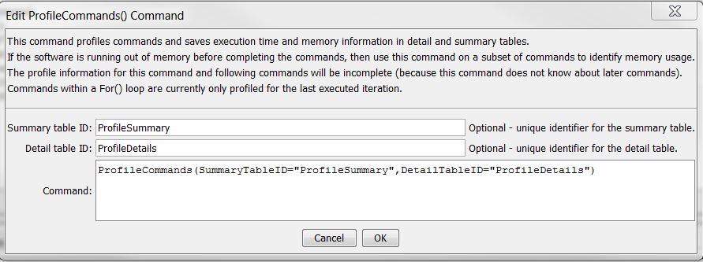
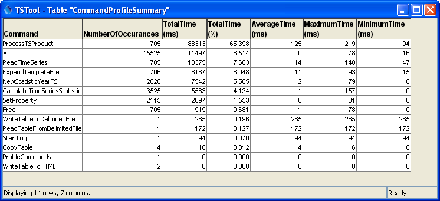
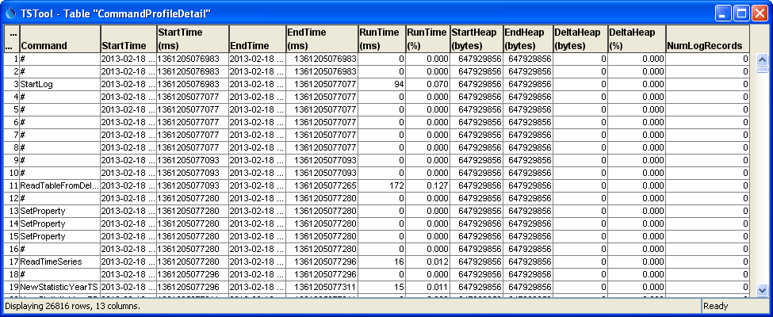

# TSTool / Command / ProfileCommands #

* [Overview](#overview)
* [Command Editor](#command-editor)
* [Command Syntax](#command-syntax)
* [Examples](#examples)
* [Troubleshooting](#troubleshooting)
* [See Also](#see-also)

-------------------------

## Overview ##

The `ProfileCommands` command summarizes run times and memory use for each command in the command list,
and outputs the information to detail (row for each command)
and summary (one row for each command name) tables.
This command is useful for evaluating which commands are
slow or use more memory in a command workflow,
so that software and command file logic improvements can occur.
The command is usually placed at the end of a command file.  The following apply to command profiling:

* Currently profiling does not handle commands in [`For`](../For/For.md) command loops.
Only the profile data for the last time the command is run will be saved.
* Because the command is processed at the time it is encountered in the command list,
the command itself and any subsequent commands are not included in the analysis.
This generally is not an issue because the command will be used near the
end of a workflow or at a strategic location where previous commands need to be examined.
* Currently the memory statistics are rough because the heap size is determined at
the start and end of each command’s execution and the Java runtime environment may
allocate heap memory in blocks.
In the future profiling data may be expanded to the estimated memory footprint of each command.
* There is a slight performance and memory hit to collect profiling information.
In the future processor property commands may be implemented to control how much profiling
data are collected (specifically if memory for each command object is estimated).
* If a command file is causing out of memory exceptions,
then placing a `ProfileCommands` command at the end of the command file likely will not be helpful.
Instead, use a subset of the full command list so the `ProfileCommands` command will be executed.
Then evaluate the performance of the commands and determine if the command list logic can be optimized.
If performance issues appear to be in the software itself,
contact the developers to evaluate the software code.
Also consider using the [`Free`](../Free/Free.md) and [`FreeTable`](../FreeTable/FreeTable.md) commands to free resources,
especially if the results do not need to be available to users via the user interface.
* The runtime percent for each command is calculated as a percentage of the
total runtime (ignoring the `ProfileCommands` command and subsequent commands).
* The heap memory percentage delta for each command is calculated using the heap memory
at the end of the command execution (not the heap memory at the end of the full run).
Consequently, the delta reflects the memory use up to that point in time.
* Command profiling currently only applies to run mode.
Commands are executed in discovery mode when a command file is loaded.
For example, a subset of time series data is retrieved so that time series
identifiers can be created and passed to following commands,
which allows choices to be populated in command editors.
Profiling discover mode is not currently supported but should use a fraction of full runtime resources.
For large command files (e.g., those generated by templates),
it may be appropriate or necessary to load the commands without running discovery
(see the `–nodiscovery` command line parameter and the ***File / Open / Command File (no discovery)*** menu item.
* Commands that generate many warning and failure messages will use more memory.
Refer to the ***NumLogRecords*** column in the detail table to determine if this could be causing memory issues.
* The command currently does not allow sorting output tables by a column.
This feature may be added in the future.
Use the interactive table view to sort by column (this is how the tables were sorted for the figures below).

If loading or running commands are slow, the following actions might help:

* Use the [`Free`](../Free/Free.md) and [`FreeTable`](../FreeTable/FreeTable.md) commands to free resources.
The command will still take up some resources because it has a place in the command list,
but data resources used by the command will be freed.
* Review the profiling results to determine if certain commands are major resource users.
Evaluate whether changes in the command logic can be implemented.
Comment out blocks of commands (`#` commands will take fewer resources than `/* */` blocks
because commands within the latter are still loaded rather than simple comment commands) and try to isolate problems.
It may be necessary to run smaller subsets of commands, for example by splitting up lists of input time series.
* On Windows, use the ***Task Manager*** (run `taskmgr`) to review memory use by the `javaw.exe` program.
If the memory use approaches the maximum, then the Java Runtime Environment likely will
be spending time dealing with short memory and run times will increase until memory runs out.
If necessary, change the `–Xmx` parameter in the `TSTool.l4j.ini` file located in the
`system` folder under the software install.
This parameter indicates the maximum heap memory that can be used by the software.
For a typical 32-bit Windows computer with at least 4GB of memory,
the `–Xmx` parameter may be set to as high as 1700mb;
however, a number that is too high may not be possible due to memory being used by other applications on the computer.

## Command Editor ##

The following dialog is used to edit the command and illustrates the command syntax when specifying a full command line.

**<p style="text-align: center;">

</p>**

**<p style="text-align: center;">
`ProfileCommands` Command Editor (<a href="../ProfileCommands.png">see also the full-size image</a>)
</p>**

The following figure illustrates the output summary table.
Because command execution may be very fast, times are shown in milliseconds (1/1000th of a second).
The table can be output to a file with other commands.

**<p style="text-align: center;">

</p>**

**<p style="text-align: center;">
`ProfileCommands` Command Summary Output Table (<a href="../ProfileCommands_Summary.png">see also the full-size image</a>)
</p>**

The following figure illustrates the output detail table.
Note that the heap memory is increased in blocks by the Java Runtime Environment
so only large memory footprint commands trigger immediate heap memory increases.

**<p style="text-align: center;">

</p>**

**<p style="text-align: center;">
`ProfileCommands` Command Detail Output Table (<a href="../ProfileCommands_Detail.png">see also the full-size image</a>)
</p>**

## Command Syntax ##

The command syntax is as follows:

```text
ProfileCommands(Parameter="Value",...)
```
**<p style="text-align: center;">
Command Parameters
</p>**

| **Parameter**&nbsp;&nbsp;&nbsp;&nbsp;&nbsp;&nbsp;&nbsp;&nbsp;&nbsp;&nbsp;&nbsp;&nbsp;&nbsp;&nbsp;&nbsp;&nbsp;&nbsp;&nbsp;&nbsp;&nbsp;&nbsp;&nbsp;&nbsp;&nbsp;&nbsp;&nbsp; | **Description** | **Default**&nbsp;&nbsp;&nbsp;&nbsp;&nbsp;&nbsp;&nbsp;&nbsp;&nbsp;&nbsp; |
| --------------|-----------------|----------------- |
|`SummaryTableID`|The identifier for the summary table.  Can be specified using `${Property}`.|Summary table will not be created.|
|`DetailTableID`|The identifier for the detail table.  Can be specified using `${Property}`.|Detail table will not be created.|

## Examples ##

* See the [automated tests](https://github.com/OpenCDSS/cdss-app-tstool-test/tree/master/test/regression/commands/general/ProfileCommands).

## Troubleshooting ##

## See Also ##
