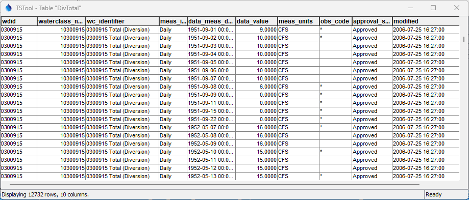

# TSTool / Command / ReadColoradoHydroBaseRest #

*   [Overview](#overview)
    +   [Diversion Records](#diversion-records)
        -   [Diversion Records Background](#diversion-record-background)
        -   [Filling Missing Values with Carry Forward](#filling-missing-values-with-carry-forward)
        -   [Filling Missing Values with Diversion Comments](#filling-missing-values-with-diversion-comments)
        -   [Additional Diversion Record Time Series Filling](#additional-diversion-record-time-series-filling)
*   [Command Editor](#command-editor)
*   [Command Syntax](#command-syntax)
*   [Examples](#examples)
*   [Troubleshooting](#troubleshooting)
*   [See Also](#see-also)

-------------------------

## Overview ##

The `ReadColoradoHydroBaseRest` command reads one or more time series from the Colorado HydroBase REST web services
(see the [ColoradoHydroBaseRest Datastore Appendix](../../datastore-ref/ColoradoHydroBaseRest/ColoradoHydroBaseRest.md)).
It is designed to utilize web service query criteria to process from one to many time series,
for example for a specific water district and data type.
The default command parameters match the results of TSID for the datastore.
Web service queries have slower performance than local database queries used with
[HydroBase database](../../datastore-ref/CO-HydroBase/CO-HydroBase.md),
but do not require local database installation and configuration.

The ***Data type***, ***Data interval***, and ***Where*** command parameters and input fields
are similar to those in the main TSTool interface.
However, whereas the main TSTool interface first requires a query to find the
matching time series list and interactive select to copy specific time series identifiers into the ***Commands*** area,
the `ReadColoradoHydroBaseRest` command reads the time series list and the corresponding data for the time series.
This can greatly shorten command files and simplify command logic, especially when processing many time series.
However, because the command can process many time series and web services are impacted by network speed,
running the command can take a while to complete.

Data for the location (station, structure, well, etc.) and time series metadata,
as shown in the main TSTool interface, are set as time series properties, using web service data values.
These properties can be transferred to a table with the
[`CopyTimeSeriesPropertiesToTable`](../CopyTimeSeriesPropertiesToTable/CopyTimeSeriesPropertiesToTable.md)
command and processed further with other table commands.

### Diversion Records ###

Diversion record time series include
observations for ditches, reservoirs, wells, and other "structures".

Diversion records queried directly from the HydroBase database using SQL
and from web services using the API result in different time series
due to the data representation and how missing/zero values are handled.
For example, web services return a stream of monthly time series records that may have gaps
whereas HydroBase monthly data tables include a full representation of a year.

Conceptually, the data representation includes measured values but does not include unmeasured values
(i.e., HydroBase is not filled with records of missing values).
The raw data must be transformed into a form that represents the accepted full data representation including handling measurement gaps.
The default behavior of TSTool is to perform basic data filling consistent with the intended data representation.
The following sections provide background and examples to illustrate how TSTool handles missing values in daily and monthly diversion records.

### Diversion Records Background ###

Diversion records adhere to the [Diversion Records Standard](https://dnrweblink.state.co.us/dwr/ElectronicFile.aspx?docid=3600965&dbid=0)
and include detailed "water class" records as well as accumulated records such as "DivTotal" (total through structure) records.

In general, diversion record values correspond to observations and estimates determined by
the State of Colorado and other entities.
The accuracy of values is higher for well-maintained measuring devices and
lower (less accurate and possibly unverified) for third-party data submission.
Water Commissioners record diversions throughout the year and review data in the non-irrigation months
before finalizing data records.

Diversion records are stored in HydroBase various forms including daily diversion records,
infrequent measurements, and diversion comments.
For example, long-term daily records may be available at large diversion structures
whereas other structures may have infrequent data records and/or annual diversion comments with one value per year.

Records for smaller interval (e.g., day) data are accumulated to larger interval (month and year).
The HydroBase observations available in diversion records can be further processed to provide additional
zero data values in data gaps, as described in the next section.
The `WaterClass` data type in TSTool uses a corresponding water class web service
that indicates `availableIntervals` for diversion records and
those with only monthly or annual measurements indicate "infrequent" measurements.
Diversion record observations have `measInterval` that indicates whether the value was
derived from daily, monthly, or annual data,
monthly and annual indicating infrequent measurements.
Diversion records consist of date, value, and flag (observation code), which can be viewed in TSTool.

### Filling Missing Values with Carry Forward ####

If the `FillDivRecordsCarryForward=True` (the default) command parameter is specified,
daily total diversion (`DivTotal`), daily total reservoir release (`RelTotal`),
and daily `WaterClass` time series have their values carried forward to fill additional zero
data values within irrigation years (November to October).
The process is explained below.

The Division of Water Resources does implement some data filling by carrying forward non-zero daily values,
indicated with corresponding data flags in the data.
However, due to the large number of structures and combinations of diversion record water classes,
diversion records often do not contain repeated zero values.
Daily and monthly web service records do not by default contain carry-forward zero values.

TSTool implements the following carry forward algorithm to facilitate access to time series that have zeros filled in for gaps.
The algorithm is applied similarly for daily and monthly time series,
although monthly time series require additional processing as explained below.
**The default behavior is the same as the [`ReadHydroBase`](../ReadHydroBase/ReadHydroBase.md) command.**
The images below illustrate the process.

1.  Water Commissioners enter zeros in the diversion records:
    1.  It is assumed that Water Commissioners enter a zero value as the last value in an irrigation year (Nov - Oct)
        to indicate that a diversion is turned off.
        If a zero value is not entered, the data may be interpreted inconsistently by data users.
    2.  Each water class should have a season-ending zero value.
    3.  Zeros at the start of an irrigation year are not required.
        Zero is assumed prior to the first non-zero value.
2.  Each irrigation year is processed separately from the start of the irrigation year to the end
    (there is no continuation of carry-forward data filling between years):
    1.  TSTool represents time series over the full period, with a data value for each interval (timestep).
        The results from a web service query are populated into the time series,
        with missing values where diversion record gaps exist.
        Because carry forward logic works on full irrigation years,
        the requested period to read is extended to full irrigation years,
        the following process is executed, and the period is reset to the requested period.
    2.  If the irrigation year contains no measurements, the year will not be filled.
    3.  Any missing values at the start of an irrigation year prior to the first non-missing value are set to zero.
        Values after the first non-missing value are handled as described in the following steps.
    4.  Any non-missing value is set as the "fill value" to be used in filling after the value.
        However, only a zero is allowed to be used to fill in the following process.
    5.  If a missing value is encountered:
        1.  If a missing value is encountered for monthly time series,
            an additional step occurs because the previous non-zero month may have had a zero daily value at the end.
            Consequently, the daily diversion time series is queried that matches the monthly time series and
            is checked for a zero value in the previous month.
            If a zero is found in the daily data, it is used as the fill value in the next step.
            For consistency and to allow testing, the daily time series is queried using the same commnad settings
            as the original monthly data query.
        2.  The current missing value will be set with the fill value only if the fill value is zero.
            Therefore, gaps that follow a zero value will be filled with zero and gaps that follow a non-zero value
            will remain as missing and require additional decisions about filling data,
            as described in the following sections.
        3.  Any value that is filled using carry forward is flagged with the value provided by the
            `FillDivRecordsCarryForwardFlag` command parameter, or `c` by default.

The following example shows the same time series using the [`ReadHydroBase`](../ReadHydroBase/ReadHydroBase.md)
command and this `ReadColoradoHydroBaseRest` command.

A query of the HydroBase `vw_CDSS_AnnualAmt` view returns the following.
Note the zeros for monthly values and there are no missing values.

**<p style="text-align: center;">

</p>**

**<p style="text-align: center;">
HydroBase Query Results for Monthly Data (<a href="../ReadColoradoHydroBaseRest_Example_AnnualAmt.png">see also the full-size image)</a>
</p>**

TSTool commands to read from the database and web services are as follows:

```
# Monthly, no filling.
ReadHydroBase(DataStore="HydroBase",TSID="0300915.DWR.DivTotal.Month~HydroBase",Alias="%L-Database-NoFill",FillDivRecordsCarryForward=False)
ReadColoradoHydroBaseRest(DataStore="HydroBaseWeb",TSID="0300915..DivTotal.Month~HydroBaseWeb",Alias="%L-Web-NoFill",FillDivRecordsCarryForward=False)
# Monthly, with carry forward filling.
ReadHydroBase(DataStore="HydroBase",TSID="0300915.DWR.DivTotal.Month~HydroBase",Alias="%L-Database-Forward")
ReadColoradoHydroBaseRest(DataStore="HydroBaseWeb",TSID="0300915..DivTotal.Month~HydroBaseWeb",Alias="%L-Web-Forward")
```

The resulting time series at the start of the output period are as shown in the following image.
The first irrigation year starts in 1949-11.
The TSTool table view ***Flags*** choice is set to `Superscript` to display the data value flags
and `c` indicates a value set by the carry forward algorithm.

**<p style="text-align: center;">

</p>**

**<p style="text-align: center;">
`ReadColoradoHydroBaseRest` Results for Monthly Data (<a href="../ReadColoradoHydroBaseRest_Example_Month.png">see also the full-size image)</a>
</p>**

The time series value columns are explained as follows:

1.  Database with no carry forward filling (`FillDivRecordsCarryForward=False`):
    *   The HydroBase database monthly view (`vw_CDSS_NetAmts`) always has 12 values for each irrigation year and in this example
        zeros are stored in the database (no need to carry forward).
    *   HydroBase queries do not provide flags for the monthly values.
2.  Web services with no carry forward filling (`FillDivRecordsCarryForward=False`):
    *   Web services returns only months with non-zero diversion records and therefore there are gaps.
    *   Web services does return HydroBase flags for monthly values.
3.  Database with fill carry forward (the default):
    *   Because the database queries return zero values, the values are the same as column 1.
4.  Web services with carry forward filling (the default):
    *   Web services returns a starting date of 1950-05.
        The software logic internally adjust diversion record time series to span full irrigation years
        to ensure that the carry forward logic works at the start of an irrigation year.
    *   Because the initial values in the first year are missing, they are set to zero.
    *   Other values can be set to zero because the software determines that the prior month
        had a daily value of zero, which allows carry forward of the zero value.
    *   The value for 1951-10 has a filled zero value because the daily time series
        for 1951-09 includes a zero.  See the next image below for more details.

The following example for daily data is consistent with the above monthly data.
The daily diversion total values from HydroBase are as follows:

**<p style="text-align: center;">

</p>**

**<p style="text-align: center;">
HydroBase Query Results for Daily Data (<a href="../ReadColoradoHydroBaseRest_Example_DivTotal_Day.png">see also the full-size image)</a>
</p>**

The commands to query the daily time series in TSTool are as follows:

```
#
# Daily, no filling.
ReadHydroBase(DataStore="HydroBase",TSID="0300915.DWR.DivTotal.Day~HydroBase",Alias="%L-Database-NoFill",FillDivRecordsCarryForward=False)
ReadColoradoHydroBaseRest(DataStore="HydroBaseWeb",TSID="0300915..DivTotal.Day~HydroBaseWeb",Alias="%L-Web-NoFill",FillDivRecordsCarryForward=False)
# Daily, with carry forward filling.
ReadHydroBase(DataStore="HydroBase",TSID="0300915.DWR.DivTotal.Day~HydroBase",Alias="%L-Database-Forward")
ReadColoradoHydroBaseRest(DataStore="HydroBaseWeb",TSID="0300915..DivTotal.Day~HydroBaseWeb",Alias="%L-Web-Forward")
```

The resulting time series for periods of interest are as follows:

**<p style="text-align: center;">

</p>**

**<p style="text-align: center;">
`ReadColoradoHydroBaseRest` Results for Daily Data, Start of Period (<a href="../ReadColoradoHydroBaseRest_Example_Day0.png">see also the full-size image)</a>
</p>**

**<p style="text-align: center;">

</p>**

**<p style="text-align: center;">
`ReadColoradoHydroBaseRest` Results for Daily Data (<a href="../ReadColoradoHydroBaseRest_Example_Day.png">see also the full-size image)</a>
</p>**

The time series value columns in the two images are explained as follows:

1.  Database with no carry forward filling (`FillDivRecordsCarryForward=False`):
    *   The HydroBase database daily view (`vw_CDSS_DivRec_WaterClassTS_Day`)
        contains a time series data representation (one data value per row).
    *   The database includes some zero values, including at the start of the time series.
    *   The first value in the database is at 1950-05-01, not the start of the irrigation year (1949-11-01).
    *   HydroBase queries provide flags for the daily values.
2.  Web services with no carry forward filling (`FillDivRecordsCarryForward=False`):
    *   Web services returns only days with diversion record measurements (including zeros) and therefore there are gaps.
    *   Web services does return flags for monthly values.
3.  Database with fill carry forward (the default):
    *   Additional zeros are filled by the carry forward algorithm.
4.  Web services with carry forward filling (the default):
    *   Web services returns a starting date of 1950-05.
        The software logic internally forces diversion record time series to span full irrigation years
        to ensure that the carry forward logic works at the start of an irrigation year.
    *   Because the initial values in the first year are missing, they are set to zero.
    *   Other values are set to zero by carrying forward zero observations.
    *   Although the database and web service values are slightly different due to how
        zeros are stored in the database, the carry forward algorithm,
        when applied to HydroBase and web service time series, results in the same output.

### Filling Missing Values with Diversion Comments ###

If `FillUsingDivComments=True` (default is `False`), daily, monthly, and yearly `DivTotal`, `RelTotal`, and `WaterClass` time series
are filled using annual irrigation year (November-October) diversion comments,
which indicate when irritation years should be treated as additional zero values.
The parameter value is `False` because the diversion comments are less precise
than daily and monthly diversion records and should be enabled after review.

Diversion comments provide additional information but may not always be consistent with diversion records.
For example, diversion comments may indicate that a structure did not divert water in a year whereas
daily and monthly records show diversions in all or some months.
The separate [`FillUsingDiversionComments`](../FillUsingDiversionComments/FillUsingDiversionComments.md) command also
is available for filling but may be phased out in the future.

### Additional Diversion Record Time Series Filling ####

The data filling approach described in the previous sections should result in diversion
records that are consistent with State of Colorado Water Commissioner recorded values and standard
carry forward filling, in particular to include additional zero values.

However, diversion records may still contain gaps that require filling for analysis and modeling.
See the following commands, which are typically used for modeling
and are applied based on engineering judgement.

*   [`FillHistMonthAverage`](../FillHistMonthAverage/FillHistMonthAverage.md) - simple average
*   [`FillPattern`](../FillPattern/FillPattern.md) - average based on dry/average/wet years
*   [`FillRepeat`](../FillRepeat/FillRepeat.md) - carry forward (will cross irrigation years)
*   [`FillConstant`](../FillConstant/FillConstant.md) - for example to set additional zero values or correct known HydroBase errors
*   Other fill commands.

## Command Editor ##

The command is available in the following TSTool menu:

*   ***Commands / Read Time Series***

The following dialog is used to edit the command and illustrates the syntax for the command.
Two options are available for matching time series, based on historical software requirements.
The following example illustrates how to read a single time series by specifying the time series identifier.
This approach is essentially equivalent to using the
[`ReadTimeSeries`](../ReadTimeSeries/ReadTimeSeries.md) command but offers parameters specific to HydroBase web services.
Specifying a TSID can be used for simple data types such as `DivTotal` where the data type matches one time series.
The `WaterClass` data type can match multiple time series and therefore requires that the `WaterClass`
parameter is specified if a single time series should be matched.

**<p style="text-align: center;">

</p>**

**<p style="text-align: center;">
`ReadColoradoHydroBaseRest` Command Editor to Read a Single Time Series (<a href="../ReadColoradoHydroBaseRest_TSID.png">see also the full-size image)</a>
</p>**

The following figure illustrates how to query multiple time series,
in this case all available water class time series for the specified structure WDID.

**<p style="text-align: center;">

</p>**

**<p style="text-align: center;">
`ReadColoradoHydroBaseRest` Command Editor to Read Multiple Time Series (<a href="../ReadColoradoHydroBaseRest_Multiple.png">see also the full-size image)</a>
</p>**

## Command Syntax ##

The command syntax is as follows:

```text
ReadColoradoHydroBaseRest(Parameter="Value",...)
```

**<p style="text-align: center;">
Command Parameters
</p>**

|**Parameter**&nbsp;&nbsp;&nbsp;&nbsp;&nbsp;&nbsp;&nbsp;&nbsp;&nbsp;&nbsp;&nbsp;&nbsp;&nbsp;&nbsp;&nbsp;&nbsp;&nbsp;&nbsp;&nbsp;&nbsp;&nbsp;&nbsp;&nbsp;&nbsp;&nbsp;&nbsp;&nbsp;&nbsp;&nbsp;&nbsp;&nbsp;&nbsp;&nbsp;&nbsp;&nbsp;&nbsp;&nbsp;&nbsp;&nbsp;&nbsp;&nbsp;&nbsp;&nbsp;&nbsp;&nbsp;&nbsp;|**Description**|**Default**&nbsp;&nbsp;&nbsp;&nbsp;&nbsp;&nbsp;&nbsp;&nbsp;&nbsp;&nbsp;&nbsp;&nbsp;&nbsp;&nbsp;&nbsp;&nbsp;&nbsp;&nbsp;&nbsp;&nbsp;&nbsp;&nbsp;&nbsp;&nbsp;&nbsp;&nbsp;&nbsp;|
|--------------|-----------------|-----------------|
|`DataStore`<br>**required**|The ColoradoHydroBaseRest datastore name to use for the database connection, as per datastore configuration files (see the [ColoradoHydroBaseRest Datastore appendix](../../datastore-ref/ColoradoHydroBaseRest/ColoradoHydroBaseRest.md)).  When using this approach the TSID will end in `~ColoradoHydroBaseRest`.| None - must be specified. |
|`DataType`<br>**required**|The data type to be queried, as documented in the [ColoradoHydroBaseRest Datastore appendix](../../datastore-ref/ColoradoHydroBaseRest/ColoradoHydroBaseRest.md).|None – must be specified.|
|`WaterClass`|The water class if only a single water class should be returned, used when `DataType=WaterClass`.  Specify as the full string including leading WDID as returned when querying all water classes, for example:  `0300909 S:2 F:0303732 U:Q T:7 G: To:`. | All matching water classes. |
|`Interval`<br>**required**|The data interval for the time series, as documented in the [ColoradoHydroBaseRest Datastore appendix](../../datastore-ref/ColoradoHydroBaseRest/ColoradoHydroBaseRest.md) (e.g. `Day`, `Month`, `Year`), consistent with the `DataType` selection.|None – must be specified.|
|`TSID`|When reading a single time series, the time series identifier to read.  If specified, this parameter will override the `WhereN` parameters.|Use `WhereN` parameters to read multiple time series.|
|`WhereN`|When reading 1+ time series, the “where” clauses to be applied.  The filters match the values in the Where fields in the command editor dialog and the TSTool main interface.  The parameters should be named `Where1`, `Where2`, etc., with a gap resulting in the remaining items being ignored.  The format of each value is:<br>`Item;Operator;Value`<br>Where `Item` indicates a data field to be filtered on, `Operator` is the type of constraint, and `Value` is the value to be checked when querying.|If not specified, the query will not be limited and very large numbers of time series may be queried.|
|`Alias`<br>|The alias to assign to the time series, as a literal string or using the special formatting characters listed by the command editor.  The alias is a short identifier used by other commands to locate time series for processing, as an alternative to the time series identifier (`TSID`).|None – alias not assigned.|
|`InputStart`|Start of the period to query, specified as a date/time with a precision that matches the requested data interval.|Read all available data.|
|`InputEnd`|End of the period to query, specified as a date/time with a precision that matches the requested data interval.|Read all available data.|
|`FillDivRecordsCarryForward`|Indicate whether to fill daily and monthly `DivTotal`, `RelTotal`, and `WaterClass` time series using the carry forward approach (see the [Filling Missing Values with Carry Forward](#filling-missing-values-with-carry-forward) section).|`True`|
|`FillDivRecordsCarryForwardFlag`|Data flag set when values are filled if `FillDivRecordsCarryForward=True` .  The flag can then be used later to label graphs, etc.| `c` |
|`FillUsingDivComments`|Indicate whether to fill `DivTotal`, `RelTotal`, and `WaterClass` time series using diversion comments.  The parameter can be used for day, month, and year interval data.  Additional zeros will result for irrigation years (November-October) where the diversion comment indicates that water was not taken. |`False`|
|`FillUsingDivCommentsFlag`|Data flag set when values are filled if `FillUsingDivComments=True`.  The flag can then be used later to label graphs, etc.  The flag will be appended to existing flags if necessary.|Value from `notUsed` flag in data.|
|`IfMissing`|Indicate the action to be taken if the requested time series is missing, one of:<ul><li>`Ignore` – ignore the time series (do not warn and the time series will not be available)</li><li>`Warn` – generate a failure for the command</li></ul>|`Warn`|

## Examples ##

See the [automated tests](https://github.com/OpenCDSS/cdss-app-tstool-test/tree/master/test/commands/ReadColoradoHydroBaseRest).

## Troubleshooting ##

See the main [TSTool Troubleshooting](../../troubleshooting/troubleshooting.md) documentation.

## See Also ##

*   [`CopyTimeSeriesPropertiesToTable`](../CopyTimeSeriesPropertiesToTable/CopyTimeSeriesPropertiesToTable.md) command
*   [`FillUsingDiversionComments`](../FillUsingDiversionComments/FillUsingDiversionComments.md) command
*   [`ReadHydroBase`](../ReadHydroBase/ReadHydroBase.md) command
*   [`ReadTimeSeries`](../ReadTimeSeries/ReadTimeSeries.md) command
