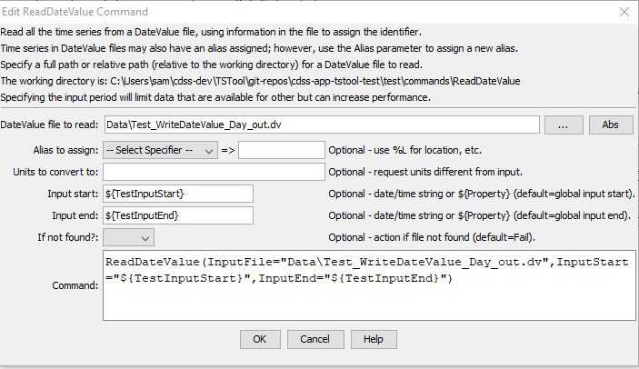

# TSTool / Command / ReadDateValue #

*   [Overview](#overview)
*   [Command Editor](#command-editor)
*   [Command Syntax](#command-syntax)
*   [Examples](#examples)
*   [Troubleshooting](#troubleshooting)
*   [See Also](#see-also)

-------------------------

## Overview ##

The `ReadDateValue` command reads all the time series in a DateValue file.
See the [DateValue Input Type Appendix](../../datastore-ref/DateValue/DateValue.md) for information about the file format.

The following dialog is used to edit the command and illustrates the command syntax.
The path to the file can be absolute or relative to the working directory.
DateValue files allow each time series to have an alias in addition to the time series identifier (`TSID`);
however, the Alias parameter can be used to assign a new alias as the file is read.

## Command Editor ##

The command is available in the following TSTool menu:

*   ***Commands / Read Time Series***

The following dialog is used to edit the command and illustrates the syntax of the command.

**<p style="text-align: center;">

</p>**

**<p style="text-align: center;">
`ReadDateValue` Command Editor (<a href="../ReadDateValue.png">see also the full-size image</a>)
</p>**

## Command Syntax ##

The command syntax is as follows:

```text
ReadDateValue(Parameter="Value",...)
```
The following older command syntax is updated to the above syntax when a command file is read:

```text
TS Alias = ReadDateValue(Parameter=Value,...)
```

**<p style="text-align: center;">
Command Parameters
</p>**

|**Parameter**&nbsp;&nbsp;&nbsp;&nbsp;&nbsp;&nbsp;&nbsp;&nbsp;&nbsp;&nbsp;&nbsp;|**Description**|**Default**&nbsp;&nbsp;&nbsp;&nbsp;&nbsp;&nbsp;&nbsp;&nbsp;&nbsp;&nbsp;&nbsp;&nbsp;&nbsp;&nbsp;&nbsp;&nbsp;&nbsp;&nbsp;&nbsp;&nbsp;&nbsp;&nbsp;&nbsp;&nbsp;&nbsp;&nbsp;&nbsp;|
|--------------|-----------------|-----------------|
|`InputFile`<br>**required**|The name of the DateValue input file to read.  Global property values can be used with the syntax `${PropertyName}`.  The file can be a zip or gz file with single compressed file.|None – must be specified.|
|`Alias`|The alias to assign to the time series, as a literal string or using the special formatting characters listed by the command editor.  The alias is a short identifier used by other commands to locate time series for processing, as an alternative to the time series identifier (`TSID`).|The alias in the file will be used if present.|
|`NewUnits`|Units to convert data to (must be in the `system/DATAUNIT` configuration file under the TSTool installation folder).|Use the data units from the file.|
|`InputStart`|Starting date/time to read data, in precision consistent with data.  Specify as a date/time string or a processor `${Property}`.|Read all data.|
|`InputEnd`|Ending date/time to read data, in precision consistent with data.  Specify as a date/time string or a processor `${Property}`.|Read all data.|
|`IfNotFound`| Indicate an action if the input file is not found:<ul><li>`Ignore` - ignore the missing file and do not warn</li><li>`Warn` - generate a warning message</li><li>`Fail` - generate a failure message</li></ul> | `Fail` |

## Examples ##

See the [automated tests](https://github.com/OpenCDSS/cdss-app-tstool-test/tree/master/test/commands/ReadDateValue).

A sample command file is as follows:

```text
ReadDateValue(InputFile="Data\08251500.DWR.Streamflow.IRREGULAR.dv")
```

## Troubleshooting ##

## See Also ##

*   [`WriteDateValue`](../WriteDateValue/WriteDateValue.md) command
