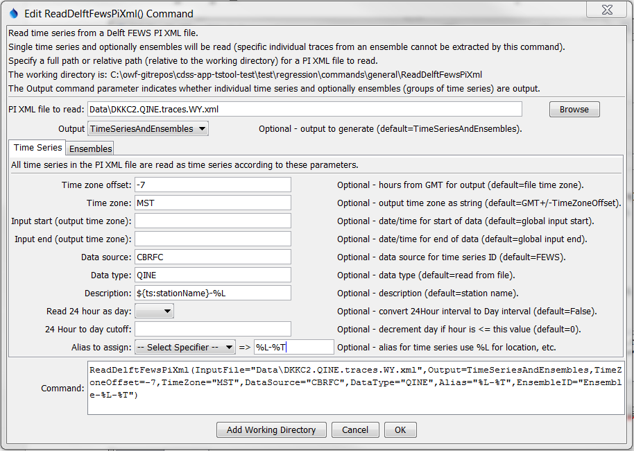
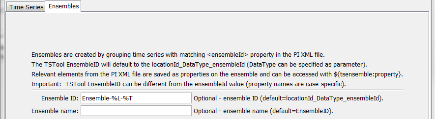

# TSTool / Command / ReadDelftFewsPiXml #

* [Overview](#overview)
* [Command Editor](#command-editor)
* [Command Syntax](#command-syntax)
* [Examples](#examples)
* [Troubleshooting](#troubleshooting)
* [See Also](#see-also)

-------------------------

## Overview ##

The `ReadDelftFewsPiXml` command reads all the time series in a Delft FEWS PI XML file.
See the [Delft FEWS Input Type Appendix](../../datastore-ref/Delft-FEWS-PI-XML/Delft-FEWS-PI-XML.md) for information about the file format.

## Command Editor ##

The following dialog is used to edit the command and illustrates the syntax of the command for time series parameters.



**<p style="text-align: center;">
`ReadDelftFewsPiXml` Command Editor for Time Series Parameters (<a href="../ReadDelftFewsPiXml.png">see also the full-size image</a>)
</p>**

The following dialog is used to edit the command and illustrates the syntax of the command for ensemble parameters.



**<p style="text-align: center;">
`ReadDelftFewsPiXml` Command Editor for Ensemble Parameters (<a href="../ReadDelftFewsPiXml_Ensemble.png">see also the full-size image</a>)
</p>**

## Command Syntax ##

The command syntax is as follows:

```text
ReadDelftFewsPiXml(Parameter="Value",...)
```
**<p style="text-align: center;">
Command Parameters
</p>**

|**Parameter**&nbsp;&nbsp;&nbsp;&nbsp;&nbsp;&nbsp;&nbsp;&nbsp;&nbsp;&nbsp;&nbsp;&nbsp;&nbsp;&nbsp;&nbsp;&nbsp;&nbsp;&nbsp;&nbsp;&nbsp;&nbsp;&nbsp;&nbsp;&nbsp;&nbsp;&nbsp;&nbsp;|**Description**|**Default**&nbsp;&nbsp;&nbsp;&nbsp;&nbsp;&nbsp;&nbsp;&nbsp;&nbsp;&nbsp;&nbsp;&nbsp;&nbsp;&nbsp;&nbsp;&nbsp;&nbsp;&nbsp;&nbsp;&nbsp;&nbsp;&nbsp;&nbsp;&nbsp;&nbsp;&nbsp;&nbsp;|
|--------------|-----------------|-----------------|
|`InputFile`<br>**required**|The name of the PI XML input file to read.  Global property values can be used with the syntax `${PropertyName}`.  The file can be a `*.xml`, `*.zip` or `*.gz` file with single compressed file.|None – must be specified.|
|`Output`|Indicate the output to be generated:<ul><li>`TimeSeries` – individual time series (even if in ensemble)</li><li>`TimeSeriesAndEnsembles` – individual time series and ensemble|`TimeSeriesAndEnsembles`|
|`TimeZoneOffset`|The desired time zone offset for output.  `0`=GMT,  `7`=US Mountain Standard Time.  The offset will be applied to the time zone shown in the <timeZone> element of the file.|Use file time zone.|
|`TimeZone`|Time zone string to assign to output date/times, for example MST.  No check is performed on the validity of the value.  The time zone should agree with the result of applying TimeZoneOffset. Use numerical time zone from file with GMT prefix.|
|`InputStart`|Starting date/time to read data, in precision consistent with data, for output time zone.  Specify as a date/time string or a processor `${Property}`.|Read all data.|
|`InputEnd`|Ending date/time to read data, in precision consistent with data, for output time zone.  Specify as a date/time string or a processor `${Property}`.|Read all data.|
|`DataSource`|Data source to use for time series identifier, for example organization that is running FEWS.  Can specify with ${ts:Property} and time series `%` specifiers.|`FEWS`|
|`DataType`|Data type to use for time series identifier, useful because default can be long and may contain special characters.  Can specify with `${ts:Property}` and time series `%` specifiers.|`<paramerId>` element from PI XML file|
|`Description`|Time series description.  Can specify with `${ts:Property}` and time series `%` specifiers.|`<stationName>` element from PI XML file|
|`Read24HourAsDay`|If True, read 24Hour interval time series as Day.  Hour `00` values are shifted to the previous day.|`False`|
|`Read24HourAsDayCutoff`|If the value of the 24Hour time series is <= this value, then the day will be decremented in the output time series.  This is necessary because hourly data may not exactly line up with days (hour 0) and it may be appropriate to shift to the previous day depending on the data type.|`0`|
|`Alias`|The alias to assign to the time series, as a literal string or using the special formatting characters listed by the command editor.  The alias is a short identifier used by other commands to locate time series for processing, as an alternative to the time series identifier (`TSID`).|No alias is assigned.|
|`EnsembleID`|Ensemble identifier to assign to output.  Can specify with `${ts:Property}` and time series `%` specifiers.|`<locationId> _DataType_<ensembleId>`|
|`EnsembleName`|Ensemble name to assign to output.  Can specify with `${ts:Property}` and time series `%` specifiers.|Value of `EnsembleID`|

## Examples ##

See the [automated tests](https://github.com/OpenCDSS/cdss-app-tstool-test/tree/master/test/regression/commands/general/ReadDelftFewsPiXml).

## Troubleshooting ##

## See Also ##

* [`WriteDelftFewsPiXml`](../WriteDelftFewsPiXml/WriteDelftFewsPiXml.md) command
