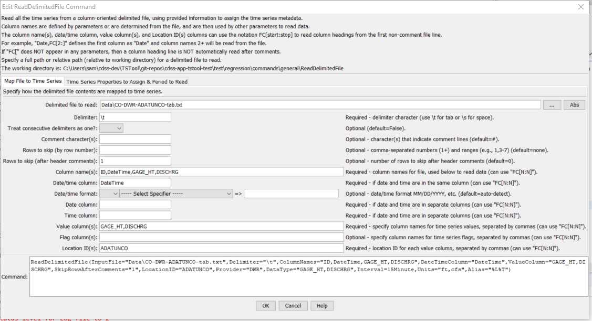
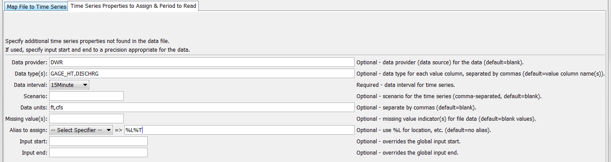
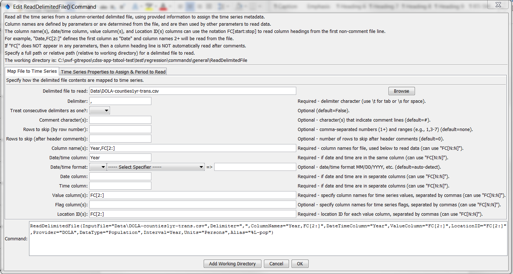

# TSTool / Command / ReadDelimitedFile #

* [Overview](#overview)
* [Command Editor](#command-editor)
* [Command Syntax](#command-syntax)
* [Examples](#examples)
* [Troubleshooting](#troubleshooting)
* [See Also](#see-also)

-------------------------

## Overview ##

The `ReadDelimitedFile` command reads one or more time series from a column-oriented delimited file,
where columns contain date/time and values.
This command is useful for processing comma-separated-value (CSV) files exported from spreadsheets
and mining data from the web (see also the [`WebGet`](../WebGet/WebGet.md) and
[`FTPGet`](../FTPGet/FTPGet.md) commands).  The command processes files that include the following types of information:

1. Comments:
	1. in the header (before data) and embedded in data records (e.g., because bad data values were commented out).
	2. as non-commented line at the top of the file, which can be skipped
2. Data records, in column format, containing date/time strings, data values, and other information.
3. Metadata, such as station identifiers, data types, units,
and interval may be read from the file or specified with command parameters.

The mapping of data in the file to data in the time series occurs first by assigning column names, using one of the following methods:

1. Read column names from a line in the file,
suitable when the column headings are simple strings and agree closely with the contents of the data columns.
2. Assign column names with command parameters.
The file being read may include metadata within column headings and data records;
however, the information can be difficult to extract because of formatting.
For example, column headings may include the data type as `“Precipitation\n(in)”` (where `\n` indicates a newline).
Consequently, the command supports assigning column names via command parameters in order to ensure robust data handling.

In any case, rather than trying to automatically determine other metadata like data type
and units from the column heading, the values can be assigned with the `DataType` and `Units` parameters.
Additional functionality may be added in the future automate metadata discovery.
Examples of use for the two cases are shown in the examples below.

## Command Editor ##

The following dialog is used to edit the command and illustrates the command syntax when specifying a full command line.

**<p style="text-align: center;">

</p>**

**<p style="text-align: center;">
`ReadDelimitedFile` Command Editor when Specifying Command Line in Full (<a href="../ReadDelimitedFile.png">see also the full-size image</a>)
</p>**

## Command Syntax ##

The command syntax is as follows:

```text
ReadDelimitedFile(Parameter="Value",...)
```
**<p style="text-align: center;">
Command Parameters
</p>**

| **Parameter**&nbsp;&nbsp;&nbsp;&nbsp;&nbsp;&nbsp;&nbsp;&nbsp;&nbsp;&nbsp;&nbsp;&nbsp;&nbsp;&nbsp;&nbsp;&nbsp;&nbsp;&nbsp;&nbsp;&nbsp;&nbsp;&nbsp;&nbsp;&nbsp;&nbsp;&nbsp; | **Description** | **Default**&nbsp;&nbsp;&nbsp;&nbsp;&nbsp;&nbsp;&nbsp;&nbsp;&nbsp;&nbsp; |
| --------------|-----------------|----------------- |
|`InputFile`<br>**required**|The name of the delimited input file to read, surrounded by double quotes to protect whitespace and special characters.  Can be specified with `${Property}`.|None – must be specified.|
|`Delimiter`<br>**required**|The delimiter character(s) that separate columns.  Can be specified with `${Property}`.|None – must be specified.|
|`TreatConsecutiveDelimitersAsOne`|Indicate whether consecutive delimiter characters should be treated as a single delimiter, for example, when multiple spaces are used to line up columns.|`False` (columns are separated by a single delimiter character)|
|`Comment`|Character(s) that if found at the start of lines in the file, indicate that the line is a comment.  The characters are interpreted individually (e.g., `#$` indicates that lines starting with `#` or `$` will be treated as comments).  Can be specified with `${Property}`.|`#`|
|`SkipRows`|Indicate absolute rows (1+) in the file to skip, using single numbers and ranges a-b, separated by commas.  Rows are skipped prior to other processing.|No rows will be skipped.|
|`SkipRowsAfterComments`|Indicate the number of rows to skip after header comments.  Use this parameter to skip column headers prior to the data lines.  This parameter is typically not used if column names are read from the file.|No rows will be skipped.|
|`ColumnNames`|The user-specified names for columns in the file, used to ensure that column headings in files are properly interpreted.  These names are used in other parameters to specify columns in the file.  Separate column names with commas.  Column names can be specified as literal strings or as `FC[start:stop]` to read columns from the file header (assumed to be the first row after leading comments), where start is 1+ and stop is blank (e.g., `FC[1:]`) to read all columns or a negative number to indicate the offset from the end column.  If column names are read from the file (triggered by `FC` notation, then the first non-comment, non-skipped row is expected to contain the column names).|None – must be specified.|
|`DateTimeColumn`|The column matching a value in `ColumnNames`, which indicates the date/time column in the file. Date and time are in one column with no separating delimiter characters.  Can be specified with `${Property}`.|Required if `DateColumn` is not specified.|
|`DateTimeFormat`|The format for date/time strings in the date/time column.  If blank, common formats such as ISO `YYYY-MM-DD hh:mm` and `MM/DD/YYYY` will automatically be detected.  However, it may be necessary to specify the format to ensure proper parsing.  This format will be used to parse date/times from the `DateTimeColumn` or the merged string from the `DateColumn` and `TimeColumn` (if specified).  The format string will depend on the formatter type.  Currently, only the “C” formatter is available, which uses C programming language specifiers.   The resulting format includes the formatter and specifiers (e.g., `C:%m%d%y`).  Can be specified with `${Property}`.|Will automatically be determined by examining date/time strings.|
|`DateColumn`|The column matching a string in `ColumnNames`, which indicates the date column in the file.  Can be specified with `${Property}`.|Required if `DateTimeColumn` is not specified.|
|`TimeColumn`|The column matching a string in `ColumnNames`, which indicates the time column in the file.  Specify this parameter when `DateColumn` is specified and time is specified in a separate column.  The `DateColumn` and `TimeColumn` contents are merged with a joining colon character and are then treated as if `DateTimeColumn` had been specified. Can be specified with `${Property}`.|A time column is required only when `DateColumn` is specified and the interval requires time.|
|`ValueColumn`|The column(s) matching a string in `ColumnNames`, which indicate the data value columns.  Separate column names with commas.  The `FC[start:stop]` notation discussed for `ColumnNames` can also be used.  Can be specified with `${Property}`.|None – must be specified.|
|`FlagColumn`|The column(s) matching a string in `ColumnNames`, which indicate the data flag columns.  Separate column names with commas.  The `FC[start:stop]` notation discussed for `ColumnNames` can also be used.  If specified, the number of columns must match the `ValueColumn` parameter, although blanks are allowed.  Double-quotes around flags are not considered part of the flag.  Can be specified with `${Property}`.|Flags are not read.|
|`LocationID`|The location identifier(s) to assign to time series for each of the value columns (or specify one value to apply to all columns).  The `FC[start:stop]` notation discussed for `ColumnNames` can also be used.  Can be specified with `${Property}`.|None – must be specified.|
|`Provider`|The data provider identifier to assign to time series for each of the value columns (or specify one value to apply to all columns).  Can be specified with `${Property}`.|No provider will be assigned.|
|`DataType`|The data type to assign to time series for each of the value columns (or specify one value to apply to all columns).  Can be specified with `${Property}`.|Use the value column names for the data types.|
|`Interval`|The interval for the time series.   Only one interval is recognized for all the time series in the file.  Interval choices are provided when editing the command.  If it is possible that the date/times are not evenly spaced, then use the IRREGULAR interval.|None – must be specified.|
|`Scenario`|The scenario to assign to time series for each of the value columns (or specify one value to apply to all columns).  Can be specified with `${Property}`.|No scenario will be assigned.|
|`Units`|The data units to assign to time series for each of the value columns (or specify one value to apply to all columns).  Can be specified with `${Property}`.|No units will be assigned.|
|`Missing`|Strings that indicate missing data in the file (e.g., `“m”`).  Can be specified with `${Property}`.|Interpret empty column values as missing data.|
|`Alias`|The alias to assign to time series, as a literal string or using the special formatting characters listed by the command editor.  The alias is a short identifier used by other commands to locate time series for processing.  Can be specified with `${Property}`.|No alias will be assigned.|
|`InputStart`|The date/time to start reading data.  Can be specified using processor `${Property}`.|All data or global input start.|
|`InputEnd`|The date/time to end reading data.  .  Can be specified using processor `${Property}`.|All data or global input end.|

## Examples ##

* See the [automated tests](https://github.com/OpenCDSS/cdss-app-tstool-test/tree/master/test/regression/commands/general/ReadDelimitedFile).

### Example of Column Names Assigned with Command Parameter ###

The following example for two time series (gate height and discharge) illustrates a
format where column headings are complex enough to require assignment of column names using a command parameter:

```
#...
#Data is returned in TAB delimited format. Data miners may find help on automating
#queries and formatting parameters at http://www.dwr.state.co.us/help
#
#Gaging Station: ALVA B. ADAMS TUNNEL AT EAST PORTAL NEAR ESTES PARK (ADATUNCO)
#Retrieved: 3/30/2010 03:04
#-----------------------------------------------------------------------------
Station Date/Time       GAGE_HT (ft)    DISCHRG (cfs)
ADATUNCO        2006-10-01 00:00        2.34    225
ADATUNCO        2006-10-01 00:15        2.34    225
...etc...
```
The following dialog is used to edit the command and illustrates the syntax for the command.
The column headings are skipped because they are assigned with a command parameter.
Because the delimiter is a tab, the space between date and time columns is NOT used
as a delimiter and the date/time information is treated as one column.

**<p style="text-align: center;">

</p>

**<p style="text-align: center;">
`ReadDelimitedFile` Command Editor when Literally Specifying Column Names (<a href="../ReadDelimitedFile.png">see also the full-size image.</a>)
</p>
**

The following dialog is the second data tab.

**<p style="text-align: center;">

</p>**

**<p style="text-align: center;">
`ReadDelimitedFile` Command Editor when Literally Specifying Column Names - Second Data Tab (<a href="../ReadDelimitedFile2.png">see also the full-size image</a>)
</p>**

### Example of Column Names Read from the File ###

The following simple example of annual county population data illustrates a
format that allows reading column names from the file.
In this case, the rows and columns have been transposed from the original format to be
compatible with this command and in the command example shown in the figure
below the “County” heading is replaced with “Year” to more clearly indicate the contents.

```
County,COLORADO,Adams,Alamosa,Arapahoe,Archuleta,Baca,Bent,Boulder,Broomfield,Chaffee,…
2000,4338793,366660,15132,491134,10027,4514,5991,296018,0,16294,2229,9386,…
2001,4456408,360389,15314,502567,10532,4486,5911,282794,41529,16382,2195,9479,…
...etc...
```

The following dialog is used to edit the command and illustrates the syntax for the command when reading column names from the file.

**<p style="text-align: center;">

</p>**

**<p style="text-align: center;">
`ReadDelimitedFile` Command Editor when Reading Column Names from the File (<a href="../ReadDelimitedFile3.png">see also the full-size image</a>)
</p>**

## Troubleshooting ##

## See Also ##

* [`WriteDelimitedFile`](../WriteDelimitedFile/WriteDelimitedFile.md) command
