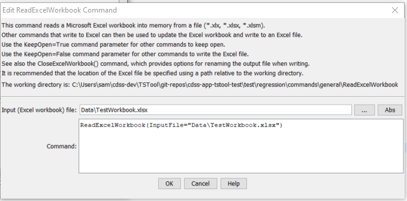

# TSTool / Command / ReadExcelWorkbook #

*   [Overview](#overview)
*   [Command Editor](#command-editor)
*   [Command Syntax](#command-syntax)
*   [Examples](#examples)
*   [Troubleshooting](#troubleshooting)
*   [See Also](#see-also)

-------------------------

## Overview ##

The `ReadExcelWorkbook` command reads a Microsoft Excel workbook file (`*.xls`, `*.xlsx`, `*.xlsm`).
The workbook is retained in memory and can be manipulated using commands that write to Excel, for example:

1.   Create an Excel workbook template with desired analysis, formatting, charts, etc.
    Leave placeholders for data sheets.  Refer to the data sheets using named ranges.
2.   Read the Excel workbook template using the `ReadExcelWorkbook` command.
3.   Manipulate the Excel workbook using TSTool commands that write to Excel, for example
    [`WriteTableToExcel`](../WriteTableToExcel/WriteTableToExcel.md).
    If the `KeepOpen=False` parameter is used, the original file will not be re-written.
    Therefore, use `KeepOpen=True` in combination with the following.
4.   Use the [`CloseExcelWorkbook`](../CloseExcelWorkbook/CloseExcelWorkbook.md) command and specify
    `WriteFile=True` to force writing the Excel workbook.
    The `NewOutputFile` parameter can also be specified to write a new output file, leaving the original Excel file intact.

TSTool uses the [Apache POI software](https://poi.apache.org) to read and manipulate
Excel workbooks and consequently functionality is constrained by the features of that software package.


## Command Editor ##

The command is available in the following TSTool menu:

*   ***Commands / Read Time Series***

The following dialog is used to edit the command and illustrates the syntax of the command.

**<p style="text-align: center;">

</p>**

**<p style="text-align: center;">
`ReadExcelWorkbook` Command Editor (<a href="../ReadExcelWorkbook.png">see also the full-size image</a>)
</p>**

## Command Syntax ##

The command syntax is as follows:

```text
ReadExcelWorkbook(Parameter="Value",...)
```
**<p style="text-align: center;">
Command Parameters
</p>**

|**Parameter**&nbsp;&nbsp;&nbsp;&nbsp;&nbsp;&nbsp;&nbsp;&nbsp;&nbsp;&nbsp;&nbsp;|**Description**|**Default**&nbsp;&nbsp;&nbsp;&nbsp;&nbsp;&nbsp;&nbsp;&nbsp;&nbsp;&nbsp;&nbsp;&nbsp;&nbsp;&nbsp;&nbsp;&nbsp;&nbsp;&nbsp;&nbsp;&nbsp;&nbsp;&nbsp;&nbsp;&nbsp;&nbsp;&nbsp;&nbsp;|
|--------------|-----------------|-----------------|
|`InputFile`<br>**required**|The name of the Excel workbook file (`*.xls`, `*.xlsx`, or `*.xlsm`) to read, as an absolute path or relative to the command file location.  Can be specified using processor `${Property}`.|None – must be specified.|

## Examples ##

See the [automated tests](https://github.com/OpenCDSS/cdss-app-tstool-test/tree/master/test/commands/ReadExcelWorkbook).

## Troubleshooting ##

See the main [TSTool Troubleshooting](../../troubleshooting/troubleshooting.md) documentation.

## See Also ##

*   [`CloseExcelWorkbook`](../CloseExcelWorkbook/CloseExcelWorkbook.md) command
*   [`WriteTableToExcel`](../WriteTableToExcel/WriteTableToExcel.md) command
