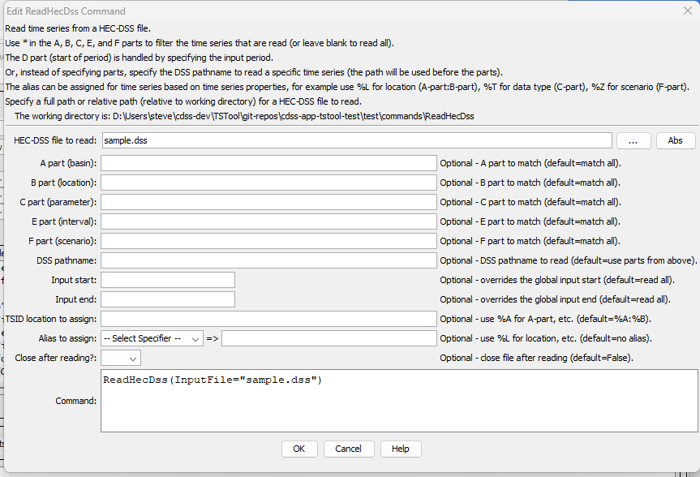

# TSTool / Command / ReadHecDss #

* [Overview](#overview)
* [Command Editor](#command-editor)
* [Command Syntax](#command-syntax)
* [Examples](#examples)
* [Troubleshooting](#troubleshooting)
* [See Also](#see-also)

-------------------------

## Overview ##

The `ReadHecDss` command reads time series from a HEC-DSS file.
See the [HEC-DSS Input Type Appendix](../../datastore-ref/HEC-DSS/HEC-DSS.md) for information
about how time series properties are assigned using HEC-DSS file data.
Current limitations for the command include:

*   Irregular time series cannot be read.
*   HEC-DSS uses times through `2400`.
    However, TSTool will convert this to `0000` of the next day.  Year, month, and day data are not impacted.

## Command Editor ##

The following dialog is used to edit the command and illustrates the syntax of the command.
In the future, it is envisioned that choices for A – F parts will be made available using data from the file.

**<p style="text-align: center;">

</p>**

**<p style="text-align: center;">
`ReadHecDss` Command Editor (<a href="../ReadHecDss.png">see also the full-size image</a>)
</p>**

## Command Syntax ##

The command syntax is as follows:

```text
ReadHecDss(Parameter="Value",...)
```
**<p style="text-align: center;">
Command Parameters
</p>**

|**Parameter**&nbsp;&nbsp;&nbsp;&nbsp;&nbsp;&nbsp;&nbsp;&nbsp;&nbsp;&nbsp;&nbsp;&nbsp;&nbsp;|**Description**|**Default**&nbsp;&nbsp;&nbsp;&nbsp;&nbsp;&nbsp;&nbsp;&nbsp;&nbsp;&nbsp;&nbsp;&nbsp;&nbsp;&nbsp;&nbsp;&nbsp;&nbsp;&nbsp;&nbsp;&nbsp;&nbsp;&nbsp;&nbsp;&nbsp;&nbsp;&nbsp;&nbsp;|
|--------------|-----------------|-----------------|
|`InputFile`<br>**required**|The name of the HEC-DSS input file to read, surrounded by double quotes to protect whitespace and special characters.  Can be specified with `${Property}` notation.|None – must be specified.|
|`A`|The A part (basin name) to match, using `*` as a wildcard.  The location type part of the TSTool time series identifier is set to this value.  Can be specified with `${Property}` notation.|Match all.|
|`B`|The B part (location) to match, using `*` as a wildcard.  The location identifier part of the TSTool time series identifier is set to this value.  Can be specified with `${Property}` notation.|Match all.|
|`C`|The C part (parameter) to match, using `*` as a wildcard.  The TSTool data type is set to this value.  Can be specified with `${Property}` notation.|Match all.|
|`E`|The E part (interval) to match, using `*` as a wildcard.  Can be specified with `${Property}` notation.|Match all.|
|`F`|The F part (scenario) to match, using `*` as a wildcard.  Can be specified with `${Property}` notation.|Match all.|
|`Pathname`|The HEC-DSS pathname for a time series, as specified in the HEC-DSS documentation.  Currently wildcards are not allowed.  If specified, this will be used instead of the A-F parameters.  Can be specified with `${Property}` notation.|Use the `A`-`F` parameters.|
|`InputStart`|Starting date/time to read data, in precision consistent with data.  Can be specified with `${Property}` notation.|Read all data.|
|`InputEnd`|Ending date/time to read data, in precision consistent with data.  Can be specified with `${Property}` notation.|Read all data.|
|`Location`|The location to assign for the time series identifier.  Use `%A`...`%F` to indicate the `A`part ... `F` part (`D` part is not available).  The assignment will impact the Alias assignment.  This is useful when only `B` part is desired as the location identifier.  Can be specified with `${Property}` notation.|Apart:Bpart (`%A:%B`).|
|`Alias`|Alias to assign to the output time series.  See the `LegendFormat` property described in the [TSView Time Series Viewing Tools appendix](../../appendix-tsview/tsview.md).  For example, `%L` is full location, `%T` is data type (parameter in HEC-DSS notation), `%I` is interval, and `%Z` is scenario.  Can be specified with `${Property}` notation.|None is assigned.  However, if the location contains periods that are in conflict with time series identifier conventions, the alias is set to the identifier with periods, and the periods are replaced with spaces in the full time series identifier.|
|`CloseAfterRead` | Close the file after reading.  This is useful because the underlying HEC-DSS software can lock files, which prevents some commands such as [`CopyFile`](../CopyFile/CopyFile.md) from working. Specify as `False` or `True`. | `False` |

## Examples ##

See the [automated tests](https://github.com/OpenCDSS/cdss-app-tstool-test/tree/master/test/commands/ReadHecDss).

A sample command file is as follows:

```text
ReadHecDss(InputFile="sample.dss",InputStart="1992-01-01",InputEnd="1992-12-31",Alias="%L_%T_%Z") 
```

## Troubleshooting ##

## See Also ##

* [`WriteHecDss`](../WriteHecDss/WriteHecDss.md) command
