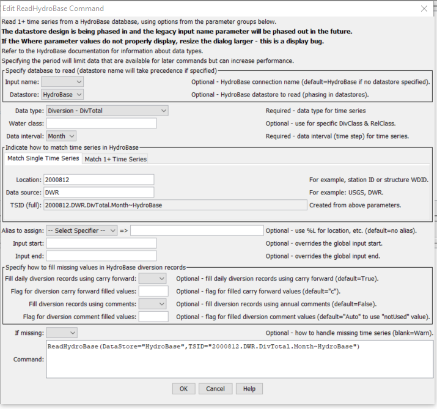
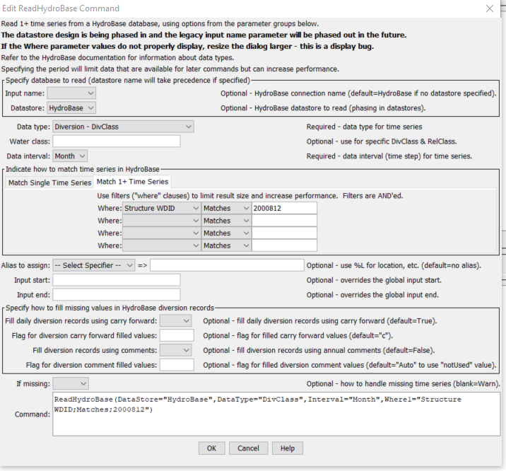

# Learn TSTool / Command / ReadHydroBase #

* [Overview](#overview)
* [Command Editor](#command-editor)
* [Command Syntax](#command-syntax)
* [Examples](#examples)
* [Troubleshooting](#troubleshooting)
* [See Also](#see-also)

-------------------------

## Overview ##

The `ReadHydroBase` command reads one or more time series from the HydroBase database
(see the [HydroBase Datastore Appendix](../../datastore-ref/CO-HydroBase/CO-HydroBase).
It is designed to utilize query criteria to process large numbers of time series,
for example for a specific water district and data type.

The ***Data type***, ***Data interval***, and ***Where*** command parameters and input fields
are similar to those from the main TSTool interface.
However, whereas the main TSTool interface first requires a query to find the
matching time series list and then an interactive select for specific time series identifiers,
the `ReadHydroBase` command reads the time series list and the corresponding data for the time series.
This can greatly shorten command files and simplify command logic, especially when processing many time series.

The command supports the old-style input name selection (which corresponds to selecting
HydroBase via the TSTool login dialog) and the new-style datastore convention
(which corresponds to datastore configuration files).
In the future, support for the input name may be phased out; however,
this will require resolving how the HydroBase selection dialog is migrated to support datastores.
Consequently, both approaches are currently supported during the transition.

Data for the location (station, structure, well, etc.) and time series metadata,
as shown in the main TSTool interface, are set as time series properties.
For example, the `latdecdeg` and `longdecdeg` values from the `HydroBase vw_CDSS_StationMeasType` view
are available as time series properties of the same name.
These properties can be transferred to a table with the
[`CopyTimeSeriesPropertiesToTable`](../CopyTimeSeriesPropertiesToTable/CopyTimeSeriesPropertiesToTable)
command and processed further with other table commands.
	
Time series corresponding to diversion records,
which also include observations for reservoirs and wells, are handled as follows:
	
1. Daily diversion (`DivTotal` and `DivClass`) and reservoir release (`RelTotal` and `RelClass`)
time series have their values automatically carried forward to fill
data within irrigation years (November to October).
HydroBase only stores full months of daily diversion record data when non-zero
observations or non-zero filled values occur in a month.
Therefore, this filling action should only provide additional zero values
in an irrigation year where a diversion or release was recorded.
Irrigation years with no observations remain as missing after the read.
2. Daily, monthly, and yearly diversion and reservoir release time series
optionally can be filled by the `ReadHydroBase` command using diversion comments,
which indicate when irritation years should be treated as missing.
See the `FillUsingDivComments` parameter below.
Note that diversion comments should not conflict with more detailed records and provide additional information.
The separate [`FillUsingDivComments`](../FillUsingDivComments/FillUsingDivComments) command also
is available for filling but may be phased out in the future.
3. It also may be appropriate to use infrequent data types (`IDivTotal`, `IDivClass`, `IRelTotal`, and `IRelClass`) to supply data;
however, because such values typically are annual values,
additional decisions must be made for how to distribute the values to monthly and daily time series.
These data, if available, are not automatically folded into the diversion records by TSTool.
4. See the [`FillHistMonthAverage`](../FillHistMonthAverage/FillHistMonthAverage),
[`FillPattern`](../FillPattern/FillPattern), and other commands,
which can be used to fill (estimate) values in data gaps after the initial time series are read.  

## Command Editor ##

The following dialog is used to edit the command and illustrates the syntax for the command.
Two options are available for matching time series, based on historical software requirements.
The following example illustrates how to read a single time series by specifying the time series identifier.
This approach is essentially equivalent to using the
[`ReadTimeSeries`](../ReadTimeSeries/ReadTimeSeries) command but offers HydroBase-specific parameters such as
[`FillUsingDivComments`](../FillUsingDivComments/FillUsingDivComments),
which are not available in the more general
[`ReadTimeSeries`](../ReadTimeSeries/ReadTimeSeries) command.
<a href="../ReadHydroBase_TSID.png">See also the full-size image.</a>



**<p style="text-align: center;">
`ReadHydroBase` Command Editor to Read a Single Time Series
</p>**

The following figure illustrates how to query multiple time series.
<a href="../ReadHydroBase_Multiple.png">See also the full-size image.</a>



**<p style="text-align: center;">
`ReadHydroBase` Command Editor to Read Multiple Time Series
</p>**

## Command Syntax ##

The command syntax is as follows:

```text
ReadHydroBase(Parameter="Value",...)
```
The following older command syntax is updated to the above syntax when a command file is read:

```text
TS Alias = ReadHydroBase(Parameter=Value,...)
```

**<p style="text-align: center;">
Command Parameters
</p>**

|**Parameter**&nbsp;&nbsp;&nbsp;&nbsp;&nbsp;&nbsp;&nbsp;&nbsp;&nbsp;&nbsp;&nbsp;&nbsp;&nbsp;&nbsp;&nbsp;&nbsp;&nbsp;&nbsp;&nbsp;&nbsp;&nbsp;&nbsp;&nbsp;&nbsp;&nbsp;&nbsp;&nbsp;&nbsp;&nbsp;&nbsp;&nbsp;&nbsp;&nbsp;&nbsp;|**Description**|**Default**&nbsp;&nbsp;&nbsp;&nbsp;&nbsp;&nbsp;&nbsp;&nbsp;&nbsp;&nbsp;&nbsp;&nbsp;&nbsp;&nbsp;&nbsp;&nbsp;&nbsp;&nbsp;&nbsp;&nbsp;&nbsp;&nbsp;&nbsp;&nbsp;&nbsp;&nbsp;&nbsp;|
|--------------|-----------------|-----------------|
|`InputName`|The HydroBase database connection input name to use for the database connection, as initialized by the HydroBase login dialog shown when TSTool starts.  When using this approach the TSID will end in `~HydroBase~InputName`.  The input name approach for specifying a HydroBase database connection may be phased out in the future in favor of the datastore approach.|Use the default HydroBase connection.|
|`DataStore`|The HydroBase datastore name to use for the database connection, as per datastore configuration files (see the [HydroBase Datastore appendix](../../datastore-ref/CO-HydroBase/CO-HydroBase).  When using this approach the TSID will end in `~DataStore`.  The datastore approach is being phased in as a more flexible design.  Configuring a datastore with name HydroBase will take precedence over `InputName=HydroBase`.|Use the default (legacy `InputName`) HydroBase connection, if available.|
|`DataType`<br>**required**|The data type to be queried, as documented in the [HydroBase Datastore appendix](../../datastore-ref/CO-HydroBase/CO-HydroBase).|None – must be specified.|
|`Interval`<br>**required**|The data interval for the time series, as documented in the [HydroBase Datastore appendix](../../datastore-ref/CO-HydroBase/CO-HydroBase) (e.g. `Day`, `Month`, `Year`), consistent with the `DataType` selection.|None – must be specified.|
|`TSID`|When reading a single time series, the time series identifier to read.  If specified, this parameter will override the `WhereN` parameters.|Use `WhereN` parameters to read multiple time series.|
|`WhereN`|When reading 1+ time series, the “where” clauses to be applied.  The filters match the values in the Where fields in the command editor dialog and the TSTool main interface.  The parameters should be named `Where1`, `Where2`, etc., with a gap resulting in the remaining items being ignored.  The format of each value is:<br>`Item;Operator;Value`<br>Where `Item` indicates a data field to be filtered on, `Operator` is the type of constraint, and `Value` is the value to be checked when querying.|If not specified, the query will not be limited and very large numbers of time series may be queried.|
|`Alias`<br>**required**|The alias to assign to the time series, as a literal string or using the special formatting characters listed by the command editor.  The alias is a short identifier used by other commands to locate time series for processing, as an alternative to the time series identifier (`TSID`).|None – must be specified.|
|`InputStart`|Start of the period to query, specified as a date/time with a precision that matches the requested data interval.|Read all available data.|
|`InputEnd`|End of the period to query, specified as a date/time with a precision that matches the requested data interval.|Read all available data.|
|`FillUsingDivComments`|Indicate whether to fill diversion and reservoir release time series using diversion comments.|`False`|
|`FillUsingDivCommentsFlag`|If specified as a single character, data flags will be enabled for the time series and each filled value will be tagged with the specified character.  The flag can then be used later to label graphs, etc.  The flag will be appended to existing flags if necessary.|No flag is assigned.|
|`IfMissing`|Indicate the action to be taken if the requested time series is missing, one of:<ul><li>`Ignore` – ignore the time series (do not warn and the time series will not be available)</li><li>`Warn` – generate a failure for the command</li></ul>|`Warn`|

## Examples ##

See the [automated tests](https://github.com/OpenWaterFoundation/cdss-app-tstool-test/tree/master/test/regression/commands/general/ReadHydroBase).

A sample command file is as follows (read all reservoir releases to structure 0300905):

```text
ReadHydroBase(DataType="DivClass",Interval="Day",Where1="District;Equals;3",Where2="Structure ID;Equals;905",Where3="SFUT;Contains;s:2")
```

## Troubleshooting ##

## See Also ##

* [`CopyTimeSeriesPropertiesToTable`](../CopyTimeSeriesPropertiesToTable/CopyTimeSeriesPropertiesToTable) command
* [`FillHistMonthAverage`](../FillHistMonthAverage/FillHistMonthAverage) command
* [`FillPattern`](../FillPattern/FillPattern) command
* [`FillUsingDivComments`](../FillUsingDivComments/FillUsingDivComments) command
* [`ReadTimeSeries`](../ReadTimeSeries/ReadTimeSeries) command
