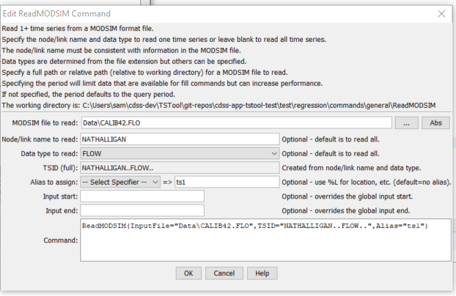

# TSTool / Command / ReadMODSIM #

*   [Overview](#overview)
*   [Command Editor](#command-editor)
*   [Command Syntax](#command-syntax)
*   [Examples](#examples)
*   [Troubleshooting](#troubleshooting)
*   [See Also](#see-also)

-------------------------

## Overview ##

The `ReadMODSIM` command reads one or more time series from a MODSIM file.
MODSIM is a node/link model used to simulate river basins
(see the [MODSIM Input Type Appendix](../../datastore-ref/MODSIM/MODSIM.md)).
Specify a node/link name and data type to read a single time series – if not
specified all time series from the file will be read.  An alias can be assigned to each time series.

## Command Editor ##

The command is available in the following TSTool menu:

*   ***Commands / Read Time Series***

The following dialog is used to edit the command and illustrates the syntax.
When a file is selected, the available data types are listed, based on the file extension (the types are not read from the file).

**<p style="text-align: center;">

</p>**

**<p style="text-align: center;">
`ReadMODSIM` Command Editor (<a href="../ReadMODSIM.png">see full-size image</a>)
</p>**

## Command Syntax ##

The command syntax is as follows:

```text
ReadMODSIM(Parameter="Value",...)
```
**<p style="text-align: center;">
Command Parameters
</p>**

|**Parameter**&nbsp;&nbsp;&nbsp;&nbsp;&nbsp;&nbsp;&nbsp;&nbsp;&nbsp;&nbsp;&nbsp;|**Description**|**Default**&nbsp;&nbsp;&nbsp;&nbsp;&nbsp;&nbsp;&nbsp;&nbsp;&nbsp;&nbsp;&nbsp;&nbsp;&nbsp;&nbsp;&nbsp;&nbsp;&nbsp;&nbsp;&nbsp;&nbsp;&nbsp;&nbsp;&nbsp;&nbsp;&nbsp;&nbsp;&nbsp;|
|--|--|--|
|`InputFile`<br>**required**|The name of the MODSIM file to read, surrounded by double quotes.  The path to the file can be absolute or relative to the working directory.|None – must be specified.|
|`TSID`<br>**required**|A time series identifier pattern to filter the read – this is constructed in the editor dialog from individual identifier parts – the location and data type are specified and used in the time series identifier.|None – must be specified to match a single time series.|
|`Alias`<br>**required**|The alias to assign to the time series, as a literal string or using the special formatting characters listed by the command editor.  The alias is a short identifier used by other commands to locate time series for processing, as an alternative to the time series identifier (`TSID`).|None – must be specified.|
|`InputStart`|The start of the period to read data – specify if the period should be different from the global query period.|Use the global query period.|
|`InputEnd`|The end of the period to read data – specify if the period should be different from the global query period.|Use the global query period.|

## Examples ##

See the [automated tests](https://github.com/OpenCDSS/cdss-app-tstool-test/tree/master/test/commands/ReadMODSIM).

A sample command file is as follows:

```text
ReadMODSIM(Alias=”BIGTOM”,InputFile="BIGTOM17.RES",TSID="GREELEYCBT..STOR_TRG..")
```

## Troubleshooting ##

See the main [TSTool Troubleshooting](../../troubleshooting/troubleshooting.md) documentation.

## See Also ##

*   [`ReadStateMod`](../ReadStateMod/ReadStateMod.md) command
*   [`ReadRiverWare`](../ReadRiverWare/ReadRiverWare.md) command
