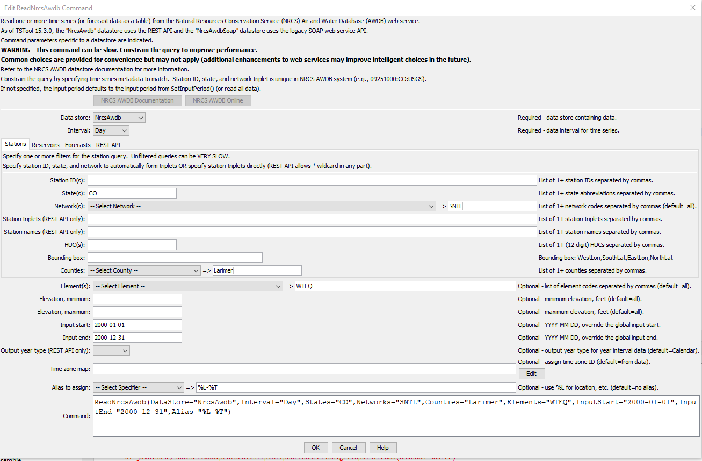
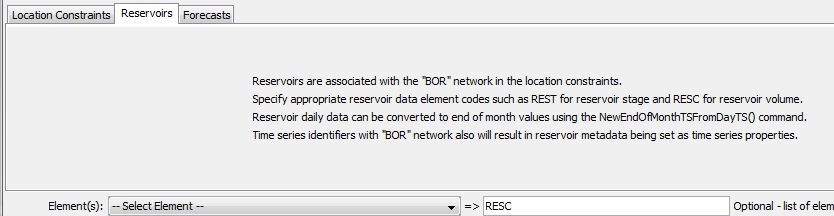
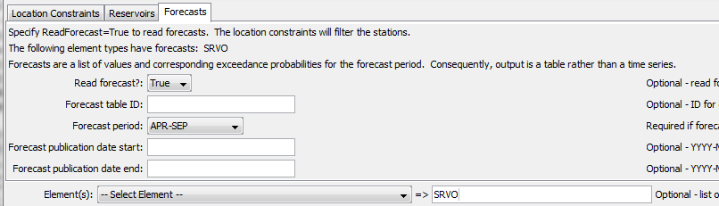

# TSTool / Command / ReadNrcsAwdb #

*   [Overview](#overview)
*   [Command Editor](#command-editor)
*   [Command Syntax](#command-syntax)
*   [Examples](#examples)
*   [Troubleshooting](#troubleshooting)
*   [See Also](#see-also)

-------------------------

## Overview ##

The `ReadNrcsAwdb` command reads one or more time series from the Natural Resources Conservation Service (NRCS)
Air and Water Database (AWDB) web service
(see the [NRCS AWDB Datastore Appendix](../../datastore-ref/NRCS-AWDB/NRCS-AWDB.md)),
including SNOTEL and Snow Course data and other data.
Data from other sources is available within the NRCS naming convention.
 
The NRCS AWDB web service allows station lists to be filtered,
both as a convenience and to ensure reasonable web service performance.
Many of the choices that are available for limiting queries allow 0+ values to be provided.
For example, specifying no requested element (data type) will return all available elements for a location.
Specifying a list of elements (separated by commas) will return only stations and time series that have data for the requested elements.

## Command Editor ##

The command is available in the following TSTool menu:

*   ***Commands / Read Time Series***

The following dialog is used to edit the command and illustrates the syntax for general parameters.

*   Some choices are provided as a convenience.  However, full listing of choices
    (such as all the thousands of HUCs) are not provided due to performance issues.
    Additional query features such as cascading choices may be enabled as web service integration is enhanced.
*   Querying many time series can be slow.
    It is recommended that filters be used to constrain the query,
    and then modify to converge on an appropriate set of filters for optimal performance.

**<p style="text-align: center;">

</p>**

**<p style="text-align: center;">
`ReadNrcsAwdb` Command Editor for General Command Parameters (<a href="../ReadNrcsAwdb.png">see also the full-size image</a>)
</p>**

The following figure illustrates the ***Reservoirs*** tab of the dialog.
No additional parameters are provided; however, the notes explain that reservoir data are
available only from the BOR network and appropriate network element codes must be selected.

**<p style="text-align: center;">

</p>**

**<p style="text-align: center;">
`ReadNrcsAwdb` Command Editor for Reservoir Query Parameters (<a href="../ReadNrcsAwdb_Reservoir.png">see also the full-size image</a>)
</p>**

The following figure illustrates the Forecasts tab of the dialog.
Forecasts are available for several element codes but mainly `SRVO` (stream volume, adjusted).
Because it is possible to read normal time series and forecasts,
the `ReadForecast` parameter is provided to specifically indicate that a forecast is being requested.
The forecast is uniquely identified by the forecast period and publication date (typically the first day of a month).

**<p style="text-align: center;">

</p>**

**<p style="text-align: center;">
`ReadNrcsAwdb` Command Editor for Forecast Query Parameters (<a href="../ReadNrcsAwdb_Forecast.png">see also the full-size image</a>)
</p>**

The resulting forecast table, as shown in the following figure,
includes all the relevant information about the forecast.
Use table processing commands to filter the table for a specific station and publication date.

**<p style="text-align: center;">

</p>**

**<p style="text-align: center;">
`ReadNrcsAwdb` Command Output Forecast Table (<a href="../ReadNrcsAwdb_ForecastTable.png">see also the full-size image</a>)
</p>**

## Command Syntax ##

The command syntax is as follows:

```text
ReadNrcsAwdb(Parameter="Value",...)
```
**<p style="text-align: center;">
Command Parameters
</p>**

|**Parameter**&nbsp;&nbsp;&nbsp;&nbsp;&nbsp;&nbsp;&nbsp;&nbsp;&nbsp;&nbsp;&nbsp;&nbsp;&nbsp;&nbsp;&nbsp;&nbsp;&nbsp;&nbsp;&nbsp;&nbsp;&nbsp;&nbsp;&nbsp;&nbsp;&nbsp;&nbsp;&nbsp;&nbsp;&nbsp;&nbsp;&nbsp;&nbsp;&nbsp;&nbsp;&nbsp;&nbsp;&nbsp;&nbsp;&nbsp;&nbsp;&nbsp;|**Description**|**Default**&nbsp;&nbsp;&nbsp;&nbsp;&nbsp;&nbsp;&nbsp;&nbsp;&nbsp;&nbsp;&nbsp;&nbsp;&nbsp;&nbsp;&nbsp;&nbsp;&nbsp;&nbsp;&nbsp;&nbsp;&nbsp;&nbsp;&nbsp;&nbsp;&nbsp;&nbsp;&nbsp;|
|--------------|-----------------|-----------------|
|`DataStore`<br>**required**|The NRCS AWDB datastore to use for queries.|None – must be specified.|
|`Interval`<br>**required**|The data interval (“duration” in NRCS AWDB terms) to query.   The Irregular interval is used for instantaneous data.|None – must be specified.|
|`Stations`|A list of station identifiers to read, separated by commas.|Do not limit the query to a station list.|
|`States`|A list of state codes (e.g., `AL`), separated by commas.|Do not limit the query to a state list.|
|`Networks`|A list of data network codes (e.g., `SNTL`), separated by commas.|Do not limit the query to a network list.|
|`HUCs`|A list of 8-digit hydrologic unit codes, separated by commas.|Do not limit the query to a HUC list.|
|`BoundingBox`|A bounding box consisting of west longitude, south latitude, east longitude, and north latitude, separated by spaces.  Longitudes in the western hemisphere are negative.  This feature is not finalized, pending resolution of a web service issue.|Do not limit the query to a bounding box.|
|`Counties`|A list of county names, separated by commas.  The state must be specified because county names are not unique.|Do not limit the query to a county list.|
|`ReadForecast`|Indicate whether forecast table should be read.|`False` (read observed time series)|
|`ForecastTableID`|The identifier for the output table.|`NRCS_Forecasts`|
|`ForecastPeriod`|The forecast period for a forecast, which is a string like `JAN-MAR`.  A list of choices is provided; however, only certain forecast periods will be valid for specific element codes.|Must be specified when `ReadForecast=True`.|
|`ForecastPublicationDateStart`|The earliest publication date for a forecast, needed to uniquely identify the time series.|All publication dates are queried.|
|`ForecastPublicationDateEnd`|The latest publication date for a forecast.|All publication dates are queried.|
|`Elements`|Data element codes for the stations (e.g., `WTEQ` for snow water equivalent), separated by commas.|All available elements are returned.|
|`ElevationMin`|Minimum station elevation, feet.|Do not limit the query based on elevation minimum.|
|`ElevationMax`|Maximum station elevation, feet.|Do not limit the query based on elevation maximum.|
|`InputStart`|The start of the period to read data – specify if the period should be different from the global query period.  Specify to the precision of the data using the format `YYYY-MM-DD hh:mm`.|Use the global query period.|
|`InputEnd`|The end of the period to read data – specify if the period should be different from the global query period.  Specify to the precision of the data using the format `YYYY-MM-DD hh:mm`.|Use the global query period.|
|`TimeZoneMap`|Indicate how to map the NRCS AWDB time zone to the output time series.  This is a simple time zone assignment, with no adjustment of date/time numerical values.  The `stationDataTimeZone` data value from station metadata indicates the time zone for time series data. For SNOTEL this is typically `8.0` (equivalent to Pacific Standard Time), regardless of station location, although Alaska stations use an offset for Alaska. |Specify the time zone map as:<br>`NrcsZone1:ZoneToUse1, NrcsZone2:ZoneToUse2`<br>for example:  `-8.0:PST` sets the time zone on time series date/time objects to `stationDataTimeZone` from the station metadata using format `GMT-8.0`. This ensures that the number does not get interpreted part of the date/time numeric values.||
|`Alias`<br>**required**|The alias to assign to the time series, as a literal string or using the special formatting characters listed by the command editor.  The alias is a short identifier used by other commands to locate time series for processing, as an alternative to the time series identifier (`TSID`).|None – must be specified.|

## Examples ##

See the [automated tests](https://github.com/OpenCDSS/cdss-app-tstool-test/tree/master/test/commands/ReadNrcsAwdb).

## Troubleshooting ##

## See Also ##

*   [`WebGet`](../WebGet/WebGet.md) command, use to test web service queries
