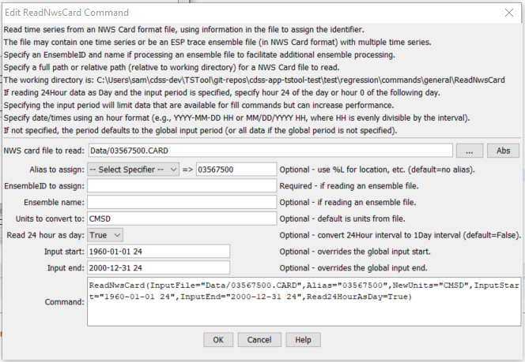
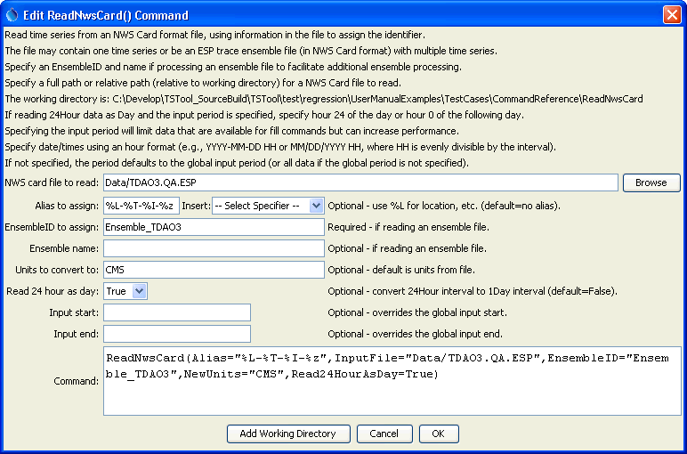

# TSTool / Command / ReadNwsCard #

*   [Overview](#overview)
*   [Command Editor](#command-editor)
*   [Command Syntax](#command-syntax)
*   [Examples](#examples)
*   [Troubleshooting](#troubleshooting)
*   [See Also](#see-also)

-------------------------

## Overview

**The NWS Card format is an older format that will likely be phased out in the future.**

The `ReadNwsCard` command reads all the time series in a National Weather Service River Forecast System CARD file
(see the [NWSCard Input Type Appendix](../../datastore-ref/NWSCard/NWSCard.md)).
This command can be used to read the following formats:

*   Single time series format.
*   Ensemble format file, such as generated by the National Weather Service ESPADP software.
    Each trace will be identified using the historical year for the start of
    the trace (as the TSID sequence number), and will be available as a time series for other commands.

The full time series identifier for each time series is set using location = station identifier,
data source = blank, data type = data type,
and data interval = data interval from file header (see also the `Read24HourAsDay` parameter below).

## Command Editor

The command is available in the following TSTool menu:

*   ***Commands / Read Time Series***

The following dialog is used to edit the command and illustrates the syntax for the command when reading a single time series.

**<p style="text-align: center;">

</p>**

**<p style="text-align: center;">
`ReadNwsCard` Command Editor for Reading a Single Time Series (<a href="../ReadNwsCard_SingleAlias.png">see also the full-size image</a>)
</p>**

The following dialog illustrates reading an ensemble file, assigning the alias to `Location-DataType-Interval-TraceNumber`.

**<p style="text-align: center;">

</p>**

**<p style="text-align: center;">
`ReadNwsCard` Command Editor for Reading an Ensemble (<a href="../ReadNwsCard.png">see also the full-size image</a>)
</p>**

## Command Syntax

The command syntax is as follows:

```text
ReadNwsCard(Parameter="Value",...)
```

The following older command syntax is updated to the above syntax when a command file is read:

```text
TS Alias = ReadNwsCard(Parameter=Value,...)
```

**<p style="text-align: center;">
Command Parameters
</p>**

|**Parameter**&nbsp;&nbsp;&nbsp;&nbsp;&nbsp;&nbsp;&nbsp;&nbsp;&nbsp;&nbsp;&nbsp;&nbsp;&nbsp;&nbsp;&nbsp;&nbsp;&nbsp;&nbsp;&nbsp;&nbsp;&nbsp;&nbsp;&nbsp;&nbsp;&nbsp;|**Description**|**Default**&nbsp;&nbsp;&nbsp;&nbsp;&nbsp;&nbsp;&nbsp;&nbsp;&nbsp;&nbsp;&nbsp;&nbsp;&nbsp;&nbsp;&nbsp;&nbsp;&nbsp;&nbsp;&nbsp;&nbsp;&nbsp;&nbsp;&nbsp;&nbsp;&nbsp;&nbsp;&nbsp;|
|--------------|-----------------|-----------------|
|` InputFile` | The name of the NWS Card input file to read, surrounded by double quotes to protect spaces and other special characters. | None – must be specified. |
|` Alias` | The alias to assign to the time series, as a literal string or using the special formatting characters listed by the command editor.  The alias is a short identifier used by other commands to locate time series for processing, as an alternative to the time series identifier (TSID). | None – must be specified. |
|` EnsembleID` | Specify when reading an ensemble file to cause an ensemble object to be created, which can be referenced by other commands. | Do not create an ensemble object. |
|` EnsembleName` | The ensemble name corresponding to `EnsembleID`. | None. |
|` NewUnits` | The units to convert to after the read. | Do not convert the units. |
|` Read24HourAsDay` | If `True`, read 24Hour time series as if the data were Day interval.  Because NWS Card format uses hours 1 to 24, treating as 24Hour results in values being saved at hour zero of the next day.  Reading as Day interval causes the values to be stored without the shift. | `False` – read as hourly and shift data at hour 24 to zero of the next day. |
|` InputStart` | Not used with ensembles.  The start of the period to read – specify if the read period should be different from the global query period.  If `Read24HourAsDay=True`, specify the period using either hour 24 of the start day, or hour 0 of the next day.  This parameter must be specified to hour precision with hour’s aligning with the file’s data. | Use the global input period or if not specified read all the data in the file. |
|` InputEnd` | Not used with ensembles.  The end of the period to read – specify if the read period should be different from the global query period.  If `Read24HourAsDay=True`, specify the period using either hour 24 of the start day, or hour 0 of the next day.  This parameter must be specified to hour precision | Use the global input period or if not specified read all the data in the file. |

## Examples ##

See the [automated tests](https://github.com/OpenCDSS/cdss-app-tstool-test/tree/master/test/commands/ReadNwsCard).

The following command file reads a card file containing one time series, reading 24Hour data as Day:

```
ReadNwsCard(Alias=”03567500”,InputFile="Data\03567500.CARD",InputStart="1960-01-01 24",InputEnd="2005-12-31 24",Read24HourAsDay=True)
```

The following example command reads an ensemble file, converts the data (from `CFS`) to `CMS`, and reads `24Hour` data as `Day`:

```
ReadNwsCard(InputFile="Data/TDAO3.QA.ESP",EnsembleID="Ensemble_TDAO3",NewUnits="CMS",Read24HourAsDay=True)
```

## Troubleshooting

## See Also

*   [`WriteNwsCard`](../WriteNwsCard/WriteNwsCard.md) command
