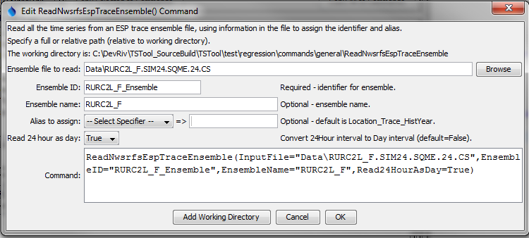

# TSTool / Command / ReadNwsrfsEspTraceEnsemble #

*   [Overview](#overview)
*   [Command Editor](#command-editor)
*   [Command Syntax](#command-syntax)
*   [Examples](#examples)
*   [Troubleshooting](#troubleshooting)
*   [See Also](#see-also)

-------------------------

## Overview ##

The `ReadNwsrfsEspTraceEnsemble` command reads all the time series traces in a National Weather Service River Forecast System (NWSRFS) ESP Trace Ensemble file
(see the [NWSRFS ESP Trace Ensemble Input Type Appendix](../../datastore-ref/NWSRFSEspTraceEnsemble/NWSRFSEspTraceEnsemble.md)).
Currently, only conditional (CS) files may be read.
Each trace is converted to a separate time series, with each having the same header information.
The sequence identifier (trace number) in the time series is set to the historical
year for the start of the trace and the alias can be set dynamically to uniquely identify each trace.

## Command Editor ##

The command is available in the following TSTool menu:

*   ***Commands / Ensemble Processing***

The following dialog is used to edit the command and illustrates the syntax for the command when reading a single time series.

**<p style="text-align: center;">

</p>**

**<p style="text-align: center;">
`ReadNwsrfsEspTraceEnsemble` Command Editor (<a href="../ReadNwsrfsEspTraceEnsemble.png">see also the full-size image</a>)
</p>**

## Command Syntax ##

The command syntax is as follows:

```text
ReadNwsrfsEspTraceEnsemble(Parameter="Value",...)
```

**<p style="text-align: center;">
Command Parameters
</p>**

|**Parameter**&nbsp;&nbsp;&nbsp;&nbsp;&nbsp;&nbsp;&nbsp;&nbsp;&nbsp;&nbsp;&nbsp;&nbsp;&nbsp;&nbsp;&nbsp;&nbsp;&nbsp;&nbsp;&nbsp;&nbsp;&nbsp;&nbsp;&nbsp;&nbsp;&nbsp;|**Description**|**Default**&nbsp;&nbsp;&nbsp;&nbsp;&nbsp;&nbsp;&nbsp;&nbsp;&nbsp;&nbsp;&nbsp;&nbsp;&nbsp;&nbsp;&nbsp;&nbsp;&nbsp;&nbsp;&nbsp;&nbsp;&nbsp;&nbsp;&nbsp;&nbsp;&nbsp;&nbsp;&nbsp;|
|--------------|-----------------|-----------------|
| `InputFile` | The name of the ensemble file to read, surrounded by double quotes. | None – must be specified. |
| `EnsembleID` | The identifier for the ensemble that is read.  This identifier is used by other commands that process ensembles. | None – must be specified. |
| `EnsembleName` | The descriptive name of the ensemble that is read. | Blank. |
| `Alias` | The alias to be assigned to each trace in the ensemble.  The string can include:<ul><li> `%` specifiers from the `LegendFormat` property (see the TSView Time Series Viewing Tools appendix).</li><li> `${Property}` strings, where Property is a value set internally by the command processor (more documentation will be provided in the future) or with the [`SetProperty`](../SetProperty/SetProperty.md) command.  This approach is useful if the TSTool command file is dynamically created with a script.</li><li> Any literal characters. | `Location_Trace_Year`, where Location is the location identifier and Year is the starting historical year for each trace. |
| `Read24HourAsDay` | Indicate whether a 24Hour interval ensemble should be read as day interval (`True`) or not (`False`).  The day is set as follows:<ul><li> If the original hour is 0, the original day is decremented.</li><li> If the original hour is not 0, the original day is used.</li></ul> | `False` |

## Examples ##

See the [automated tests](https://github.com/OpenCDSS/cdss-app-tstool-test/tree/master/test/commands/ReadNwsrfsEspTraceEnsemble).

A sample command file is as follows, which will use the location identifier and sequence identifier (historical year) in the alias:

```
ReadNwsrfsEspTraceEnsemble(InputFile="Data\CSCI.CSCI2.SQIN.06.CS",EnsembleID="Ensemble_CSCI2",EnsembleName="test ensemble",Alias="%L_%z_Baseline")
```

## Troubleshooting ##

## See Also ##

*   [`WriteNwsrfsEspTraceEnsemble`](../WriteNwsrfsEspTraceEnsemble/WriteNwsrfsEspTraceEnsemble.md) command
