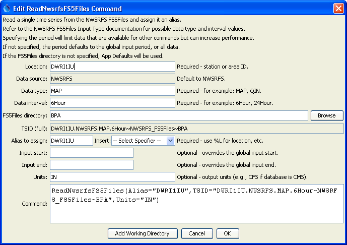

# TSTool / Command / ReadNwsrfsFS5Files #

* [Overview](#overview)
* [Command Editor](#command-editor)
* [Command Syntax](#command-syntax)
* [Examples](#examples)
* [Troubleshooting](#troubleshooting)
* [See Also](#see-also)

-------------------------

## Overview ##

The `ReadNwsrfsFS5Files` command reads a single time series from an NWSRFS FS5Files database
(see the [NWSRFS FS5Files Input Type Appendix](../../datastore-ref/NWSRFS-FS5Files/NWSRFS-FS5Files.md)) and assigns an alias to the result.

## Command Editor ##

The following dialog is used to edit the command and illustrates the syntax:

**<p style="text-align: center;">

</p>**

**<p style="text-align: center;">
`ReadNwsrfsFS5Files` Command Editor (<a href="../ReadNwsrfsFS5Files.png">see also the full-size image</a>)
</p>**

## Command Syntax ##

The command syntax is as follows:

```text
ReadNwsrfsFS5Files(Parameter="Value",...)
```

**<p style="text-align: center;">
Command Parameters
</p>**

|**Parameter**&nbsp;&nbsp;&nbsp;&nbsp;&nbsp;&nbsp;&nbsp;&nbsp;&nbsp;&nbsp;&nbsp;&nbsp;&nbsp;&nbsp;&nbsp;&nbsp;&nbsp;&nbsp;&nbsp;&nbsp;&nbsp;&nbsp;&nbsp;&nbsp;&nbsp;|**Description**|**Default**&nbsp;&nbsp;&nbsp;&nbsp;&nbsp;&nbsp;&nbsp;&nbsp;&nbsp;&nbsp;&nbsp;&nbsp;&nbsp;&nbsp;&nbsp;&nbsp;&nbsp;&nbsp;&nbsp;&nbsp;&nbsp;&nbsp;&nbsp;&nbsp;&nbsp;&nbsp;&nbsp;|
|--------------|-----------------|-----------------|
| `TSID` | A time series identifier to read – see the [NWSRFS FS5Files Input Type Appendix](../../datastore-ref/NWSRFS-FS5Files/NWSRFS-FS5Files.md).  The input name for the time series identifier will agree with how the NWSRFS FS5Files were specified.  For example if Apps Defaults are used, the input name will be omitted.  If a directory is specified, it can be an absolute path or can be relative to the working directory (location of the command file). |  |
| `Alias` | The alias to assign to the time series, as a literal string or using the special formatting characters listed by the command editor.  The alias is a short identifier used by other commands to locate time series for processing, as an alternative to the time series identifier (TSID). | None – must be specified. |
| `InputStart` | The start of the period to read data – specify if the period should be different from the global query period. | Use the global query period. |
| `InputEnd` | The end of the period to read data – specify if the period should be different from the global query period. | Use the global query period. |
| `Units` | The data units to be returned.  The units must be specified compatible with the database units to allow for the conversion. | Use the database units, which typically are SI units. |

## Examples ##

See the [automated tests](https://github.com/OpenCDSS/cdss-app-tstool-test/tree/master/test/regression/commands/general/ReadNwsrfsFS5Files).

A sample command file is as follows:

```
ReadNwsrfsFS5Files(Alias=”x”,TSID="DWRI1IU.NWSRFS.MAP.6Hour~NWSRFS_FS5Files~Data_BPA",Units="IN")
```

## Troubleshooting ##

## See Also ##
