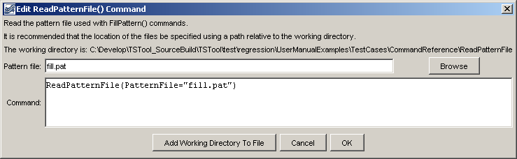

# TSTool / Command / ReadPatternFile #

*   [Overview](#overview)
*   [Command Editor](#command-editor)
*   [Command Syntax](#command-syntax)
*   [Examples](#examples)
*   [Troubleshooting](#troubleshooting)
*   [See Also](#see-also)

-------------------------

## Overview ##

The `ReadPatternFile` command reads pattern time series to be used with
[`FillPattern`](../FillPattern/FillPattern.md) command.
The patterns indicate whether a month is wet, dry, or average, although any number of characterizations can be used.
One or more patterns can be included in each pattern file, similar to StateMod time series files
(see the [StateMod Input Type appendix](../../datastore-ref/StateMod/StateMod.md)).
Multiple pattern files can be used, if appropriate.
The following example illustrates the file format.
See also the [`AnalyzePattern`](../AnalyzePattern/AnalyzePattern.md) command, which can be used to generate the file.

```
#  Years Shown = Water Years
#  Missing monthly data filled by the Mixed Station Method, USGS 1989
#  Time series identifier         = 09034500.CRDSS_USGS.QME.MONTH.1
#  Description                    = COLORADO RIVER AT HOT SULPHUR SPRINGS, CO.
# -e-b----------eb------eb------eb------eb------eb------eb------eb------eb------eb------eb------eb------eb------eb--------e
   10/1908  -      9/1996 ACFT  WYR
1909 09034500         AVG     AVG     AVG     WET     WET     AVG     AVG     AVG     WET     WET     WET     WET
1910 09034500         WET     WET     WET     WET     WET     WET     AVG     AVG     AVG     AVG     AVG     AVG
1911 09034500         AVG     AVG     WET     AVG     AVG     AVG     AVG     WET     WET     WET     AVG     WET
1912 09034500         WET     WET     WET     WET     WET     AVG     AVG     WET     WET     WET     WET     WET
...ommitted...
```

## Command Editor ##

The command is available in the following TSTool menu:

*   ***Commands / Fill Time Series Missing Data***

The following dialog is used to edit the command and illustrates the syntax of the command.

**<p style="text-align: center;">

</p>**

**<p style="text-align: center;">
`ReadPatternFile` Command Editor (<a href="../ReadPatternFile.png">see also the full-size image</a>)
</p>**

## Command Syntax ##

The command syntax is as follows:

```text
ReadPatternFile(Parameter="Value",...)
```
**<p style="text-align: center;">
Command Parameters
</p>**

|**Parameter**&nbsp;&nbsp;&nbsp;&nbsp;&nbsp;&nbsp;&nbsp;&nbsp;&nbsp;&nbsp;&nbsp;|**Description**|**Default**&nbsp;&nbsp;&nbsp;&nbsp;&nbsp;&nbsp;&nbsp;&nbsp;&nbsp;&nbsp;&nbsp;&nbsp;&nbsp;&nbsp;&nbsp;&nbsp;&nbsp;&nbsp;&nbsp;&nbsp;&nbsp;&nbsp;&nbsp;&nbsp;&nbsp;&nbsp;&nbsp;|
|--------------|-----------------|-----------------|
|`PatternFile`<br>**required**|The path to the pattern file, which can be absolute or relative to the working directory.|None – must be specified.|

## Examples ##

See the [automated tests](https://github.com/OpenCDSS/cdss-app-tstool-test/tree/master/test/commands/ReadPatternFile).

## Troubleshooting ##

See the main [TSTool Troubleshooting](../../troubleshooting/troubleshooting.md) documentation.

## See Also ##

*   [`FillPattern`](../FillPattern/FillPattern.md) command
*   [`AnalyzePattern`](../AnalyzePattern/AnalyzePattern.md) command
