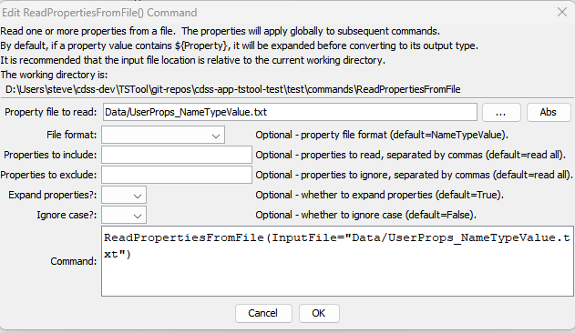

# TSTool / Command / ReadPropertiesFromFile #

* [Overview](#overview)
* [Command Editor](#command-editor)
* [Command Syntax](#command-syntax)
* [Examples](#examples)
* [Troubleshooting](#troubleshooting)
* [See Also](#see-also)

-------------------------

## Overview ##

The `ReadPropertiesFromFile` command reads the values of one or more time series processor properties from a file.
The corresponding [`WritePropertiesToFile`](../WritePropertiesToFile/WritePropertiesToFile.md)
command can be used to write properties to a file.
Processor properties include global defaults such as `InputStart`, `InputEnd`,
`OutputStart`, `OutputEnd`, `OutputYearType`, `WorkingDir`,
and also user-defined properties set with the [`SetProperty`](../SetProperty/SetProperty.md) command.
Internally, properties have a name and a value, which is of a certain type
(string, integer, date/time, etc.).  Examples of using the command include:

* creating tests to verify that properties are being set
* passing information from TSTool to another program, such as a Python script
* storing persistent information for later use, such as the date/time that data were last downloaded from a web service

A number of property formats are supported as listed in the following table.

**<p style="text-align: center;">
Property File Formats
</p>**

| **Format**&nbsp;&nbsp;&nbsp;&nbsp;&nbsp;&nbsp;&nbsp;&nbsp;&nbsp;&nbsp;&nbsp;&nbsp;&nbsp;&nbsp;&nbsp;&nbsp;&nbsp;&nbsp;&nbsp;&nbsp;&nbsp;&nbsp;&nbsp;&nbsp;&nbsp;&nbsp;&nbsp;&nbsp;&nbsp; | **Description** |
|-----------------------|-----------------|
| `NameValue`           | Simple format, all properties handled as text:<br><br>`PropertyName=PropertyValue`<br>`PropertyName="Property value, quoted if necessary"` |
| `NameTypeValue`       | Same as `NameValue` format, with non-primitive objects treated as simple constructors:<br><br>`PropertyName=PropertyValue`<br>`DateTimeProperty=DateTime("2010-10-01 12:30")`|
| `NameTypeValuePython` | Similar to the `NameTypeValue` format; however, objects are represented using “Pythonic” notation, to allow the file to be used directly by Python scripts:<br><br>`PropertyName="PropertyValue"`<br>`DateTimeProperty=DateTime(2010,10,1,12,30)` |

The format of the file currently is not required when reading the file because
the command detects the format for each property and creates an appropriate object type. 

## Command Editor ##

The following dialog is used to edit the command and illustrates the command syntax.

**<p style="text-align: center;">

</p>**

**<p style="text-align: center;">
`ReadPropertiesFromFile` Command Editor (<a href="../ReadPropertiesFromFile.png">see also the full-size image</a>)
</p>**

## Command Syntax ##

The command syntax is as follows:

```text
ReadPropertiesFromFile(Parameter="Value",...)
```
**<p style="text-align: center;">
Command Parameters
</p>**

| **Parameter**&nbsp;&nbsp;&nbsp;&nbsp;&nbsp;&nbsp;&nbsp;&nbsp;&nbsp;&nbsp;&nbsp;&nbsp;&nbsp;&nbsp;&nbsp;&nbsp;&nbsp;&nbsp;&nbsp;&nbsp;&nbsp;&nbsp;&nbsp;&nbsp;&nbsp;&nbsp; | **Description** | **Default**&nbsp;&nbsp;&nbsp;&nbsp;&nbsp;&nbsp;&nbsp;&nbsp;&nbsp;&nbsp; |
| --------------|-----------------|----------------- |
|`InputFile`<br>**required**|The property file to read, as an absolute path or relative to the command file.  Can be specified using `${Property}`.|None – must be specified.|
|`FileFormat`|Format of the properties file (see descriptions in the above Property File Formats table):<ul><li>`NameValue`</li><li>`NameTypeValue`</li><li>`NameTypeValuePython`</li></ul>|`NameValue`|
|`IncludeProperty`|The names of properties to read, separated by commas.  Can be specified using `${Property}`.|If not specified, all processor properties will be written.|

## Examples ##

See the [automated tests](https://github.com/OpenCDSS/cdss-app-tstool-test/tree/master/test/commands/ReadPropertiesFromFile).

## Troubleshooting ##

## See Also ##

* [`SetProperty`](../SetProperty/SetProperty.md) command
* [`SetPropertyFromTimeSeries`](../SetPropertyFromTimeSeries/SetPropertyFromTimeSeries.md) command
* [`WritePropertiesToFile`](../WritePropertiesToFile/WritePropertiesToFile.md) command
