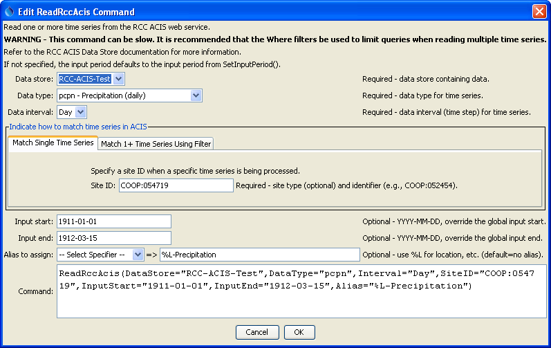
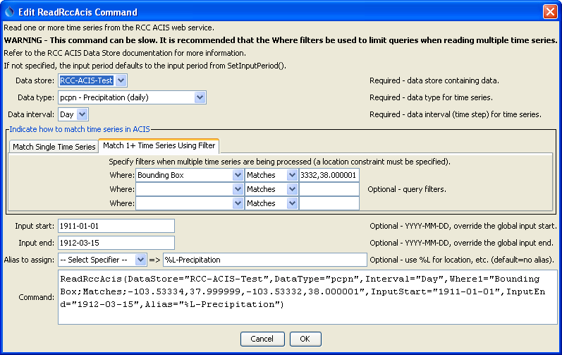

# TSTool / Command / ReadRccAcis #

* [Overview](#overview)
* [Command Editor](#command-editor)
* [Command Syntax](#command-syntax)
* [Examples](#examples)
* [Troubleshooting](#troubleshooting)
* [See Also](#see-also)

-------------------------

## Overview ##

The `ReadRccAcis` command reads one or more time series from the
Regional Climate Center (RCC) Applied Climate Information System (ACIS) web services,
in particular to provide access to daily historical and real-time values from the National Climatic Data Center (NCDC).
Features and limitations of ACIS are described in the [RCC ACIS Data Store appendix](../../datastore-ref/RCC-ACIS/RCC-ACIS.md).
Because web services are used to access a remote database, there may be some delay in retrieving data.
For data intensive processes, it may be advisable to mine the data, save to a local file or database,
and then perform additional processing using the local data.

## Command Editor ##

The following dialog is used to edit the command and illustrates the syntax of the command for reading a single time series.



**<p style="text-align: center;">
`ReadRccAcis` Command Editor for Reading a Single Time Series (<a href="../ReadRccAcis_Single.png">see also the full-size image</a>)
</p>**

The following dialog is used to edit the command and illustrates the
syntax for the command when reading multiple time series.
This is appropriate when performing bulk processing.
Mouse over the ***Where*** data entry fields to see information about choices.



**<p style="text-align: center;">
`ReadRccAcis` Command Editor for Reading Multiple Time Series (<a href="../ReadRccAcis_Multiple.png">see also the full-size image</a>)
</p>**

## Command Syntax ##

The command syntax is as follows:

```text
ReadRccAcis(Parameter="Value",...)
```
**<p style="text-align: center;">
Command Parameters
</p>**

|**Parameter**&nbsp;&nbsp;&nbsp;&nbsp;&nbsp;&nbsp;&nbsp;&nbsp;&nbsp;&nbsp;&nbsp;|**Description**|**Default**&nbsp;&nbsp;&nbsp;&nbsp;&nbsp;&nbsp;&nbsp;&nbsp;&nbsp;&nbsp;&nbsp;&nbsp;&nbsp;&nbsp;&nbsp;&nbsp;&nbsp;&nbsp;&nbsp;&nbsp;&nbsp;&nbsp;&nbsp;&nbsp;&nbsp;&nbsp;&nbsp;|
|--------------|-----------------|-----------------|
|`DataStore`<br>**required**|The name of the RCC ACIS data store from which to read. |None – must be specified.|
|`DataType`<br>**required**|The data type to be queried, as documented in the [RCC ACIS Data Store appendix](../../datastore-ref/RCC-ACIS/RCC-ACIS.md).  For example, use `pcpn` to request precipitation data (for the older version 1 ACIS, the “Variable Major” number is used, for example `4` for precipitation).|None – must be specified.|
|`Interval`<br>**required**|The data interval for the time series.  Currently only daily time series can be requested.|None – must be specified.|
|`SiteID`|Used when reading a single time series.  The site ID should be specified using the station type and site identifier (e.g., `COOP:052454`).  The station type can be determined by first querying the time series using the TSTool main interface or using the WhereN parameter and reviewing the resulting time series identifiers in returned time series.  Omitting the station type will assume the ACIS identifier, which is internal to the ACIS system and not typically used by users.  Specifying the `SiteID` will override the `WhereN` parameter.|If not specified, the `WhereN` filters are used.|
|`WhereN`|Used when reading 1+ time series.  The “where” clauses to be applied to filter the list of stations, matching the values in the Where fields in the command editor dialog and the TSTool main interface.  The parameters should be named `Where1`, `Where2`, etc., and a gap in numbering will result in the remaining items being ignored.  The format of each value is:<br>`Item;Operator;Value`<br>where `Item` indicates a data field to be filtered on, `Operator` is the type of constraint, and `Value` is the value to be checked when querying.|If not specified, the query will not be limited and very large numbers of time series may be queried.|
|`InputStart`|Start of the period to query, specified as a date/time with a precision that matches the requested data interval.|Read all available data.|
|`InputEnd`|End of the period to query, specified as a date/time with a precision that matches the requested data interval.|Read all available data.|
|`Alias`<br>**required**|The alias to assign to the time series, as a literal string or using the special formatting characters listed by the command editor.  The alias is a short identifier used by other commands to locate time series for processing, as an alternative to the time series identifier (`TSID`).|None – must be specified.|

## Examples ##

See the [automated tests](https://github.com/OpenCDSS/cdss-app-tstool-test/tree/master/test/regression/commands/general/ReadRccAcis).

## Troubleshooting ##

## See Also ##

