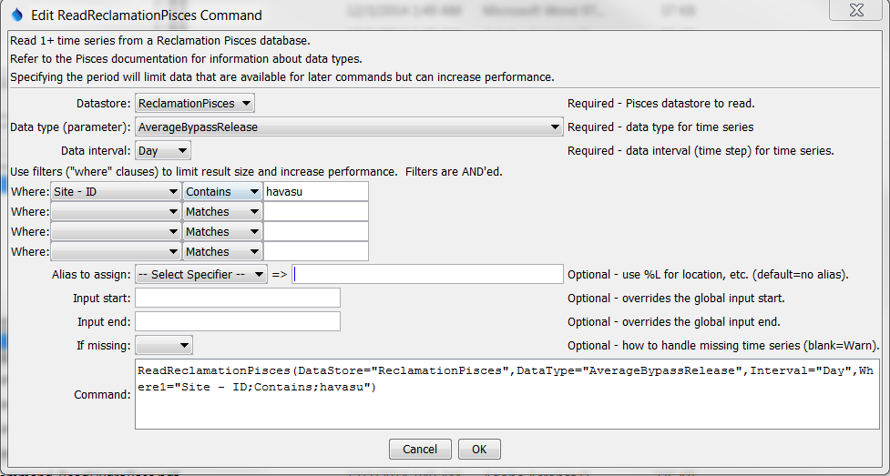

# TSTool / Command / ReadReclamationPisces #

*   [Overview](#overview)
*   [Command Editor](#command-editor)
*   [Command Syntax](#command-syntax)
*   [Examples](#examples)
*   [Troubleshooting](#troubleshooting)
*   [See Also](#see-also)

-------------------------

## Overview ##

The `ReadReclamationPisces` command reads one or more time series from the US Bureau of Reclamation Pisces database
(see the [Reclamation Pisces Datastore Appendix](../../datastore-ref/ReclamationPisces/ReclamationPisces.md)).
It is designed to utilize query criteria to process large numbers of time series,
for example for a specific location and parameter type.

The ***Data type***, ***Data interval***, and ***Where*** command parameters and input fields are similar to
those from the main TSTool interface.
However, whereas the main TSTool interface first requires a query to find the matching time series list
and then an interactive select for specific time series identifiers,
the `ReadReclamationPisces` command reads the time series in bulk.
This can greatly shorten command files and simplify command logic, especially when processing many time series. 

## Command Editor ##

The command is available in the following TSTool menu:

*   ***Commands / Read Time Series***

The following dialog is used to edit the command and illustrates the syntax of the command.

**<p style="text-align: center;">

</p>**

**<p style="text-align: center;">
`ReadReclamationPisces` Command Editor (<a href="../ReadReclamationPisces.png">see also the full-size image</a>)
</p>**

## Command Syntax ##

The command syntax is as follows:

```text
ReadReclamationPisces(Parameter="Value",...)
```
**<p style="text-align: center;">
Command Parameters
</p>**

|**Parameter**&nbsp;&nbsp;&nbsp;&nbsp;&nbsp;&nbsp;&nbsp;&nbsp;&nbsp;&nbsp;&nbsp;|**Description**|**Default**&nbsp;&nbsp;&nbsp;&nbsp;&nbsp;&nbsp;&nbsp;&nbsp;&nbsp;&nbsp;&nbsp;&nbsp;&nbsp;&nbsp;&nbsp;&nbsp;&nbsp;&nbsp;&nbsp;&nbsp;&nbsp;&nbsp;&nbsp;&nbsp;&nbsp;&nbsp;&nbsp;|
|--------------|-----------------|-----------------|
|`DataStore`<br>**required**|The Reclamation Pisces datastore name to use for the database connection, as per datastore configuration.|None – must be specified.|
|`DataType`<br>**required**|The data type (Pisces parameter) to be queried.|None – must be specified.|
|`Interval`<br>**required**|The data interval for the time series, consistent with the ***DataType*** selection.|None – must be specified.|
|`WhereN`|When reading 1+ time series, the “where” clauses to be applied.  The filters match the values in the Where fields in the command editor dialog and the TSTool main interface.  The parameters should be named `Where1`, `Where2`, etc., with a gap resulting in the remaining items being ignored.  The format of each value is:<br>`“Item;Operator;Value”`<br>Where `Item` indicates a data field to be filtered on, `Operator` is the type of constraint, and `Value` is the value to be checked when querying.|If not specified, the query will not be limited and very large numbers of time series may be queried.|
|`InputStart`|Start of the period to query, specified as a date/time with a precision that matches the requested data interval.  Can be specified using `${Property}` notation.|Read all available data.|
|`InputEnd`|End of the period to query, specified as a date/time with a precision that matches the requested data interval.  Can be specified using `${Property}` notation.|Read all available data.|
|`Alias`|The alias to assign to the time series, as a literal string or using the special formatting characters listed by the command editor.  The alias is a short identifier used by other commands to locate time series for processing, as an alternative to the time series identifier (TSID).|No alias will be assigned.|
|`IfMissing`|Indicate the action to be taken if the requested time series is missing, one of:<br><ul><li>`Ignore` – ignore the time series (do not warn and the time series will not be available)</li><li>`Warn` – generate a failure for the command</li></ul>|`Warn`|

## Examples ##

See the [automated tests](https://github.com/OpenCDSS/cdss-app-tstool-test/tree/master/test/commands/ReadReclamationPisces).

## Troubleshooting ##

See the main [TSTool Troubleshooting](../../troubleshooting/troubleshooting.md) documentation.

## See Also ##

*   [`ReadReclamationHDB`](../ReadReclamationHDB/ReadReclamationHDB.md) command
