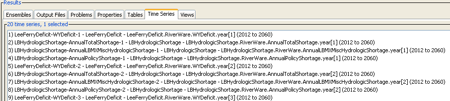
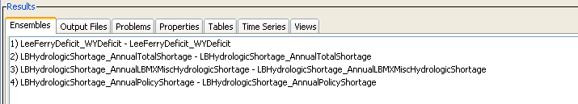
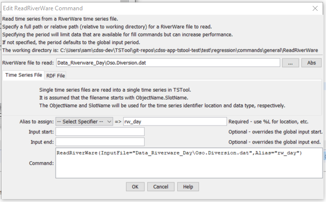
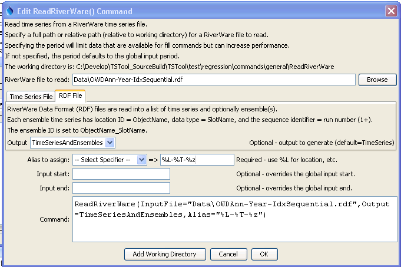

# TSTool / Command / ReadRiverWare #

* [Overview](#overview)
* [Command Editor](#command-editor)
* [Command Syntax](#command-syntax)
* [Examples](#examples)
* [Troubleshooting](#troubleshooting)
* [See Also](#see-also)

-------------------------

## Overview ##

The `ReadRiverWare` command reads time series from a RiverWare file (see the
[RiverWare Input Type Appendix](../../datastore-ref/RiverWare/RiverWare.md)) and assigns an alias to the result.
Two types of RiverWare time series files can be read:

### 1. Single time series format used with DMI slot input (`*.dat` files), similar to the following: ###

```
start_date: 1969-10-01 24:00
end_date: 2006-09-30 24:00
timestep: 1 DAY
units: cfs
scale: 1
0
...
```
These files assume that the filename starts with `ObjectName.SlotName`.
The `ObjectName` is used for the time series identifier location and the
`SlotName` is used for the time series data type,
with other time series metadata coming from the first lines in the file.

### 2. RiverWare Data Format (RDF) file

See:  [RiverWare Technical Documentation - Output](http://www.riverware.org/PDF/RiverWare/documentation/Output.pdf),
which can store1+ time series, including multiple runs and multiple slots for each run.
Time series are treated as ensemble traces if `idx_sequential = 1` or `number_of_runs > 0` in the file,
in which case the individual time series will have a sequence identifier corresponding to the run number.
The `Output` command parameter can be used to indicate whether the results of the
command are a list of time series or a list of time series and ensembles.
Properties read from the file are set as properties on each time series.
If ensembles are read, the ensemble identifier and name are both set to `ObjectName_SlotName`.
Because each time series in the ensemble has location identifier `ObjectName` and data type `SlotName`,
the relationship between time series and ensembles is clear.
Additional guidelines for handling ensembles include:

1. Date/times in the file generally follow the form `YYYY-MM-DD hh:mm`.
 Month, day, hour, and minute can be 1 or 2 digits.
TSTool uses hour 0-23; consequently, for hour timestep,
any times specified at hour 24 are converted to hour 0 of the next day.
2. For ensembles (overlapping time series),
the run start and end for all runs must be the same.
Data are treated as sequential.
How are leap years handled in the data array (assume sequential based on the specified overlapping run period)?

See the following figure for examples of TSTool time series results when reading RDF ensembles.



**<p style="text-align: center;">
`ReadRiverWare` Ensemble Time Series Results (<a href="../ReadRiverWare_RDF_TimeSeries.png">see also the full-size image</a>)
</p>**

See the following figure for examples of TSTool ensemble results when reading RDF ensembles.



**<p style="text-align: center;">
`ReadRiverWare` Ensemble Results (<a href="../ReadRiverWare_RDF_Ensembles.png">see also the full-size image</a>)
</p>**

## Command Editor ##

The following dialog is used to edit the command and illustrates the command syntax for a single time series `*.dat` file:



**<p style="text-align: center;">
`ReadRiverWare` Command Editor (<a href="../ReadRiverWare.png">see also the full-size image</a>)
</p>**

The following dialog is used to edit the command and illustrates the command syntax for an RDF file:



**<p style="text-align: center;">
`ReadRiverWare` Command Editor for RDF (<a href="../ReadRiverWare_RDF.png">see also the full-size image</a>)
</p>**

## Command Syntax ##

The command syntax is as follows:

```text
ReadRiverWare(Parameter="Value",...)
```
**<p style="text-align: center;">
Command Parameters
</p>**

|**Parameter**&nbsp;&nbsp;&nbsp;&nbsp;&nbsp;&nbsp;&nbsp;&nbsp;&nbsp;&nbsp;&nbsp;|**Description**|**Default**&nbsp;&nbsp;&nbsp;&nbsp;&nbsp;&nbsp;&nbsp;&nbsp;&nbsp;&nbsp;&nbsp;&nbsp;&nbsp;&nbsp;&nbsp;&nbsp;&nbsp;&nbsp;&nbsp;&nbsp;&nbsp;&nbsp;&nbsp;&nbsp;&nbsp;&nbsp;&nbsp;|
|--------------|-----------------|-----------------|
|`InputFile`<br>**required**|The name of the RiverWare file to read, surrounded by double quotes.  The path to the file can be absolute or relative to the working directory.  Can be specified with `${Property}` notation.|None – must be specified.|
|`Output`|When reading an RDF file, indicate what should be output from the command:<ul><li>`TimeSeries` – time series, with sequence identifier if multiple runs and time series overlap.</li><li>`TimeSeriesAndEnsembles` – time series and ensembles, where each ensemble corresponds to an ObjectName/SlotName pair.</li></ul>|`TimeSeries`|
|`Alias`<br>**required**|The alias to assign to the time series, as a literal string or using the special formatting characters listed by the command editor.  The alias is a short identifier used by other commands to locate time series for processing, as an alternative to the time series identifier (TSID).|None – must be specified.|
|`InputStart`|The start of the period to read data – specify if the period should be different from the global query period.  Can be specified with `${Property}` notation.|Use the global query period.|
|`InputEnd`|The end of the period to read data – specify if the period should be different from the global query period.  Can be specified with `${Property}` notation.|Use the global query period.|

## Examples ##

See the [automated tests](https://github.com/OpenCDSS/cdss-app-tstool-test/tree/master/test/regression/commands/general/ReadRiverWare).

A sample command file is as follows:

```text
ReadRiverWare(Alias=”ts1”,InputFile="OSO.Diversion.dat")
```

## Troubleshooting ##

## See Also ##

* [`WriteRiverWare`](../WriteRiverWare/WriteRiverWare.md) command
