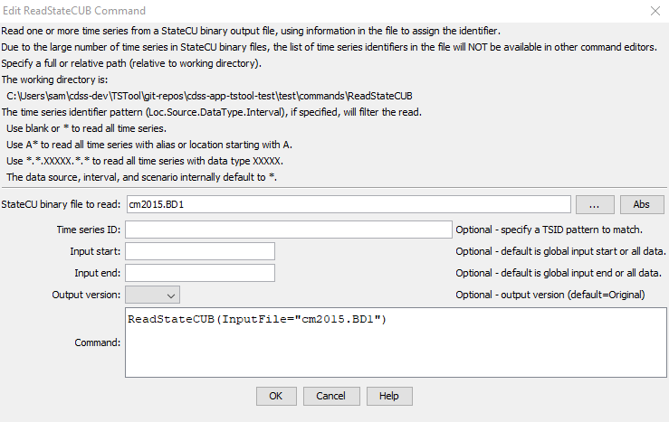

# TSTool / Command / ReadStateCUB #

* [Overview](#overview)
* [Command Editor](#command-editor)
* [Command Syntax](#command-syntax)
* [Examples](#examples)
* [Troubleshooting](#troubleshooting)
* [See Also](#see-also)

-------------------------

## Overview ##

The `ReadStateCUB` command reads time series from a StateCU binary output time series file.
See the [StateCUB Input Type Appendix](../../datastore-ref/StateCUB/StateCUB).
The actual reading occurs as the commands are being processed.
For this reason and because the number of time series in the binary file is usually large,
if any other commands reference the StateCU binary file time series,
the time series identifiers must be specified manually or use wildcards in identifiers
(identifiers are not available to list in dialogs).
Only data types that contain floating point numbers will be read.

## Command Editor ##

The following dialog is used to edit the command and illustrates the syntax of the command.
<a href="../ReadStateCUB.png">See also the full-size image.</a>



**<p style="text-align: center;">
`ReadStateCUB` Command Editor
</p>**

## Command Syntax ##

The command syntax is as follows:

```text
ReadStateCUB(Parameter="Value",...)
```
**<p style="text-align: center;">
Command Parameters
</p>**

|**Parameter**&nbsp;&nbsp;&nbsp;&nbsp;&nbsp;&nbsp;&nbsp;&nbsp;&nbsp;&nbsp;&nbsp;|**Description**|**Default**&nbsp;&nbsp;&nbsp;&nbsp;&nbsp;&nbsp;&nbsp;&nbsp;&nbsp;&nbsp;&nbsp;&nbsp;&nbsp;&nbsp;&nbsp;&nbsp;&nbsp;&nbsp;&nbsp;&nbsp;&nbsp;&nbsp;&nbsp;&nbsp;&nbsp;&nbsp;&nbsp;|
|--------------|-----------------|-----------------|
|`InputFile`<br>**required**|The name of the StateCU binary time series file to read.  The path to the file can be absolute or relative to the working directory.|None – must be specified.|
|`TSID`|Time series identifier pattern to filter the read.|Read all time series.|
|`InputStart`|The starting date/time to read data, specified to Month precision.|Read all data.|
|`InputEnd`|The ending date/time to read data, specified to Month precision.|Read all data.|

## Examples ##

See the [automated tests](https://github.com/OpenWaterFoundation/cdss-app-tstool-test/tree/master/test/regression/commands/general/ReadStateCUB).

The following example command file illustrates how to read all CU Shortage time series:

```text
ReadStateCUB(InputFile="Data\farmers.BD1",TSID="*.*.CU Shortage.*.*")
```

The following example illustrates how to read all time series from a binary file with debug turned on to echo all information that is read.  

```text
StartLog(LogFile="commands.TSTool.log")
SetDebugLevel(LogFileLevel=1)
ReadStateCUB(InputFile="Data\farmers.BD1")
```

## Troubleshooting ##

## See Also ##

* [`ReadStateCU`](../ReadStateCU/ReadStateCU) command
