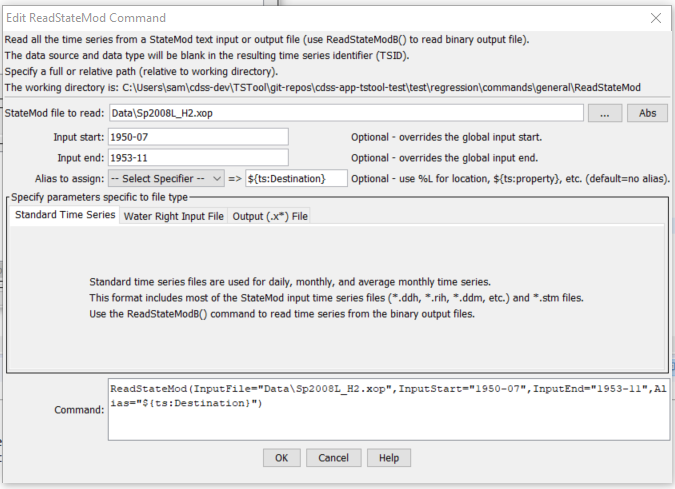
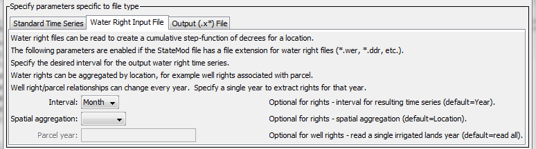
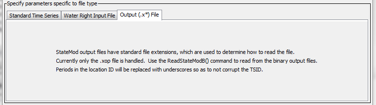

# TSTool / Command / ReadStateMod #

*   [Overview](#overview)
*   [Command Editor](#command-editor)
*   [Command Syntax](#command-syntax)
*   [Examples](#examples)
*   [Troubleshooting](#troubleshooting)
*   [See Also](#see-also)

-------------------------

## Overview ##

The `ReadStateMod` command reads all the time series in a StateMod time series file:

*   Standard time series file (see the [StateMod Input Type Appendix](../../datastore-ref/StateMod/StateMod.md)).
    Single time series can be read by using time series identifier (TSID) commands.
*   Water rights files can be read and converted to time series,
    which is useful for visualization, water supply analysis, and to test well right processing.
    Considering all water rights for a location based on the administration number results
    in a step function of decree over time.
    Monthly and yearly time series use calendar year and a right is active
    if it is turned on anywhere in the month or year.
    Free water rights (e.g., those having administration numbers > 90000.00000)
    are treated like other rights and therefore may not impact the results in the current
    period because the corresponding appropriation date is in the future.
    If processing well rights and multiple years of parcel data are processed,
    this command executes the same logic as the StateDMI `MergeWellRights` command.
*   Output (`*.x**`) files, currently only `*.xop` is supported.
    The data type is set to Operational.  Identifiers that include a period will have the period replaced with an underscore.

## Command Editor ##

The command is available in the following TSTool menu:

*   ***Commands / Read Time Series***

The following dialog is used to edit the command and illustrates the syntax of the command for general parameters.

**<p style="text-align: center;">

</p>**

**<p style="text-align: center;">
`ReadStateMod` Command Editor (<a href="../ReadStateMod.png">see also the full-size image</a>)
</p>**

The following dialog is used to edit the command and illustrates the syntax of the command for water right file parameters.

**<p style="text-align: center;">

</p>**

**<p style="text-align: center;">
`ReadStateMod` Command Editor for Water Right File Parameters (<a href="../ReadStateMod_Rights.png">see also the full-size image</a>)
</p>**

The following dialog is used to edit the command and illustrates the syntax of the command for output file parameters.

**<p style="text-align: center;">

</p>**

**<p style="text-align: center;">
`ReadStateMod` Command Editor for Output File Parameters (<a href="../ReadStateMod_X.png">see also the full-size image</a>)
</p>**

## Command Syntax ##

The command syntax is as follows:

```text
ReadStateMod(Parameter="Value",...)
```
**<p style="text-align: center;">
Command Parameters
</p>**

|**Parameter**&nbsp;&nbsp;&nbsp;&nbsp;&nbsp;&nbsp;&nbsp;&nbsp;&nbsp;&nbsp;&nbsp;&nbsp;&nbsp;&nbsp;&nbsp;&nbsp;&nbsp;&nbsp;&nbsp;&nbsp;&nbsp;|**Description**|**Default**&nbsp;&nbsp;&nbsp;&nbsp;&nbsp;&nbsp;&nbsp;&nbsp;&nbsp;&nbsp;&nbsp;&nbsp;&nbsp;&nbsp;&nbsp;&nbsp;&nbsp;&nbsp;&nbsp;&nbsp;&nbsp;&nbsp;&nbsp;&nbsp;&nbsp;&nbsp;&nbsp;&nbsp;&nbsp;|
|--------------|-----------------|-----------------|
|`InputFile`<br>**required**|The name of the StateMod time series file to read, surrounded by double quotes.  The path to the file can be absolute or relative to the working directory.  Global property values can be inserted using the syntax `${PropertyName}`.|None – must be specified.|
|`InputStart`|The start of the period to read data – specify if the period should be different from the global query period.  Specify to a precision that matches the data.  If reading water rights, the output time series will start on this date.|Use the global query period or if not specified read all data. The default for water rights is the date of the first right.|
|`InputEnd`|The end of the period to read data – specify if the period should be different from the global query period.  Specify to a precision that matches the data.  If reading water rights, the output time series will end on this date.|Use the global query period or if not specified read all data.  The default for water rights is the date of the last right.|
|`Alias`|The alias to assign to the time series that are read.  Use the format choices and other characters to define a unique alias.  Time series properties can be specified with `${ts:property}` syntax.  In particular, the properties prior to each time series in output (`*.x`) files are available for use in the alias.|No alias is assigned.|
|`Interval`|When reading a water right file, specify the interval for the resulting time series, one of `Day`, `Month`, or `Year`.|`Year`|
|`SpatialAggregation`|When reading a water right file, indicate how time series are to be aggregated spatially, one of:<ul><li>`Location` – aggregate by the station identifier.</li><li>`Parcel` – (only used with well rights) aggregate based on the parcel number and parcel year.</li><li>`None` – do not aggregate spatially, which will result in constant value time series for each water right.</li></ul>|`Location`|
|`ParcelYear`|When processing a well water right file, indicate the year of parcel data to process.  Parcel configurations change from year to year, and a single year of parcel data can be processed if desired.|Process all parcel years.|

## Examples ##

See the [automated tests](https://github.com/OpenCDSS/cdss-app-tstool-test/tree/master/test/commands/ReadStateMod).

## Troubleshooting ##

See the main [TSTool Troubleshooting](../../troubleshooting/troubleshooting.md) documentation.

## See Also ##

*   [`ReadStateModB`](../ReadStateModB/ReadStateModB.md) command
*   [`WriteStateMod`](../WriteStateMod/WriteStateMod.md) command
