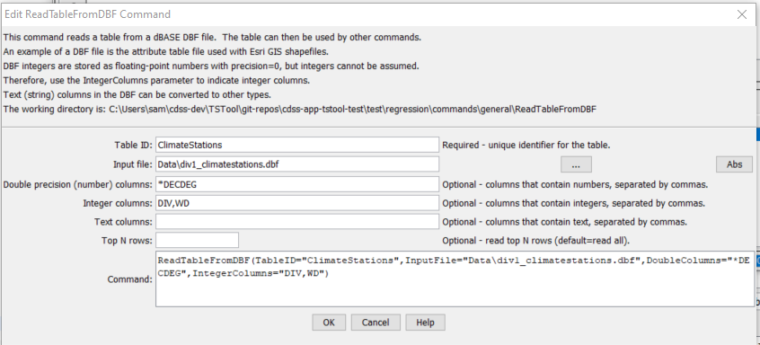

# TSTool / Command / ReadTableFromDBF #

* [Overview](#overview)
* [Command Editor](#command-editor)
* [Command Syntax](#command-syntax)
* [Examples](#examples)
* [Troubleshooting](#troubleshooting)
* [See Also](#see-also)

-------------------------

## Overview ##

The `ReadTableFromDBF` command reads a table from a dBASE file,
such as the files used with Esri GIS shapefiles.
dBASE files are self-contained binary database files.

Handling of dBASE files is limited and support for newer features may not be included.
An attempt is made to properly convert dBASE internal data representations to appropriate equivalents.
In the future additional parameters may be added to control handling of numbers and dates.

## Command Editor ##

The following dialog is used to edit the command and illustrates the command syntax.
<a href="../ReadTableFromDBF.png">See also the full-size image.</a>



**<p style="text-align: center;">
`ReadTableFromDBF` Command Editor
</p>**

## Command Syntax ##

The command syntax is as follows:

```text
ReadTableFromDBF(Parameter="Value",...)
```
**<p style="text-align: center;">
Command Parameters
</p>**

| **Parameter**&nbsp;&nbsp;&nbsp;&nbsp;&nbsp;&nbsp;&nbsp;&nbsp;&nbsp;&nbsp;&nbsp;&nbsp; | **Description** | **Default**&nbsp;&nbsp;&nbsp;&nbsp;&nbsp;&nbsp;&nbsp;&nbsp;&nbsp;&nbsp;&nbsp;&nbsp;&nbsp;&nbsp;&nbsp;&nbsp;&nbsp;&nbsp; |
| --------------|-----------------|----------------- |
|`TableID`<br>**required**|Identifier to assign to the table that is read, which allows the table data to be used with other commands.  Can be specified with `${Property}.`|None – must be specified.|
|`InputFile`<br>**required**|The name of the file to read, as an absolute path or relative to the command file location.  Can be specified with `${Property}`.|None – must be specified.|
|`Top`|If specified, the top number of rows specified by the parameter will be read.|Return all data.|

## Examples ##

See the [automated tests](https://github.com/OpenWaterFoundation/cdss-app-tstool-test/tree/master/test/regression/commands/general/ReadTableFromDBF).

## Troubleshooting ##

## See Also ##

* [`WriteTableToDelimitedFile`](../WriteTableToDelimitedFile/WriteTableToDelimitedFile) command
