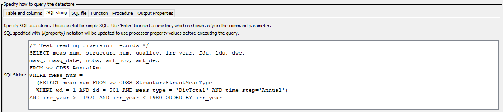

# TSTool / Command / ReadTableFromDataStore #

* [Overview](#overview)
* [Command Editor](#command-editor)
* [Command Syntax](#command-syntax)
* [Examples](#examples)
* [Troubleshooting](#troubleshooting)
* [See Also](#see-also)

-------------------------

## Overview ##

The [`ReadTableFromDataStore`](../ReadTableFromDataStore/ReadTableFromDataStore) command executes
a database query for a datastore that is associated with a database,
and places the result in a TSTool table,
which can subsequently be processed with other TSTool commands.
This command cannot be used with web service datastores because the underlying
software relies on a database to perform the query.
If database datastore support is not specifically provided by TSTool,
a generic database datastore can be used (see the
[Generic Database DataStore appendix](../../datstore-ref/GenericDatabase/GenericDatabase).
For example, use a generic database datastore to read data from a Microsoft Access database.
This command is useful when the database can provide results with a simple query and
tight integration with TSTool is not required or has not been implemented
via an application programming interface (API).
The query can be specified in the following ways:

* Specify a single table/view to query:
	+ the list of tables is filtered to remove internal database tables;
	however, this capability varies by database product and in some cases internal tables will be listed
	+ the query is constructed from the provided database table/view name and column names
	+ the output can be sorted by specifying column names
	+ “where” clauses currently are not supported but may be added in the future
	+ the top N rows of the result can be returned to allow “peeking”
	at tables (may not be available for all database software)
* Specify a SQL select statement:
	+ SQL must be valid for the database (syntax may vary based on database software)
	+ Use `${Property}` notation to insert processor property values set with
	[`SetProperty`](../SetProperty/SetProperty) or other commands.
	+ SQL syntax is not checked for validity and therefore error messages
	from the database may be more difficult to interpret.
	+ Comments can be specified using [`/* */`](../CommentBlockStart/CommentBlockStart)
	notation or - - (double dash) for end of line comments.
	TSTool removes comments if using Microsoft Access because Access does not support comments in SQL.
* Specify an SQL select statement in a file:
	+ Similar to the above option; however, the SQL statement is read from a file
	+ Useful if the SQL statement is also used by other tools
* Specify a procedure to run:
	+ Available procedures are listed and can be selected
	+ Currently, only procedures that do not require parameters can be run

General constraints on the query are as follows:

* the table, views, and procedures being queried must be readable
	(some databases restrict direct access to data  and require using stored procedures)
* the resulting table in TSTool will have columns with names that match the database query results
* data types for columns will closely match the database results:
	+ data will be treated as strings if unable to match the database column type
	+ the precision of floating point numbers for displays is defaulted to 6 digits
	+ null values in the database will transfer to null values in
	the TSTool table and will display as blank table cells
	+ date/time columns in the database will be represented as such in the TSTool table;
	however, it may not be possible to limit the precision of the date/time
	(i.e., hours, minutes, and seconds may be shown with default zero values in output)

Future enhancements will add additional features to intelligently map database results to TSTool tables.

## Command Editor ##

The following dialog is used to edit the command and illustrates the syntax for the command,
in this case reading a small table from the State of Colorado’s HydroBase.
<a href="../ReadTableFromDataStore_Table.png">See also the full-size image.</a>


**<p style="text-align: center;">
`ReadTableFromDataStore` Command Editor when Querying a Single Table (or View)
</p>**

The corresponding output table is as shown below:
<a href="../ReadTableFromDataStore_Results.png">See also the full-size image.</a>


**<p style="text-align: center;">
Example `ReadTableFromDataStore` Command Output Table
</p>**

The following example illustrates using an SQL query string,
in this case to read diversion records for a specific structure in the State of Colorado’s HydroBase database:
<a href="../ReadTableFromDataStore_SQL.png">See also the full-size image.</a>



**<p style="text-align: center;">
`ReadTableFromDataStore` Command Editor when Specifying an SQL Query String
</p>**

The following example illustrates using an SQL file:
<a href="../ReadTableFromDataStore_SQLFile.png">See also the full-size image.</a>


**<p style="text-align: center;">
`ReadTableFromDataStore` Command Editor when Specifying an SQL File
</p>**

The following example illustrates using a database procedure:
<a href="../ReadTableFromDataStore_Procedure.png">See also the full-size image.</a>


**<p style="text-align: center;">
`ReadTableFromDataStore` Command Editor when Specyfing a Procedure
</p>**

## Command Syntax ##

The command syntax is as follows:

```text
ReadTableFromDataStore(Parameter="Value",...)
```
**<p style="text-align: center;">
Command Parameters
</p>**

|**Query Method**|**Parameter**&nbsp;&nbsp;&nbsp;&nbsp;&nbsp;&nbsp;&nbsp;&nbsp;&nbsp;&nbsp;&nbsp;&nbsp;&nbsp;&nbsp;&nbsp;&nbsp;&nbsp;&nbsp;&nbsp;&nbsp;&nbsp;&nbsp;&nbsp;&nbsp;&nbsp;&nbsp; | **Description** | **Default**&nbsp;&nbsp;&nbsp;&nbsp;&nbsp;&nbsp;&nbsp;&nbsp;&nbsp;&nbsp; |
| --------------|-----------------|----------------- |
|All|`DataStore`<br>**required**|The name of a database datastore to read.|None – must be specified.|
|Table/view|`DataStoreTable`|The name of the database table or view to read when querying a single table or view.  If specified, do not specify `Sql` or `SqlFile`.|None.|
|Table/view|`DataStoreColumns`|When reading a single table/view, the names of the columns to read, separated by commas.|All columns from `DataStoreTable` are read.|
|Table/view|`OrderBy`|When reading a single table/view, a list of column names separated by commas to control the order of output.|Default database sort order will be used.|
|Table/view|`Top`|Indicate that Top rows should be returned.  This functionality may not be implemented for all databases (SQL is not fully standardized for this feature).  This parameter is useful to determine the columns for a table prior to using the `Sql` or `SqlFile` parameters.|Return all rows.|
|SQL string|`Sql`|The SQL string that will be used to query the database, optionally using `${Property}` notation to insert processor property values.  If specified, do not specify `DataStoreTable` or `SqlFile`.|None.|
|SQL file|`SqlFile`|The name of the file containing an SQL string to execute, optionally using `${Property}` notation in the SQL file contents to insert processor property values.  If specified, do not specify `DataStoreTable` or `Sql`.|None.|
|Procedure|`DataStoreProcedure`|The name of the database procedure to run.  Currently, only procedures that do not require parameters can be run.|None.|
|All|`TableID`<br>**required**|Identifier to assign to the output table in TSTool, which allows the table data to be used with other commands.  A new table will be created.  Can be specified with `${Property}`.|None – must be specified.|
|All|`RowCountProperty`|The name of the processor property that will be set to the row count, optionally using `${Property}` notation to specify the name.|Property is not set.|

## Examples ##

* See the [automated tests](https://github.com/OpenWaterFoundation/cdss-app-tstool-test/tree/master/test/regression/commands/general/ReadTableFromDataStore).

## Troubleshooting ##

## See Also ##

* [`RunSql`](../RunSql/RunSql) command
