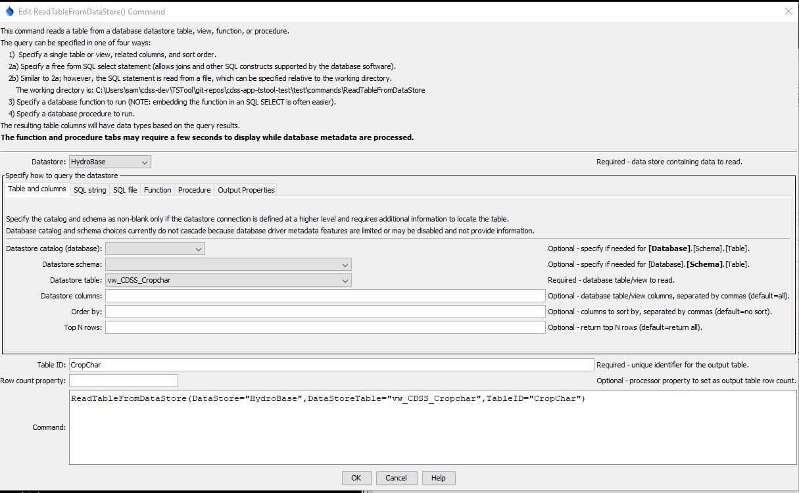

# TSTool / Command / ReadTableFromDataStore #

* [Overview](#overview)
    + [Limitations](#limitations)
* [Command Editor](#command-editor)
* [Command Syntax](#command-syntax)
* [Examples](#examples)
* [Troubleshooting](#troubleshooting)
* [See Also](#see-also)

-------------------------

## Overview ##

The `ReadTableFromDataStore` command executes
a database query for a datastore that is associated with a database,
and places the result in a TSTool table,
which can subsequently be processed with other TSTool commands.
This command is useful when the database can provide results with a simple query and
tight integration with TSTool is not required or has not been implemented
via an application programming interface (API).
This command cannot be used with web service datastores because the underlying
software relies on a database to perform the query.

If database datastore support is not provided by a built-in TSTool datastore,
a generic database datastore can be used (see the
[Generic Database DataStore appendix](../../datastore-ref/GenericDatabase/GenericDatabase.md)).
A datastore plugin may also be available for a database,
in which case the plugin software can be developed and maintained separate from the main TSTool software.

The query can be specified in the following ways:

* Specify a single table/view to query:
	+ the list of tables is filtered to remove internal database tables;
	however, this capability varies by database product and in some cases internal tables will be listed
	+ the query is constructed from the provided database table/view name and column names
	+ the output can be sorted by specifying column names
	+ “where” clauses currently are not supported but may be added in the future
	+ the top N rows of the result can be returned to allow “peeking”
	at tables (may not be available for all database software)
* Specify a SQL select statement:
	+ SQL must be valid for the database (syntax may vary based on database software)
	+ Use `${Property}` notation to insert processor property values set with
	[`SetProperty`](../SetProperty/SetProperty) or other commands.
	+ SQL syntax is not checked for validity and therefore error messages
	from the database may be more difficult to interpret.
	+ Comments can be specified using [`/* */`](../CommentBlockStart/CommentBlockStart.md)
	notation for 1+ line comments or `--` (double dash) for single line comments.
	The comments are removed before executing the query if comments are not supported by the database software.
	Newlines can be used to format SQL by using `Enter` when editing SQL and
	are shown as `\n` in the SQL parameter.
* Specify an SQL select statement in a file:
	+ Similar to the above option; however, the SQL statement is read from a file.
	+ Useful if the SQL statement is also used by other tools.
* Specify a function to run:
	+ **This functionality is under development - functions can typically be called in `SELECT` statements.**
	+ Available functions are listed using function signature with parameter types and return value.
	+ Function parameters, if required, are specified with `ProcedureParameters` parameter.
* Specify a procedure to run:
	+ **This functionality is under development.**
	+ Available procedures are listed using procedure signature with parameter types and return value.
	+ Procedure parameters, if required, are specified with `ProcedureParameters` parameter.
	+ Procedure return status, if available, can be saved as a property with `ProcedureReturnProperty` parameter.

General constraints on the query are as follows:

* the tables, views, functions, and procedures being queried must be readable
* the resulting table in TSTool will have columns with names that match the database query results
* SQL syntax varies between database software so care should be take to use standard SQL if possible,
if the commands will be run on different databases.
* data types for columns will closely match the database results:
	+ data will be treated as strings if unable to match the database column type
	+ the precision of floating point numbers for displays is defaulted to 6 digits
	+ null values in the database will transfer to null values in
	the TSTool table and will display as blank table cells
	+ date/time columns in the database will be represented as such in the TSTool table;
	however, it may not be possible to limit the precision of the date/time
	(i.e., hours, minutes, and seconds may be shown with default zero values in output)

Future enhancements will add additional features to intelligently map database results to TSTool tables.

### Limitations ###

The ability to run functions and procedures is under development.
Functions and procedures can be overloaded in some databases,
meaning that the same function name has different parameters.
Consequently, to select a function or procedure to run,
it is necessary to select a function's unique signature,
which includes the parameter names and types.

**The ability to run functions and procedures will be fully enabled in the future.**
Many databases allow functions to be called in `SELECT` statements.

## Command Editor ##

The following dialog is used to edit the command and illustrates the syntax for the command,
in this case reading a small table from the State of Colorado’s HydroBase.

**<p style="text-align: center;">

</p>**

**<p style="text-align: center;">
`ReadTableFromDataStore` Command Editor when Querying a Single Table or View (<a href="../ReadTableFromDataStore_Table.png">see the full-size image</a>)
</p>**

The corresponding output table is as shown below:

**<p style="text-align: center;">

</p>**

**<p style="text-align: center;">
Example `ReadTableFromDataStore` Command Output Table (<a href="../ReadTableFromDataStore_Results.png">see the full-size image</a>)
</p>**

The following example illustrates using an SQL query string,
in this case to read diversion records for a specific structure in the State of Colorado’s HydroBase database.
Use `Enter` to add new lines, which will be represented by `\n` in the command parameter.

**<p style="text-align: center;">

</p>**

**<p style="text-align: center;">
`ReadTableFromDataStore` Command Editor when Specifying an SQL Query String (<a href="../ReadTableFromDataStore_SQL.png">see the full-size image</a>)
</p>**

The following example illustrates using an SQL file:

**<p style="text-align: center;">

</p>**

**<p style="text-align: center;">
`ReadTableFromDataStore` Command Editor when Specifying an SQL File (<a href="../ReadTableFromDataStore_SQLFile.png">see the full-size image.</a>)
</p>**

The following example illustrates using a database function.
The ***Edit*** dialog will automatically populate the list of parameters if the database metadata provides such information.

**<p style="text-align: center;">

</p>**

**<p style="text-align: center;">
`ReadTableFromDataStore` Command Editor when Specifying a Function (<a href="../ReadTableFromDataStore_Function.png">see the full-size image</a>)
</p>**

The following example illustrates using a database procedure.
The ***Edit*** dialog will automatically populate the list of parameters if the database metadata provides such information.

**<p style="text-align: center;">

</p>**

**<p style="text-align: center;">
`ReadTableFromDataStore` Command Editor when Specifying a Procedure (<a href="../ReadTableFromDataStore_Procedure.png">see the full-size image</a>)
</p>**

The following illustrates how to set properties if the result is a single row.
This is useful when querying configuration or controlling data from the database.

**<p style="text-align: center;">

</p>**

**<p style="text-align: center;">
`ReadTableFromDataStore` Command Editor when Specifying Output Properties (<a href="../ReadTableFromDataStore_OutputProperties.png">see the full-size image</a>)
</p>**

## Command Syntax ##

The command syntax is as follows:

```text
ReadTableFromDataStore(Parameter="Value",...)
```
**<p style="text-align: center;">
Command Parameters
</p>**

|**Query Method**|**Parameter**&nbsp;&nbsp;&nbsp;&nbsp;&nbsp;&nbsp;&nbsp;&nbsp;&nbsp;&nbsp;&nbsp;&nbsp;&nbsp;&nbsp;&nbsp;&nbsp;&nbsp;&nbsp;&nbsp;&nbsp;&nbsp;&nbsp;&nbsp;&nbsp;&nbsp;&nbsp;&nbsp;&nbsp;&nbsp;&nbsp;&nbsp;&nbsp; | **Description** | **Default**&nbsp;&nbsp;&nbsp;&nbsp;&nbsp;&nbsp;&nbsp;&nbsp;&nbsp;&nbsp; |
|--------------|-----------------|-----------------|----|
|All|`DataStore`<br>**required**|The name of a database datastore to read.|None – must be specified.|
|***Table and columns***|`DataStoreTable`|The name of the database table or view to read when querying a single table or view.  If specified, do not specify `Sql`, `SqlFile`, `DataStoreFunction`, or `DataStoreProcedure`.|None.|
||`DataStoreColumns`|When reading a single table/view, the names of the columns to read, separated by commas.|All columns from `DataStoreTable` are read.|
||`OrderBy`|When reading a single table/view, a list of column names separated by commas to control the order of output.  Additional modifiers are allowed for each column, for example to ignore case when sorting with SQLite, can use: `columnName COLLATE NOCASE`.|Default database sort order will be used.|
||`Top`|Indicate that Top rows should be returned.  This functionality may not be implemented for all databases (SQL is not fully standardized for this feature).  This parameter is useful to determine the columns for a table prior to using the `Sql` or `SqlFile` parameters.|Return all rows.|
|***SQL string***|`Sql`|The SQL string that will be used to query the database, optionally using `${Property}` notation to insert processor property values.  If specified, do not specify `DataStoreTable`, `SqlFile`, `DataStoreFunction`, or `DataStoreProcedure`.|None.|
|***SQL file***|`SqlFile`|The name of the file containing an SQL string to execute, optionally using `${Property}` notation in the SQL file contents to insert processor property values.  If specified, do not specify `DataStoreTable`, `Sql`, `DataStoreFunction`, or `DataStoreProcedure`.|None.|
|***Function*** | `DataStoreFunction`|The name of the database function to run, as full signature if metadata are available.  If specified, do not specify `DataStoreTable`, `Sql`, `SqlFile`, or `DatabaseProcedure`.|None.|
| |`FunctionParameters`|Parameters for function, in order that is required, using syntax `parameter1:value1,parameter2:value2,...`.  Use the ***Edit*** button to see the list of parameters and their type.||
|***Procedure***|`DataStoreProcedure`|The name of the database procedure to run, as full signature if metadata are available. If specified, do not specify `DataStoreTable`, `Sql`, `SqlFile`, or `DataStoreFunction`. |None.|
||`ProcedureParameters`|Parameters for procedure/function, in order that is required, using syntax `parameter:value1,parameter2:value2,...`.  Use the ***Edit*** button to see the list of parameters and their type.||
||`ProcedureReturnProperty`|Property name for procedure return value.||
|All|`OutputProperties`|A map of table column names to processor property names using syntax `name1:property1,name2:property1,...`  If a result is a single row, the output can be assigned to properties. Specify as many column names as desired. | Properties are not set. |
||`TableID`<br>**required**|Identifier to assign to the output table in TSTool, which allows the table data to be used with other commands.  A new table will be created.  Can be specified with `${Property}`.|None – must be specified.|
||`RowCountProperty`|The name of the processor property that will be set to the row count, optionally using `${Property}` notation to specify the name.|Property is not set.|

## Examples ##

* See the [automated tests](https://github.com/OpenCDSS/cdss-app-tstool-test/tree/master/test/commands/ReadTableFromDataStore).

## Troubleshooting ##

## See Also ##

* [`CloseDataStore`](../CloseDataStore/CloseDataStore.md) command
* [`OpenDataStore`](../OpenDataStore/OpenDataStore.md) command
* [`RunSql`](../RunSql/RunSql.md) command
* [`SetProperty`](../SetProperty/SetProperty.md) command
* [`WriteTableToDataStore`](../WriteTableToDataStore/WriteTableToDataStore.md) command
