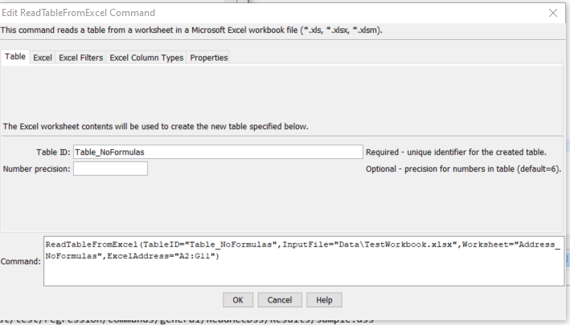
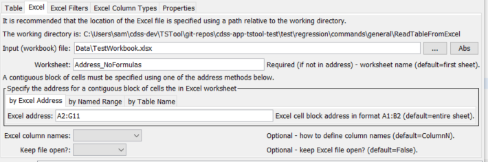
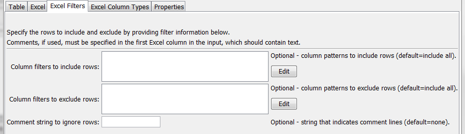
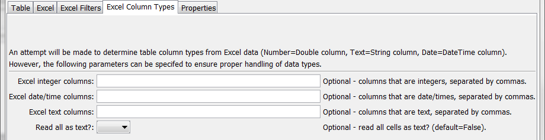
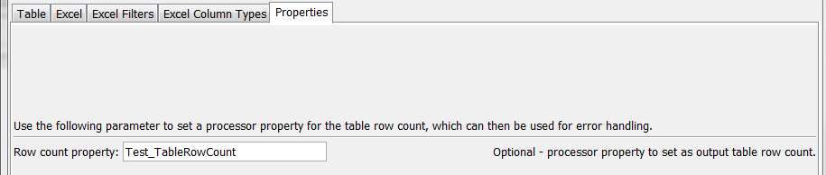

# TSTool / Command / ReadTableFromExcel #

* [Overview](#overview)
* [Command Editor](#command-editor)
* [Command Syntax](#command-syntax)
* [Examples](#examples)
* [Troubleshooting](#troubleshooting)
* [See Also](#see-also)

-------------------------

## Overview ##

The `ReadTableFromExcel` command reads a table from a Microsoft Excel file,
more specifically from a worksheet in an Excel workbook file.
A contiguous block of cells (rectangle) must be specified in one of the following ways:

* Specify a range of cells using Excel address notation (e.g., `A1:D10`)
* Specify the name of an Excel named range.
* Specify a table name (essentially a named range).

Table column types (number, text, etc.) are determined from the cells
in the first data row being read (NOT the column name row) – data types must be consistent
for all cells in a column, although blanks are allowed.
Table column names are determined according to the `ExcelColumnNames` command parameter.

TSTool uses the [Apache POI software](http://poi.apache.org) to read the Excel file
and consequently functionality is constrained by the features of that software package.
The software reads and writes Excel files.
POI does not fully implement Excel functionality and consequently some formula capabilities
are not available, which will generate errors getting values for some cells.
One solution, for example to create test data in Excel,
is to copy cells with “paste special” and then paste the values.
It is expected that updates to POI will continue to add more formula support.

Table columns must contain consistent data types (all strings, all numeric, etc.).
The following table describes how column types are determined
and data values are transferred to the table.
Column type determination uses the first data row in the specified address range.
If a column is determined to be a type and then cell values in the column are different,
conversions are made to maintain the intent of the values if possible.
For example, a Boolean value stored in a cell will get converted to 1.0
if the table column has been determined to be for double precision numbers.
Errors in processing cells may result in empty cell values in the output table.

**<p style="text-align: center;">
Excel Data Table Conversion to Table
</p>**

|**Excel Cell Format ("Number Category")**|**Conversion from Excel to TSTool Table**&nbsp;&nbsp;&nbsp;&nbsp;&nbsp;&nbsp;&nbsp;&nbsp;&nbsp;&nbsp;&nbsp;&nbsp;&nbsp;&nbsp;&nbsp;&nbsp;&nbsp;&nbsp;&nbsp;&nbsp;&nbsp;&nbsp;&nbsp;&nbsp;&nbsp;&nbsp; |
| --------------|-----------------|
|Number:<br><ul><li>General</li><li>Number</li><li>Currency</li><li>Accounting</li><li>Percentage</li><li>Fraction</li><li>Scientific</li><li>Special</li><li>Custom</li><ul>|<ul><li>If Excel cell is internally a “numeric”, convert to a double-precision number, where the format “Decimal places” is used in the TSTool table for formatting.  The number of decimal places in Excel is fixed for some of the number categories shown on the left (e.g., Special=Zip Code). Excel internally stores integers as numbers with zero decimals.  **Need to figure out how to get the Excel cell formatting number of decimals to similarly set in the output table – but DO NOT assume zero decimals should convert to an integer.**</li><li>See the `ExcelIntegerColumns` parameter, which specifies the output table to use integers.</li><li>If Excel cell is internally a “Boolean”, convert to an integer having values 0 or 1.  **Need to evaluate having a parameter `ExcelBooleanColumns` to transfer to a Boolean column in the output table.  Excel seems to handle Booleans as text with values True or False.**</li></ul>|
|Date:|<ul><li>Date</li><li>Time</li></ul>|TSTool will convert Number-formatted columns to date/time values when the `ExcelDateTimeColumns` parameter indicates which columns are date/times.|
|Text|Converts to a string.|
|Blank|<ul><li>Treated as Text (may in the future scan down the column to determine data type from first non-blank cell).</li><li>Blank cells found once the column type is determined are set to empty strings in text columns, and null in number and date columns.</li><ul>|
|Error|<ul><li>Treated as Text (may in the future scan down the column to determine data type from first non-error cell).</li><li>Blank cells found once the column type is determined are set to empty strings in text columns, and null in number and date columns.</li><ul>|
|Formula|Expanded internally and the resulting cell value is set in the output table.  POI does not support all formulas and errors may be generated, which result in empty output table cells.|

Consider the following Excel worksheet example, which is equivalent to a comma-separated-value (CSV) file that has comments at the top and four columns:


**<p style="text-align: center;">
Example Excel Worksheet with Comments, Column Names, and Text and Integer Columns
</p>**

Although it is possible to use comments in Excel (annotation on cells),
these comments cannot be saved in simple text files like CSV files.
Consequently, for transparency and automation of a full process,
embedding comments in the worksheet may make sense.
Note also that the numeric cells are formatted as type “Number” with 0 decimals in Excel.
Internally, Excel does not have an integer data type and consequently it is difficult
for the `ReadTableFromExcel` command to know when to convert a zero-decimal
number in Excel to a floating point or integer number in the output table
(it therefore defaults to a floating point number in output).
To make this conversion more explicit, use the `ExcelIntegerColumns` command parameter.
The comment lines in the above example will be ignored in determining the headings,
and any data rows that have a first cell value starting with the comment character will be ignored.

## Command Editor ##

The following dialog is used to edit the command and illustrates the syntax for the command when reading the above Excel worksheet.



**<p style="text-align: center;">
`ReadTableFromExcel` Command Editor for Table Parameters (<a href="../ReadTableFromExcel_Table.png">see also the full-size image</a>)
</p>**

The following dialog is used to edit the command and illustrates main Excel parameters.



**<p style="text-align: center;">
`ReadTableFromExcel` Command Editor for Main Excel Parameters (<a href="../ReadTableFromExcel_Excel.png">see also the full-size image</a>)
</p>**

The following dialog is used to edit the command and illustrates filter parameters.



**<p style="text-align: center;">
`ReadTableFromExcel` Command Editor for Filter Parameters (<a href="../ReadTableFromExcel_Filters.png">see also the full-size image</a>)
</p>**

The following dialog is used to edit the command and illustrates column type parameters.



**<p style="text-align: center;">
`ReadTableFromExcel` Command Editor for Column Type Parameters (<a href="../ReadTableFromExcel_Types.png">see also the full-size image</a>)
</p>**

The following dialog is used to edit the command and illustrates properties parameters.



**<p style="text-align: center;">
`ReadTableFromExcel` Command Editor for Properties Parameters (<a href="../ReadTableFromExcel_Properties.png">see also the full-size image</a>)
</p>**

## Command Syntax ##

The command syntax is as follows:

```text
ReadTableFromExcel(Parameter="Value",...)
```
**<p style="text-align: center;">
Command Parameters
</p>**

|**Parameter**&nbsp;&nbsp;&nbsp;&nbsp;&nbsp;&nbsp;&nbsp;&nbsp;&nbsp;&nbsp;&nbsp;&nbsp;&nbsp;&nbsp;&nbsp;&nbsp;&nbsp;&nbsp;&nbsp;&nbsp;&nbsp;&nbsp;&nbsp;&nbsp;&nbsp;&nbsp; | **Description** | **Default**&nbsp;&nbsp;&nbsp;&nbsp;&nbsp;&nbsp;&nbsp;&nbsp;&nbsp;&nbsp; |
| --------------|-----------------|----------------- |
|`TableID`<br>**required**|Identifier to assign to the table that is read, which allows the table data to be used with other commands.  Can be specified using processor `${Property}`.|None – must be specified.|
|`NumberPrecision`|The number of digits to the right of the decimal to use for numeric columns that are not identified as integer columns.  Currently the cell formatting information is not interpreted to determine precision.|6|
|`InputFile`<br>**required**|The name of the Excel workbook file (`*.xls` or `*.xlsx`) to read, as an absolute path or relative to the command file location.  Can be specified using processor `${Property}`.|None – must be specified.|
|`Worksheet`|The name of the worksheet in the workbook to read.  Currently this is required if a specific sheet is read but in the future it may be made optional because the sheet can be determined from named range and table names (global resources in the workbook) and absolute Excel addresses that include the sheet name.  Can be specified using processor `${Property}`.|Read the first worksheet.  If no address parameter is specified, read the entire worksheet.|
|`ExcelAddress`|Indicates the block of cells to read into the table, using Excel address notation (e.g., `A1:D10`).|Must specify address using one of available address parameters.|
|`ExcelNamedRange`|Indicates the block of cells to read into the table, using an Excel named range.|Must specify address using one of available address parameters.|
|`ExcelTableName`|Indicates the block of cells to read into the table, using an Excel named range.|Must specify address using one of available address parameters.|
|`ExcelColumnNames`|Indicate how to determine the column names for the table, one of:<ul><li>`ColumnN` – column name will be `Column1`, `Column2`, etc.</li><li>`FirstRowInRange` – column names are taken from the first non-comment row in the address range</li><li>`RowBeforeRange` – column names are taken from the first non-comment row before the address range</li></ul><br>Column cell values will be converted to text.  Numeric cell values are formatted as integers before conversion to text (if this is not appropriate the software will need to be enhanced to consider the format or other input).|`ColumnN`, **or `FirstRowInRange` when `ExcelTableName` is specified?**|
|`KeepFileOpen`|Should the Excel file that is read remain open for other interactions with the file?|`False` – close the file after reading|
|`ColumnIncludeFilters`|Indicate column names (as assigned by `ExcelColumnNames`) and pattern to use to include rows.  The format of the parameter is:<br>`ColumnName1:Pattern1,`<br>`ColumnName2:Pattern2,...`<br>where patterns can contain `*` to match a substring.  Any match will cause the row to be included (the patterns are ORed).|Include all rows.|
|`ColumnExcludeFilters`|Indicate column names (as assigned by `ExcelColumnNames`) and pattern to use to exclude rows.  For example, exclude rows with blanks in columns.  The format of the parameter is:<br>`ColumnName1:Pattern1,`<br>`ColumnName2:Pattern2,...`<br>where patterns can contain `*` to match a substring.  Any match will cause the row to be excluded (the patterns are ORed).|Include all rows.|
|`Comment`|Specify the string that if found at the start of the first column in a row (not just the specified address range) indicates that the row is a comment and can be ignored in transferring data to the output table.  Comments are particularly useful when processing entire data sheets.|Include all rows.|
|`ExcelIntegerColumns`|Indicate the names of columns (separated by commas) that should be treated as integer columns in the output table.|Numeric columns are treated as double-precision values in the output table.|
|`ExcelDateTimeColumns`|Indicate the names of columns (separated by commas) that should be treated as date/time columns in the output table. If text, the text will be parsed to create date/time objects internally.|Numeric columns that are formatted as dates are treated as date/time columns in output.|
|`ExcelTextColumns`|Indicate the names of columns (separated by commas) that should be treated as text (string) columns in the output table.|Columns that are not numeric, or formulas are treated as text.|
|`ReadAllAsText`|Indicate with True or False whether all columns in the Excel address block should be treated as text columns.|False – set table column types using the first data row|
|`TableRowCount`|Name of property to set with the count of rows in the table.  Can specify using processor `${Property}`.||

## Examples ##

* See the [automated tests](https://github.com/OpenCDSS/cdss-app-tstool-test/tree/master/test/regression/commands/general/ReadTableFromExcel).

## Troubleshooting ##

## See Also ##

* [`ReadTableFromDelimitedFile`](../ReadTableFromDelimitedFile/ReadTableFromDelimitedFile.md) command
* [`WriteTableToExcel`](../WriteTableToExcel/WriteTableToExcel.md) command
