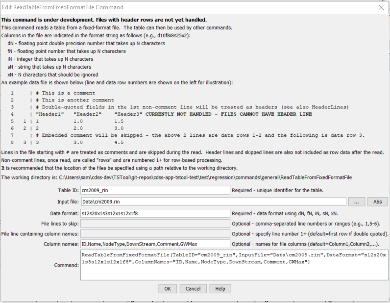
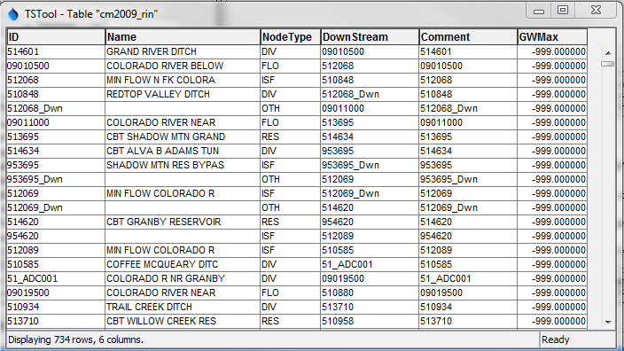

# TSTool / Command / ReadTableFromFixedFormatFile #

* [Overview](#overview)
* [Command Editor](#command-editor)
* [Command Syntax](#command-syntax)
* [Examples](#examples)
* [Troubleshooting](#troubleshooting)
* [See Also](#see-also)

-------------------------

## Overview ##

The `ReadTableFromFixedFormatFile` command reads a table from a fixed-format file,
for example input files to scientific models.
Columns are indicated by a column type and width.  Files have the following characteristics:

* Comments indicated by lines starting with `#` are stripped during the read.
* Extraneous lines in the file can be skipped during the read using the `SkipLines` parameter (**not yet implemented**).
* Files cannot have header lines (see the `ColumnNames` parameter) – **header lines will be handled in the future**.
* Data in columns are assumed to be of consistent type (i.e., all numerical data or all text), based on the format specifier (see `DataFormat` parameter).
* Missing values can be indicated by blanks in the input file.
* Values in adjacent columns that have no intervening space are read properly.

## Command Editor ##

The following dialog is used to edit the command and illustrates the command syntax.

**<p style="text-align: center;">

</p>**

**<p style="text-align: center;">
`ReadTableFromFixedFormatFile` Command Editor (<a href="../ReadTableFromFixedFormatFile.png">see also the full-size image</a>)
</p>**

## Command Syntax ##

The command syntax is as follows:

```text
ReadTableFromFixedFormatFile(Parameter="Value",...)
```
**<p style="text-align: center;">
Command Parameters
</p>**

| **Parameter**&nbsp;&nbsp;&nbsp;&nbsp;&nbsp;&nbsp;&nbsp;&nbsp;&nbsp;&nbsp;&nbsp;&nbsp; | **Description** | **Default**&nbsp;&nbsp;&nbsp;&nbsp;&nbsp;&nbsp;&nbsp;&nbsp;&nbsp;&nbsp;&nbsp;&nbsp;&nbsp;&nbsp;&nbsp;&nbsp;&nbsp;&nbsp; |
| --------------|-----------------|----------------- |
|`TableID`<br>**required**|Identifier to assign to the table that is read, which allows the table data to be used with other commands.|None – must be specified.|
|`InputFile`<br>**required**|The name of the file to read, as an absolute path or relative to the command file location.|None – must be specified.|
|`DataFormat`<br>**required**|The data format, using a combination of the following specifiers (N is a number to be inserted and indicates the column width):<ul><li>`dN` – floating point double-precision number N characters wide</li><li>`fN` – floating point number N characters wide</li><li>`iN` – integer N characters wide</li><li>`sN` – string N characters wide</li><li>`xN` – N characters that should be ignored|None – must be specified.|
|`SkipLines`|Indicates the number of lines in the file to skip, which otherwise would interfere with reading row data.  Individual row numbers and ranges can be specified, for example:  `1,5-6,17`<br>**Not yet implemented.**|No lines are skipped.|
|`HeaderLines`|Indicate the rows that include header information, which should be used for column names.  Currently this should only be one row, although a range may be fully supported in the future. **Not yet implemented.**|If the first non-comment line contains quoted field names, they are assumed to be headers.  Otherwise, no headers are read.|
|`ColumnNames`|The names to assign to columns that are read.|`Column1, Column2,...`|

## Examples ##

See the [automated tests](https://github.com/OpenCDSS/cdss-app-tstool-test/tree/master/test/regression/commands/general/ReadTableFromFixedFormatFile).

The following example illustrates a fixed-format file.
In this case the name includes a string name and a “node type” separated by an underscore.
The following data format can be specified to ignore the underscore and read the parts:  `s12s20x1s3s12x1s12x1f8.`
The `ColumnNames` parameter is used to assign column names to the output table.

```
#> *******************************************************
#>  StateMod River Network File
#>  WARNING - if .net file is available, it should be edited and the .rin
#>  file should be created from the .net
#>
#>  format:  (a12, a24, a12, 1x, a12, 1x, f8.0)
#>
#>  ID           cstaid:  Station ID
#>  Name         stanam:  Station name
#>  Downstream   cstadn:  Downstream node ID
#>  Comment     comment:  Alternate identifier/comment.
#>  GWMax        gwmaxr:  Max recharge limit (cfs) - see iwell in control file.
#>
#>   ID                Name          DownStream     Comment    GWMax
#>---------eb----------------------eb----------exb----------exb------e
#>
#>EndHeader
#>
514601      GRAND RIVER DITCH   _DIV09010500     514601           -999
09010500    COLORADO RIVER BELOW_FLO512068       09010500         -999
512068      MIN FLOW N FK COLORA_ISF510848       512068           -999
510848      REDTOP VALLEY DITCH _DIV512068_Dwn   510848           -999
512068_Dwn                      _OTH09011000     512068_Dwn       -999
09011000    COLORADO RIVER NEAR _FLO513695       09011000         -999
513695      CBT SHADOW MTN GRAND_RES514634       513695           -999
514634      CBT ALVA B ADAMS TUN_DIV953695       514634           -999
953695      SHADOW MTN RES BYPAS_ISF953695_Dwn   953695           -999
953695_Dwn                      _OTH512069       953695_Dwn       -999
```

The following table in TSTool illustrates the resulting output:

**<p style="text-align: center;">

</p>**

**<p style="text-align: center;">
`ReadTableFromFixedFormatFile` Command Output Table Example (<a href="../ReadTableFromFixedFormatFile_Output.png">see also the full-size image</a>)
</p>**

## Troubleshooting ##

## See Also ##

* [`ReadTableFromDelimitedFile`](../ReadTableFromDelimitedFile/ReadTableFromDelimitedFile.md) command
* [`WriteTableToDelimitedFile`](../WriteTableToDelimitedFile/WriteTableToDelimitedFile.md) command
