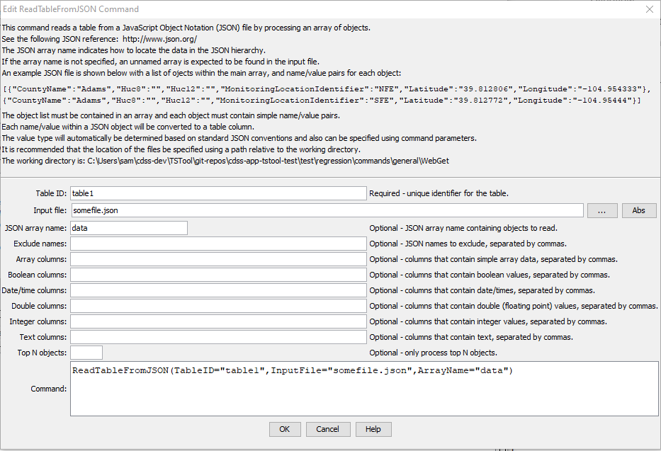

# TSTool / Command / ReadTableFromJSON #

*   [Overview](#overview)
*   [Command Editor](#command-editor)
*   [Command Syntax](#command-syntax)
*   [Examples](#examples)
    +   [Top Level Array (No Array Name)](#top-level-array-no-array-name)
    +   [Named Array](#named-array)
    +   [Nested Arrays (`AppendArrays=True`)](#nested-arrays-appendarraystrue)
*   [Troubleshooting](#troubleshooting)
*   [See Also](#see-also)

-------------------------

## Overview ##

The `ReadTableFromJSON` command reads a table from a [JavaScript Object Notation (JSON)](https://www.json.org/) file
or an object that has been created by another command such as
[`NewObject`](../NewObject/NewObject.md).

JSON is a hierarchical data representation that can have multiple nesting levels.
Arrays are indicated by brackets `[ ]`,
objects are indicated by curly braces `{ }` and `"name": value` pairs define data for an object.
Objects are generically represented in software as a "map" or "dictionary".
A simple example is as follows,
where the outer braces enclose the entire JSON object and `someArray` is the data array of interest:

```
{
  "someArray": [
     {
       "stringProp": "a string",
       "numberProp": 1.0,
       "number2Prop": 1,
       "dateTimeProp": "2021-01-02T00:01:03-06:00"
     },
     {
       "stringProp": "another string",
       "numberProp": 2.0,
       "number2Prop": 2,
       "dateTimeProp": "2021-01-03T00:01:03-06:00"
     },
     ... etc. ...
  ]
}
```

This command has the following functionality:

*   An array name must be specified to indicate the level within the JSON to read:
    +   If not specified, the topmost array is used.
    +   All simple data objects in the array are read unless filtered.
    +   Additional arrays and maps (dictionaries) are ignored.
*   Table column names match the object data names:
    +   Objects do not need to have consistently-named properties, although this is typical.
    +   The names within each object correspond to table column names in output.
    +   Processing of names is case dependent and redundant names will overwrite.
*   Types for table columns are determined by examining the JSON structure:
    +   Quoted values are interpreted to be strings.
    +   Booleans are handled directly.
    +   Floating point numbers with decimal default to double precision output.
    +   Command parameters `ArrayColumns`, `BooleanColumns`, `DateTimeColumns`, `DoubleColumns`, `IntegerColumns`,
        and `TextColumns` can be used to override the default data type mapping.
    +   Arrays containing primitive values (such as all strings or all numbers), can be read into the table as an array column.
    +   The `ExcludeNames` parameter is provided to exclude JSON names within the data objects.
*   Empty strings that are converted to non-string types are set to null.

## Command Editor ##

The following dialog is used to edit the command and illustrates the command syntax.

**<p style="text-align: center;">

</p>**

**<p style="text-align: center;">
`ReadTableFromJSON` Command Editor (<a href="../ReadTableFromJSON.png">see also the full-size image</a>)
</p>**

## Command Syntax ##

The command syntax is as follows:

```text
ReadTableFromJSON(Parameter="Value",...)
```
**<p style="text-align: center;">
Command Parameters
</p>**

| **Parameter**&nbsp;&nbsp;&nbsp;&nbsp;&nbsp;&nbsp;&nbsp;&nbsp;&nbsp;&nbsp;&nbsp;&nbsp;&nbsp;&nbsp;&nbsp;&nbsp; | **Description** | **Default**&nbsp;&nbsp;&nbsp;&nbsp;&nbsp;&nbsp;&nbsp;&nbsp;&nbsp;&nbsp;&nbsp;&nbsp;&nbsp;&nbsp;&nbsp;&nbsp;&nbsp;&nbsp; |
| --------------|-----------------|----------------- |
|`InputFile`<br>|The name of the file to read, as an absolute path or relative to the command file location.  Can be specified using processor `${Property}`.| Must be specified if `ObjectID` is not specified.|
|`ObjectID`<br>|The identifier for an object that contains JSON data for the table.  Can be specified using `${Property}`.| Must be specified if `InputFile` is not specified.|
|`TableID`<br>**required**|Identifier to assign to the table that is read, which allows the table data to be used with other commands.  Can be specified using processor `${Property}`.|None – must be specified.|
|`ArrayName`|JSON array name containing data objects to read.  Can be specified using processor `${Property}`. | First array found will be read. |
|`AppendArrays`|If `False`, the first matching array is processed.  If `True`, all matching arrays are processed and appended. | `False` |
|`IncludeParents`|**Planned feature.** It may be necessary to include parent element values to ensure uniqueness. Parent data will be duplicated in child array table rows. ||
|`ExcludeNames`|List of JSON names in data objects to exclude from table, separated by commas.|Include all names.  Can be specified using processor `${Property}`.|
|`ArrayColumns`|List of comma-separated column names for columns that should be treated as containing primitive array data such as array of strings or numbers.   Can be specified using processor `${Property}`.| Ignore array types. |
|`DateTimeColumns`|List of comma-separated column names for columns that should be treated as containing date/time values. These are JSON strings that contain text that can be converted to date/time objects.   Can be specified using processor `${Property}`.| Date/time columns are not automatically determined and must be indicated.|
|`BooleanColumns`|List of comma-separated column names for columns that should be treated as containing boolean values.  Can be specified using processor `${Property}`.|Automatically determine column type based on `true` and `false` values.|
|`DoubleColumns`|List of comma-separated column names for columns that should be treated as containing double-precision (floating point number) values.  Can be specified using processor `${Property}`.|Automatically determine columns type based on numbers with decimal point.|
|`IntegerColumns`|List of comma-separated column names for columns that should be treated as containing integer values.  Can be specified using processor `${Property}`.|Automatically determine column type based on numbers without decimal point.|
|`TextColumns`|List of comma-separated column names for columns that should be treated as containing text values.  Can be specified using processor `${Property}`.| Default column type if other type is not determined.|
|`Top`|Specify the number of data rows to read, useful when prototyping an analysis process.|Process all rows.  Can be specified using processor `${Property}`.|
|`RowCountProperty`| Name of the property to set containing the number of rows in the output table.| A property is not set. |
|`Append`| Indicate whether to append results to the specified table (`True`) or (re)create the table (`False`). | `False` |

## Examples ##

See the [automated tests](https://github.com/OpenCDSS/cdss-app-tstool-test/tree/master/test/commands/ReadTableFromJSON).

### Top Level Array (No Array Name)

The following JSON uses a top-level array of objects.
In this case the command wraps the data with `{ "toparray":  }` so that a data map can be generated,
and the array is read because it is the first array that is found.

```
ReadTableFromJSON(TableID="Table1",InputFile="Data/toplevel-array.json",BooleanColumns="string_bool",DateTimeColumns="string_datetime",DoubleColumns="string_double",IntegerColumns="string_int")
```

```
[
  {
    "double": 1.0,
    "int": 1,
    "string": "s1",
    "bool": true,
    "datetime":  "2021-01-01T01:01:01:01",
    "string_double": "1.1",
    "string_int": "11",
    "string_bool": "true",
    "string_datetime":  "2021-11-11T01:11:11:11"
  },
  {
    "double": 2.0,
    "int": 2,
    "string": "s2",
    "bool": false,
    "datetime":  "2021-02-02T01:02:02:02",
    "string_double": "2.2",
    "string_int": "22",
    "string_bool": "false",
    "string_datetime":  "2021-02-22T01:22:22:22"
  },
  {
    "double": 3.0,
    "int": 3,
    "string": "s3",
    "bool": true,
    "datetime":  "2021-03-03T01:03:03:03",
    "string_double": "3.3",
    "string_int": "33",
    "string_bool": "true",
    "string_datetime":  "2021-03-30T01:33:33:33"
  }
]
```

### Named Array

The following JSON uses a named array of objects.
Because there is only one array, the array name can be specified, or can be omitted.

```
ReadTableFromJSON(TableID="Table1",InputFile="Data/named-array.json",BooleanColumns="string_bool",DateTimeColumns="string_datetime",DoubleColumns="string_double",IntegerColumns="string_int")
```

or

```
ReadTableFromJSON(TableID="Table1",InputFile="Data/named-array.json",ArrayName="data",BooleanColumns="string_bool",DateTimeColumns="string_datetime",DoubleColumns="string_double",IntegerColumns="string_int")
```

```
{
  "data" : [
    {
      "double": 1.0,
      "int": 1,
      "string": "s1",
      "bool": true,
      "datetime":  "2021-01-01T01:01:01:01",
      "string_double": "1.1",
      "string_int": "11",
      "string_bool": "true",
      "string_datetime":  "2021-11-11T01:11:11:11"
    },
    {
      "double": 2.0,
      "int": 2,
      "string": "s2",
      "bool": false,
      "datetime":  "2021-02-02T01:02:02:02",
      "string_double": "2.2",
      "string_int": "22",
      "string_bool": "false",
      "string_datetime":  "2021-02-22T01:22:22:22"
    },
    {
      "double": 3.0,
      "int": 3,
      "string": "s3",
      "bool": true,
      "datetime":  "2021-03-03T01:03:03:03",
      "string_double": "3.3",
      "string_int": "33",
      "string_bool": "true",
      "string_datetime":  "2021-03-30T01:33:33:33"
    }
  ]
}
```

### Nested Arrays (`AppendArrays=True`)

The following JSON uses an outer array of objects that each contain a data array.
The array name is specified and `AppendArrays=True` is specified to append the inner arrays.
Currently the properties of parent objects are not included but this feature is planned for the future.

```
ReadTableFromJSON(TableID="Table1",InputFile="Data/named-array-nested.json",ArrayName="data",AppendArrays=True,BooleanColumns="string_bool",DateTimeColumns="string_datetime",DoubleColumns="string_double",IntegerColumns="string_int")
```

```
{
  "stations" : [
    {
      "name": "station1",
      "data" : [
        {
          "double": 1.0,
          "int": 1,
          "string": "s1",
          "bool": true,
          "datetime":  "2020-01-01T01:01:01:01",
          "string_double": "1.1",
          "string_int": "11",
          "string_bool": "true",
          "string_datetime":  "2020-11-11T01:11:11:11"
        },
        {
          "double": 2.0,
          "int": 2,
          "string": "s2",
          "bool": false,
          "datetime":  "2020-02-02T01:02:02:02",
          "string_double": "2.2",
          "string_int": "22",
          "string_bool": "false",
          "string_datetime":  "2020-02-22T01:22:22:22"
        },
        {
          "double": 3.0,
          "int": 3,
          "string": "s3",
          "bool": true,
          "datetime":  "2020-03-03T01:03:03:03",
          "string_double": "3.3",
          "string_int": "33",
          "string_bool": "true",
          "string_datetime":  "2020-03-30T01:33:33:33"
        }
      ]
    },
    {
      "name": "station1",
      "data" : [
        {
          "double": 100.0,
          "int": 100,
          "string": "s100",
          "bool": true,
          "datetime":  "2021-01-01T01:01:01:01",
          "string_double": "100.1",
          "string_int": "110",
          "string_bool": "true",
          "string_datetime":  "2021-11-11T01:11:11:11"
        },
        {
          "double": 200.0,
          "int": 200,
          "string": "s200",
          "bool": false,
          "datetime":  "2021-02-02T01:02:02:02",
          "string_double": "200.2",
          "string_int": "220",
          "string_bool": "false",
          "string_datetime":  "2021-02-22T01:22:22:22"
        },
        {
          "double": 300.0,
          "int": 300,
          "string": "s300",
          "bool": true,
          "datetime":  "2021-03-03T01:03:03:03",
          "string_double": "300.3",
          "string_int": "330",
          "string_bool": "true",
          "string_datetime":  "2021-03-30T01:33:33:33"
        }
      ]
    }
  ]
}
```

## Troubleshooting ##

## See Also ##

*   [`NewObject`](../NewObject/NewObject.md) command
