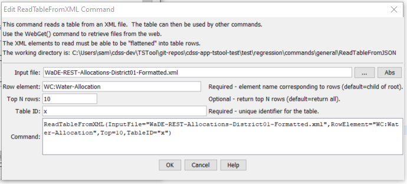

# TSTool / Command / ReadTableFromXml #

* [Overview](#overview)
* [Command Editor](#command-editor)
* [Command Syntax](#command-syntax)
* [Examples](#examples)
* [Troubleshooting](#troubleshooting)
* [See Also](#see-also)

-------------------------

## Overview ##

The `ReadTableFromXML` command reads a table from an XML file.
An excerpt from an XML file is shown below.
Note the `WC:WaterAllocation` content, which is data that can be read into a table as a “flat” representation.

```xml
<?xml version="1.0"?>
<?xml-stylesheet type="text/xsl" href="../styles/detail.xsl"?>
<WC:WaDE xmlns:WC="http://www.exchangenetwork.net/schema/WaDE/0.2">
  …
    <WC:Report>
      <WC:ReportIdentifier>2014</WC:ReportIdentifier>
      <WC:ReportingDate>2015-03-01</WC:ReportingDate>
      <WC:ReportingYear>2014</WC:ReportingYear>
      <WC:ReportName>2014 CODWR WaDE REPORT</WC:ReportName>
      <WC:ReportLink/>
      <WC:YearType>IY</WC:YearType>
      <WC:ReportDetails>
        <WC:WaterAllocation>
          <WC:AllocationIdentifier>0109505-53868.00000-0A</WC:AllocationIdentifier>
          <WC:AllocationOwnerName>SWENSON AR WL FLD</WC:AllocationOwnerName>
          <WC:ApplicationDate>1997-06-26</WC:ApplicationDate>
          <WC:PriorityDate>1997-06-26</WC:PriorityDate>
          <WC:LegalStatusCode>ABSOLUTE</WC:LegalStatusCode>
          <WC:DetailLocation>
            <WC:StateCode>CO</WC:StateCode>
            <WC:ReportingUnitIdentifier>1</WC:ReportingUnitIdentifier>
            <WC:WFSReference/>
          </WC:DetailLocation>
          <WC:AllocationAmount>
            <WC:WaterAllocated>
              <WC:BeneficialUse>
                <WC:BeneficialUseContext>CODWR</WC:BeneficialUseContext>
                <WC:BeneficialUseTypeName>IRRMUNCOMINDRECFISFIRDOMSTKAUG
 </WC:BeneficialUseTypeName>
              </WC:BeneficialUse>
              <WC:AllocatedVolume>
                <WC:AmountNumber>32.000</WC:AmountNumber>
                <WC:AmountUnitsCode>AFY</WC:AmountUnitsCode>
              </WC:AllocatedVolume>
              <WC:FreshSalineIndicator>FRESH</WC:FreshSalineIndicator>
              <WC:TimeFrame>
                <WC:TimeFrameStartName>1/1</WC:TimeFrameStartName>
                <WC:TimeFrameEndName>12/31</WC:TimeFrameEndName>
              </WC:TimeFrame>
            </WC:WaterAllocated>
          </WC:AllocationAmount>
        </WC:WaterAllocation>
...
```

The command requires an element to be specified to indicate rows, for example `WC:WaterAllocation`.
All intervening elements that do not have child nodes will be added as columns.
It is assumed that elements with child nodes are grouping elements and should
not themselves be added (because they have no text content).
The text content for nodes is added for the row’s data values.
Currently all values are added as text.  In the future an XSD file may be used to determine column types.

## Command Editor ##

The following dialog is used to edit the command and illustrates the command syntax.



**<p style="text-align: center;">
`ReadTableFromXml` Command Editor (<a href="../ReadTableFromXml.png">see also the full-size image</a>)
</p>**

## Command Syntax ##

The command syntax is as follows:

```text
ReadTableFromXml(Parameter="Value",...)
```
**<p style="text-align: center;">
Command Parameters
</p>**

| **Parameter**&nbsp;&nbsp;&nbsp;&nbsp;&nbsp;&nbsp;&nbsp;&nbsp;&nbsp;&nbsp;&nbsp;&nbsp; | **Description** | **Default**&nbsp;&nbsp;&nbsp;&nbsp;&nbsp;&nbsp;&nbsp;&nbsp;&nbsp;&nbsp;&nbsp;&nbsp;&nbsp;&nbsp;&nbsp;&nbsp;&nbsp;&nbsp; |
| --------------|-----------------|----------------- |
|`InputFile`<br>**required**|The name of the file to read, as an absolute path or relative to the command file location.|None – must be specified.|
|`RowElement`|The XML file element that brackets a row’s data.|None – must be specified.|
|`Top`<br>**required**|If specified, the top (first) number of rows specified by the parameter will be returned.|Return all data.|
|`TableID`<br>**required**|Identifier to assign to the table that is read, which allows the table data to be used with other commands.|None – must be specified.|

## Examples ##

See the [automated tests](https://github.com/OpenCDSS/cdss-app-tstool-test/tree/master/test/regression/commands/general/ReadTableFromXml).

## Troubleshooting ##

## See Also ##

* [`WriteTableToDelimitedFile`](../WriteTableToDelimitedFile/WriteTableToDelimitedFile.md) command
