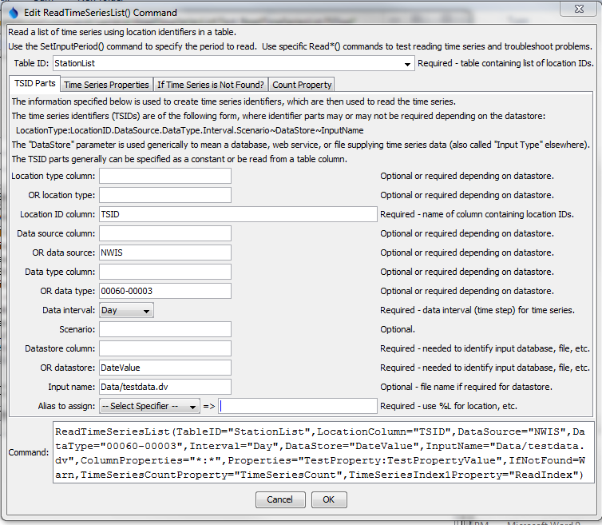
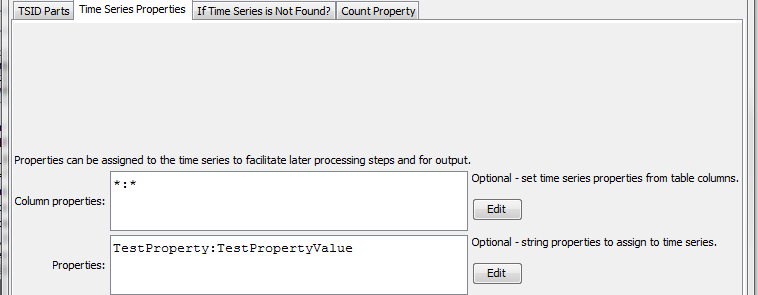
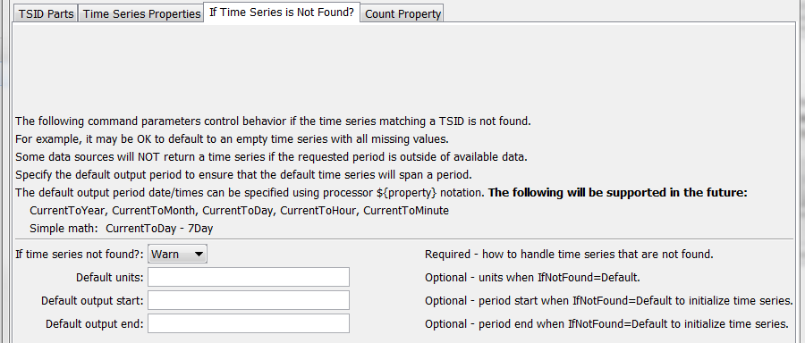
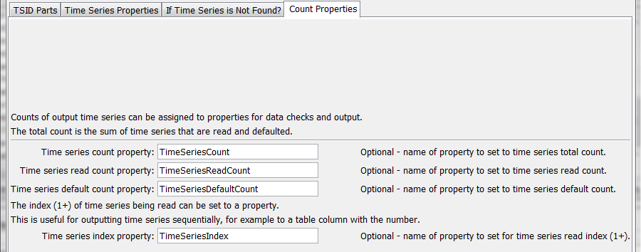

# TSTool / Command / ReadTimeSeriesList #

*   [Overview](#overview)
*   [Command Editor](#command-editor)
*   [Command Syntax](#command-syntax)
*   [Examples](#examples)
*   [Troubleshooting](#troubleshooting)
*   [See Also](#see-also)

-------------------------

## Overview ##

The `ReadTimeSeriesList` command reads one or more time series using location identifiers from a table,
an example of which is shown below as a comma-separated value file
(tables can also be read from Excel, delimited file, datastore, or other source):

```text
# Example list file.  Comments start with the # character.
# Column headings can be specified in the first non-comment row using quotes.
“Structure ID”,”Structure Name”
500501,Ditch 501
500502,Ditch 502
# Invalid ID (see IfNotFound parameter)
509999,Ditch 9999
```
The command typically is used when reading time series from a single
source and can streamline processing in the following situations:

*   A list of identifiers may have been generated from a database query
*   A list of identifiers may have been extracted from a model data set

TSTool uses the location identifiers in the table with the command parameters
and internally creates a list of time series identifiers.
The time series are of the standard form (information in brackets is optional for basic use):

```text
[LocationType:]Location.DataSource.DataType.Interval[.Scenario]~DataStore[~InputName]
```
TSTool then queries each time series using the time series identifier.
See also the [`ReadTimeSeries`](../ReadTimeSeries/ReadTimeSeries.md) command,
which performs essentially the same functionality but only reads one time series.
Refer to the appendices for each datastore and file input type to understand specific time series identifier conventions.

Although it is possible to specify a datastore or input type that reads
from files by also using the `InputName` parameter,
this may not be appropriate because the `ReadTimeSeriesList` command can
only specify one input file name and the file will be reopened for each time series read.
Instead, read commands for specific file formats should be used because
these commands typically are optimized to read multiple time series from the files.
Use the [`SetInputPeriod`](../SetInputPeriod/SetInputPeriod.md) command to set the period to read.

## Command Editor ##

The command is available in the following TSTool menu:

*   ***Commands / Read Time Series***

The following dialog is used to edit the command and illustrates the syntax of the command for time series identifier parts.

**<p style="text-align: center;">

</p>**

**<p style="text-align: center;">
`ReadTimeSeriesList` Command Editor for Time Series Identifier Parts Parameters (<a href="../ReadTimeSeriesList.png">see also the full-size image</a>)
</p>**

The following dialog is used to edit the command and illustrates the syntax of the command for time series properties.

**<p style="text-align: center;">

</p>**

**<p style="text-align: center;">
`ReadTimeSeriesList` Command Editor for Time Series Propeties Parameters (<a href="../ReadTimeSeriesList_TimeSeriesProperties.png">see also the full-size image</a>)
</p>**

The following dialog is used to edit the command and illustrates the syntax of the command for parameters if the time series is not found.

**<p style="text-align: center;">

</p>**

**<p style="text-align: center;">
`ReadTimeSeriesList` Command Editor for Parameters if Time Series is Not Found (<a href="../ReadTimeSeriesList_IfNotFound.png">see also the full-size image</a>)
</p>**

The following dialog is used to edit the command and illustrates the syntax of the command for parameters used in checks.

**<p style="text-align: center;">

</p>**

**<p style="text-align: center;">
`ReadTimeSeriesList` Command Editor for Parameters Used in Checks (<a href="../ReadTimeSeriesList_Check.png">see also the full-size image</a>)
</p>**

## Command Syntax ##

The command syntax is as follows:

```text
ReadTimeSeriesList(Parameter="Value",...)
```
**<p style="text-align: center;">
Command Parameters
</p>**

|**Parameter**&nbsp;&nbsp;&nbsp;&nbsp;&nbsp;&nbsp;&nbsp;&nbsp;&nbsp;&nbsp;&nbsp;&nbsp;&nbsp;&nbsp;&nbsp;&nbsp;&nbsp;&nbsp;&nbsp;&nbsp;&nbsp;&nbsp;&nbsp;&nbsp;&nbsp;&nbsp;&nbsp;&nbsp;&nbsp;&nbsp;&nbsp;&nbsp;&nbsp;&nbsp;&nbsp;&nbsp;&nbsp;&nbsp;&nbsp;&nbsp;&nbsp;&nbsp;&nbsp;&nbsp;&nbsp;&nbsp;&nbsp;|**Description**|**Default**&nbsp;&nbsp;&nbsp;&nbsp;&nbsp;&nbsp;&nbsp;&nbsp;&nbsp;&nbsp;&nbsp;&nbsp;&nbsp;&nbsp;&nbsp;&nbsp;&nbsp;&nbsp;&nbsp;&nbsp;&nbsp;&nbsp;&nbsp;&nbsp;&nbsp;&nbsp;&nbsp;|
|--------------|-----------------|-----------------|
|`TableID`<br>**required**|The identifier for the table that provides the list of location identifiers.  Can be specified using processor `${Property}`.|None – must be specified.|
|`LocationTypeColumn`|The column in the table containing the location type to use in time series identifiers.  Specify `LocationTypeColumn` or `LocationType`.|May or may not be required, depending on the datastore or input type.|
|`LocationType`|The location type in the time series identifier.  Specify `LocationTypeColumn` or `LocationType`.|May or may not be required, depending on the datastore or input type.|
|`LocationColumn`<br>**required**|The column in the table containing the location identifiers to use in time series identifiers.|None – must be specified.|
|`DataSourceColumn`|The column in the table containing the data source to use in time series identifiers.  Specify `DataSourceColumn` or `DataSource`.|May or may not be required, depending on the datastore or input type.|
|`DataSource `|The data source(s) in the time series identifier, separated by commas.  For example, if using the [State of Colorado’s HydroBase](../../datastore-ref/CO-HydroBase/CO-HydroBase.md), `USGS` indicates that data are from the United States Geological Survey and `DWR` are from the Division of Water Resources.  If multiple data sources are specified, each will be tried until a time series is found.  This is enabled because sometimes data collection sites change ownership.  Specify `DataSourceColumn` or `DataSource`.|May or may not be required, depending on the datastore or input type|
|`DataTypeColumn`|The column in the table containing the data type to use in time series identifiers.  Specify `DataTypeColumn` or `DataType`.|Data type is often required|
|`DataType`|The data type in the time series identifier.  For example, if using the [State of Colorado’s HydroBase](../../datastore-ref/CO-HydroBase/CO-HydroBase.md), `DivTotal` is used for diversion totals.  Specify `DataTypeColumn` or `DataType`.|Data type is often required|
|`Interval`|Data interval in the time series identifier, using standard values such as `15Minute`, `6Hour`, `Day`, `Month`, `Year`.|None – must be specified.|
|`Scenario`|Scenario in the time series identifier.|Usually not required.|
|`DataStore`|The data store (or input type) in the time series identifier.  Refer to the datastore and input type appendices or the TSTool main GUI for options.|None – must be specified.|
|`InputName`|The input name in the time series identifier, when a file name is required.|Generally only required when reading from a file.|
|`Alias`|Time series alias to assign, using a combination of % specifiers and literal strings.|No alias is assigned.|
|`ColumnProperties`|Column names and matching time series property name to set, using syntax:<br>`Column1:Property1,Column2:Property2`<br>Specify `*` for the column name to set all column values as properties.  Specify `*` for the property value to use the column name for the time series property.|No time series properties will be set from the table.|
|`Properties`|String properties to be assigned to the time series using syntax<br>`Property1:Value1,Property2:Value2`||
|`IfNotFound`|Indicates how to handle missing time series, one of:<ul><li>`Warn` – generate fatal warnings and do not include in output.</li><li>`Ignore` – generate non-fatal warnings and do not include in output.</li><li>`Default` – generate non-fatal warnings and create empty time series for those that could not be found.  This requires that a [`SetOutputPeriod`](../SetOutputPeriod/SetOutputPeriod.md) command be used before the command to define the period for default time series.</li></ul>|`Warn`|
|`DefaultUnits`|Default units when `IfNotFound=Default`.|Blank – no units.|
|`DefaultOutputStart`|Specify the output period start when a default time series is read, using date/time string or `${Property}`.|Uses global output start.|
|`DefaultOutputEnd`|Specify the output period start when a default time series is read, using date/time string or `${Property}`.|Uses global output end.|
|`TimeSeriesCountProperty`|The name of the processor property to set with the total count of time series processed, including read and defaulted time series.  Can be specified using processor `${Property}`.||
|`TimeSeriesReadCountProperty`|The name of the processor property to set with the count of time series read (not defaulted).  Can be specified using processor `${Property}`.||
|`TimeSeriesDefaultCountProperty`|The name of the processor property to set with the count of time series that were defaulted.  Can be specified using processor `${Property}`.||
|`TimeSeriesIndex1Property`|The name of the time series property to set with the index position (1+) for the time series read from the list, essentially a running count of read time series.  Can be specified using processor `${Property}`.||

## Examples ##

See the [automated tests](https://github.com/OpenCDSS/cdss-app-tstool-test/tree/master/test/commands/ReadTimeSeriesList).

A sample command file to read monthly diversion time series from the [State of Colorado’s HydroBase database](../../datastore-ref/CO-HydroBase/CO-HydroBase.md)
is as follows:

```text
# Read monthly diversion total from HydroBase for the structures in the list
# file. The data source is set to DWR because data source is saved in HydroBase.
ReadTimeSeriesList(TableID=”Diversions.csv",LocationColumn=”WDID”,DataSource=DWR,DataType=DivTotal,Interval=Month,InputType=HydroBase,IfNotFound=Default)
```

## Troubleshooting ##

See the main [TSTool Troubleshooting](../../troubleshooting/troubleshooting.md) documentation.

## See Also ##

*   [`ReadTimeSeries`](../ReadTimeSeries/ReadTimeSeries.md) command
*   [`SetInputPeriod`](../SetInputPeriod/SetInputPeriod.md) command
*   [`SetOutputPeriod`](../SetOutputPeriod/SetOutputPeriod.md) command
