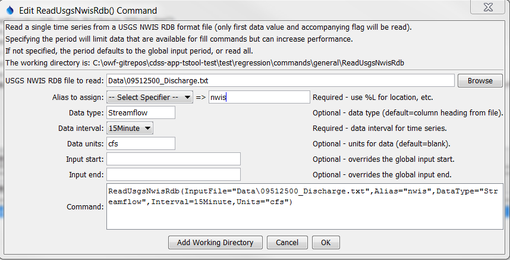

# TSTool / Command / ReadUsgsNwisRdb #

*   [Overview](#overview)
*   [Command Editor](#command-editor)
*   [Command Syntax](#command-syntax)
*   [Examples](#examples)
*   [Troubleshooting](#troubleshooting)
*   [See Also](#see-also)

-------------------------

## Overview ##

The `ReadUsgsNwisRdb` command reads a single time series from a USGS NWIS RDB file
(see the [UsgsNwisRdb Input Type Appendix](../../datastore-ref/USGS-NWIS-RDB/USGS-NWIS-RDB.md))
and assigns an alias to the result.
This command replaces the older `ReadUsgsNwis` command – legacy `ReadUsgsNwis` commands
are automatically translated to `ReadUsgsNwisRdb` commands.
RDB files do not have complete metadata (such as indicating the data interval)
and therefore command parameters are required.
See also the [`WebGet`](../WebGet/WebGet.md) command,
which can be used to retrieve data files from the USGS website.

## Command Editor ##

The command is available in the following TSTool menu:

*   ***Commands / Read Time Series***

The following dialog is used to edit the command and illustrates the syntax of the command.

**<p style="text-align: center;">

</p>**

**<p style="text-align: center;">
`ReadUsgsNwisRdb` Command Editor (<a href="../ReadUsgsNwisRdb.png">see also the full-size image</a>)
</p>**

## Command Syntax ##

The command syntax is as follows:

```text
ReadUsgsNwisRdb(Parameter="Value",...)
```
The following legacy command syntax is updated to the above syntax when a command file is read:

```
TS Alias = ReadUsgsNwis (Parameter=Value,...)
```

**<p style="text-align: center;">
Command Parameters
</p>**

|**Parameter**&nbsp;&nbsp;&nbsp;&nbsp;&nbsp;&nbsp;&nbsp;&nbsp;&nbsp;&nbsp;&nbsp;|**Description**|**Default**&nbsp;&nbsp;&nbsp;&nbsp;&nbsp;&nbsp;&nbsp;&nbsp;&nbsp;&nbsp;&nbsp;&nbsp;&nbsp;&nbsp;&nbsp;&nbsp;&nbsp;&nbsp;&nbsp;&nbsp;&nbsp;&nbsp;&nbsp;&nbsp;&nbsp;&nbsp;&nbsp;|
|--------------|-----------------|-----------------|
|`InputFile`<br>**required**|The name of the USGS NWIS RDB file to read, surrounded by double quotes.  The path to the file can be absolute or relative to the working directory.  Can be specified with `${Property}`.|None – must be specified.|
|`Alias`|The alias to assign to the time series, as a literal string or using the special formatting characters listed by the command editor.  The alias is a short identifier used by other commands to locate time series for processing, as an alternative to the time series identifier (TSID).|None – must be specified.|
|`DataType`|The data type to assign to time series.|Use the column heading, e.g., `01_00060`.|
|`Interval`|The time series data interval for output.|In the future may determine from the file but should be defined by the parameter.|
|`Units`|Data units to assign to output.|No units assigned.|
|`InputStart`|The start of the period to read data – specify if the period should be different from the global query period.  Can be specified with `${Property}`.|Use the global query period.|
|`InputEnd`|The end of the period to read data – specify if the period should be different from the global query period.  Can be specified with `${Property}`.|Use the global query period.|

## Examples ##

See the [automated tests](https://github.com/OpenCDSS/cdss-app-tstool-test/tree/master/test/commands/ReadUsgsNwisRdb).

## Troubleshooting ##

## See Also ##

*   [`WebGet`](../WebGet/WebGet.md) command
