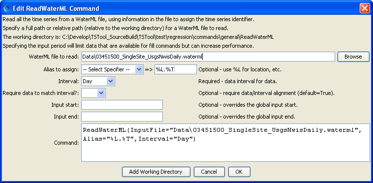

# TSTool / Command / ReadWaterML #

*   [Overview](#overview)
*   [Command Editor](#command-editor)
*   [Command Syntax](#command-syntax)
*   [Examples](#examples)
*   [Troubleshooting](#troubleshooting)
*   [See Also](#see-also)

-------------------------

## Overview ##

The `ReadWaterML` command reads one or more time series from a WaterML XML time series file
(see the [WaterML Input Type Appendix](../../datastore-ref/WaterML/WaterML.md)).
WaterML version 1.1 is supported.  WaterML files can be created using the
[`ReadUsgsNwisDaily`](../ReadUsgsNwisDaily/ReadUsgsNwisDaily.md),
[`ReadUsgsNwisGroundwater`](../ReadUsgsNwisGroundwater/ReadUsgsNwisGroundwater.md),
[`ReadUsgsNwisInstantaneous`](../ReadUsgsNwisInstantaneous/ReadUsgsNwisInstantaneous.md),
[`ReadWaterOneFlow`](../ReadWaterOneFlow/ReadWaterOneFlow.md), and
[`WriteWaterML`](../WriteWaterML/WriteWaterML.md) commands,
and can be saved from web sites that provide WaterML using the
[`WebGet`](../WebGet/WebGet.md) command.
This command may be enhanced in the future to read a subset of the time series in the WatermL file
(currently all time series in the file are read), and additional WaterML versions may be supported.

See also the [`ReadWaterML2`](../ReadWaterML2/ReadWaterML2.md) command, which reads newer WaterML 2 format.

## Command Editor ##

The command is available in the following TSTool menu:

*   ***Commands / Read Time Series***

The following dialog is used to edit the command and illustrates the command syntax.

**<p style="text-align: center;">

</p>**

**<p style="text-align: center;">
`ReadWaterML` Command Editor (<a href="../ReadWaterML.png">see also the full-size image</a>)
</p>**

## Command Syntax ##

The command syntax is as follows:

```text
ReadWaterML(Parameter="Value",...)
```
**<p style="text-align: center;">
Command Parameters
</p>**

|**Parameter**&nbsp;&nbsp;&nbsp;&nbsp;&nbsp;&nbsp;&nbsp;&nbsp;&nbsp;&nbsp;&nbsp;&nbsp;&nbsp;&nbsp;&nbsp;&nbsp;&nbsp;&nbsp;&nbsp;&nbsp;&nbsp;&nbsp;&nbsp;&nbsp;&nbsp;|**Description**|**Default**&nbsp;&nbsp;&nbsp;&nbsp;&nbsp;&nbsp;&nbsp;&nbsp;&nbsp;&nbsp;&nbsp;&nbsp;&nbsp;&nbsp;&nbsp;&nbsp;&nbsp;&nbsp;&nbsp;&nbsp;&nbsp;&nbsp;&nbsp;&nbsp;&nbsp;&nbsp;&nbsp;|
|--------------|-----------------|-----------------|
| `InputFile` | The name of the WaterML file to read.  The path to the file can be absolute or relative to the working directory. | None – must be specified. |
| `Alias` | The alias to assign to the time series, as a literal string or using the special formatting characters listed by the command editor.  The alias is a short identifier used by other commands to locate time series for processing, as an alternative to the time series identifier (TSID). | No alias is assigned. |
| `Interval` | The data interval for the file, necessary because WaterML 1.1 does not have a data element indicating the interval (time step for the data) and using irregular by default would be inefficient for data management.  This issue is being further evaluated. | None – must be specified. |
| `RequireDataToMatchInterval` | Indicate whether the date/time for each data value must align with the interval:<ul><li> `True` – For example, if `Interval=15Min` for USGS instantaneous data, then values a warning will be generated.</li><li> `False` – Date/times that do not align result in time series values being assigned using a truncated date/time.  For example, USGS groundwater web service values read with `Interval=Day` will be assigned to the nearest day (by ignoring more precise time information).</li></ul><br>This parameter and the Interval parameter will continue to be evaluated. | `True`<br> Parameter is not used for irregular data. |
| `InputStart` | The start of the period to read data – specify if the period should be different from the global query period. | Use the global query period. |
| `InputEnd` | The end of the period to read data – specify if the period should be different from the global query period. | Use the global query period. |

## Examples ##

See the [automated tests](https://github.com/OpenCDSS/cdss-app-tstool-test/tree/master/test/commands/ReadWaterML).

## Troubleshooting ##

See the main [TSTool Troubleshooting](../../troubleshooting/troubleshooting.md) documentation.

## See Also ##

*   [`ReadUsgsNwisDaily`](../ReadUsgsNwisDaily/ReadUsgsNwisDaily.md) command
*   [`ReadUsgsNwisGroundwater`](../ReadUsgsNwisGroundwater/ReadUsgsNwisGroundwater.md) command
*   [`ReadUsgsNwisInstantaneous`](../ReadUsgsNwisInstantaneous/ReadUsgsNwisInstantaneous.md) command
*   [`ReadWaterML2`](../ReadWaterML2/ReadWaterML2.md) command
*   [`ReadWaterOneFlow`](../ReadWaterOneFlow/ReadWaterOneFlow.md) command
*   [`WebGet`](../WebGet/WebGet.md) command
*   [`WriteWaterML`](../WriteWaterML/WriteWaterML.md) command
