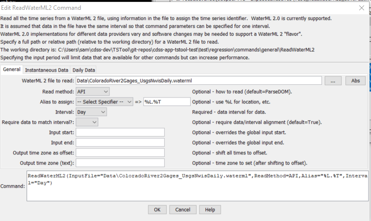
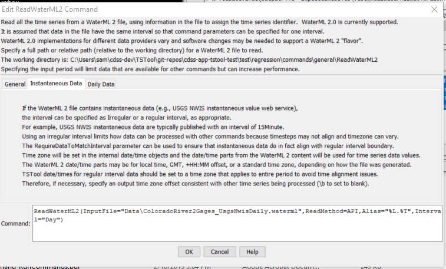
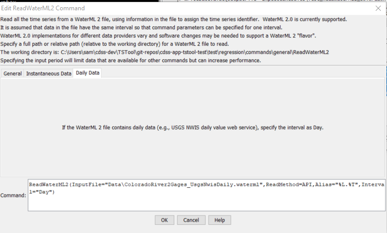

# TSTool / Command / ReadWaterML2 #

*   [Overview](#overview)
*   [Command Editor](#command-editor)
*   [Command Syntax](#command-syntax)
*   [Examples](#examples)
*   [Troubleshooting](#troubleshooting)
*   [See Also](#see-also)

-------------------------

## Overview ##

The `ReadWaterML2` command reads one or more time series from a WaterML 2 XML time series file
(see the [WaterML2 Input Type Appendix](../../datastore-ref/WaterML2/WaterML2.md)).
WaterML files can be created using the
[`ReadUsgsNwisDaily`](../ReadUsgsNwisDaily/ReadUsgsNwisDaily.md),
[`ReadUsgsNwisGroundwater`](../ReadUsgsNwisGroundwater/ReadUsgsNwisGroundwater.md),
[`ReadUsgsNwisInstantaneous`](../ReadUsgsNwisInstantaneous/ReadUsgsNwisInstantaneous.md),
[`ReadWaterOneFlow`](../ReadWaterOneFlow/ReadWaterOneFlow.md), and
[`WriteWaterML2`](../WriteWaterML2/WriteWaterML2.md) commands,
and can be saved from web sites that provide WaterML using the
[`WebGet`](../WebGet/WebGet.md) command.

See also the [`ReadWaterML`](../ReadWaterML/ReadWaterML.md) command, which reads older WaterML format.

Although WaterML 2 is intended to be a generally useful format for transferring time series data,
its implementation by different organizations is not completely consistent and the specification allows
some variability in the format.  This causes issues for software like TSTool and consequently,
a number of command parameters are implemented to allow control over handling different WaterML 2 "flavors".
These issues need additional review, testing, and likely incremental software enhancements
to ensure that the software can support WaterML 2 from various data providers.

## Command Editor ##

The command is available in the following TSTool menu:

*   ***Commands / Read Time Series***

The following dialog is used to edit the command and illustrates the command syntax.

**<p style="text-align: center;">

</p>**

**<p style="text-align: center;">
`ReadWaterML2` Command Editor for General Parameters (<a href="../ReadWaterML2_General.png">see also the full-size image</a>)
</p>**

**<p style="text-align: center;">

</p>**

**<p style="text-align: center;">
`ReadWaterML2` Command Editor for Instantaneous Data Parameters (<a href="../ReadWaterML2_InstantaneousData.png">see also the full-size image</a>)
</p>**

**<p style="text-align: center;">

</p>**

**<p style="text-align: center;">
`ReadWaterML2` Command Editor for Daily Data Parameters (<a href="../ReadWaterML2_DailyData.png">see also the full-size image</a>)
</p>**

## Command Syntax ##

The command syntax is as follows:

```text
ReadWaterML(Parameter="Value",...)
```
**<p style="text-align: center;">
Command Parameters
</p>**

|**Parameter**&nbsp;&nbsp;&nbsp;&nbsp;&nbsp;&nbsp;&nbsp;&nbsp;&nbsp;&nbsp;&nbsp;&nbsp;&nbsp;&nbsp;&nbsp;&nbsp;&nbsp;&nbsp;&nbsp;&nbsp;&nbsp;&nbsp;&nbsp;&nbsp;&nbsp;&nbsp;&nbsp;&nbsp;&nbsp;&nbsp;|**Description**|**Default**&nbsp;&nbsp;&nbsp;&nbsp;&nbsp;&nbsp;&nbsp;&nbsp;&nbsp;&nbsp;&nbsp;&nbsp;&nbsp;&nbsp;&nbsp;&nbsp;&nbsp;&nbsp;&nbsp;&nbsp;&nbsp;&nbsp;&nbsp;&nbsp;&nbsp;&nbsp;&nbsp;|
|--------------|-----------------|-----------------|
| `InputFile` | The name of the WaterML 2 file to read.  The path to the file can be absolute or relative to the working directory. | None – must be specified. |
| `ReadMethod` | Indicate the method by which to to read the file:<ul><li>`API` - use the software API that is auto-generated from the web services WSDL file, which in some cases does not provide access to data needed by TSTool</li><li>`ParseDOM` - directly parse the WaterML 2 XML file rather than using the auto-generated API (see `API`), relying on the file to adhere to the WaterML specification</li></ul><br>In both cases, it may be necessary to implement additional software logic to handle WaterML 2 from specific web services because organizations interpret the specification differently when publishing their data.  TSTool has been developed mainly using WaterML 2 files from USGS NWIS services. | `ParseDOM` |
| `Alias` | The alias to assign to the time series, as a literal string or using the special formatting characters listed by the command editor.  The alias is a short identifier used by other commands to locate time series for processing, as an alternative to the time series identifier (TSID). | No alias is assigned. |
| `Interval` | The data interval for the file, necessary because WaterML 2 does not have a data element that clearly indicates interval (time step for the data) and using irregular by default would be inefficient for data management.  This issue is being further evaluated. | None – must be specified. |
| `RequireDataToMatchInterval` | Indicate whether the date/time for each data value must align with the interval:<ul><li> `True` – For example, if `Interval=15Min` for USGS instantaneous data, then values a warning will be generated.</li><li> `False` – Date/times that do not align result in time series values being assigned using a truncated date/time.  For example, USGS groundwater web service values read with `Interval=Day` will be assigned to the nearest day (by ignoring more precise time information).</li></ul><br>This parameter and the Interval parameter will continue to be evaluated. | `True`<br> Parameter is not used for irregular data. |
| `InputStart` | The start of the period to read data – specify if the period should be different from the global query period. | Use the global query period. |
| `InputEnd` | The end of the period to read data – specify if the period should be different from the global query period. | Use the global query period. |
| `OutputTimeZoneAsOffset` | Offset in hours to adjust the times in the file to `OutputTimeZone`. | Use time zone in the file. |
| `OutputTimeZone` | The output time zone string to use after applying `OutputTimeZoneAsOffset`. | Use time zone in the file. |

## Examples ##

See the [automated tests](https://github.com/OpenCDSS/cdss-app-tstool-test/tree/master/test/commands/ReadWaterML2).

## Troubleshooting ##

## See Also ##

*   [`ReadUsgsNwisDaily`](../ReadUsgsNwisDaily/ReadUsgsNwisDaily.md) command
*   [`ReadUsgsNwisGroundwater`](../ReadUsgsNwisGroundwater/ReadUsgsNwisGroundwater.md) command
*   [`ReadUsgsNwisInstantaneous`](../ReadUsgsNwisInstantaneous/ReadUsgsNwisInstantaneous.md) command
*   [`ReadWaterML`](../ReadWaterML/ReadWaterML.md) command
*   [`ReadWaterOneFlow`](../ReadWaterOneFlow/ReadWaterOneFlow.md) command
*   [`WebGet`](../WebGet/WebGet.md) command
*   [`WriteWaterML2`](../WriteWaterML2/WriteWaterML2.md) command
