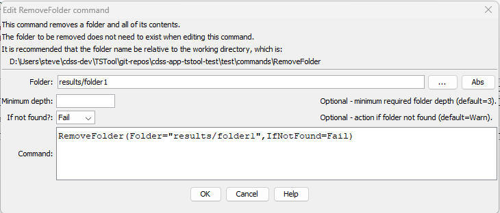

# TSTool / Command / RemoveFolder #

*   [Overview](#overview)
*   [Command Editor](#command-editor)
*   [Command Syntax](#command-syntax)
*   [Examples](#examples)
*   [Troubleshooting](#troubleshooting)
*   [See Also](#see-also)

-------------------------

## Overview ##

The `RemoveFolder` command removes a folder and its contained files and folders.
Common uses for the command are:

*   remove workflow output files before regenerating the results so that no old files might be mistaken for current results
*   remove temporary and working files that are not needed at the end of a workflow
*   remove folders during software testing to ensure that commands are generating output as expected

A failure will be generated if the folder exists and cannot be removed (e.g., due to file permissions or because
a file in the folder is being used by another process).

Even read-only files may be removed by this command, depending on how the operating system and computer environment handle access permissions,
for example if TSTool is run as a "sudo" user on Linux.

Because removing a folder is a destructive process, it is recommended that TSTool is run as a normal user without administrative privileges.
The `MinDepth` parameter provides a level of protection to make sure that the desired level of subfolder is removed.

See the [`CreateFolder`](../CreateFolder/CreateFolder.md) command to create a folder.

## Command Editor ##

The command is available in the following TSTool menu:

*   ***Commands / General - File Handling***

The following dialog is used to edit the command and illustrates the command syntax.

**<p style="text-align: center;">

</p>**

**<p style="text-align: center;">
`RemoveFolder` Command Editor (<a href="../RemoveFolder.png">see full-size image</a>)
</p>**

## Command Syntax ##

The command syntax is as follows:

```text
RemoveFolder(Parameter="Value",...)
```
**<p style="text-align: center;">
Command Parameters
</p>**

|**Parameter**&nbsp;&nbsp;&nbsp;&nbsp;&nbsp;&nbsp;&nbsp;&nbsp;&nbsp;&nbsp;&nbsp;&nbsp;&nbsp;&nbsp;&nbsp;&nbsp;&nbsp;&nbsp;&nbsp;&nbsp;&nbsp;&nbsp;&nbsp;&nbsp;&nbsp;&nbsp; | **Description** | **Default**&nbsp;&nbsp;&nbsp;&nbsp;&nbsp;&nbsp;&nbsp;&nbsp;&nbsp;&nbsp; |
|--------------|-----------------|----------------- |
|`Folder`<br>**required**   | The name of the folder to delete.  Can be specified using `${Property}`. | None - must be specified. |
|`MinDepth` | The minimum folder depth that is required, which is used to guard against accidentally deleting high-level folders. For example `/folder1/folder2/file.txt` has a folder depth of 2. If the minimum depth is not met, the command will fail. | `3` |
|`IfNotFound`  | Indicate an action if the folder is not found:<ul><li>`Ignore` - ignore the missing folder and do not warn</li><li>`Warn` - generate a warning message</li><li>`Fail` - generate a failure message</li></ul> | `Warn` |

## Examples ##

See the [automated tests](https://github.com/OpenCDSS/cdss-app-tstool-test/tree/master/test/commands/RemoveFolder).

## Troubleshooting ##

See the main [TSTool Troubleshooting](../../troubleshooting/troubleshooting.md) documentation.

## See Also ##

*   [`CreateFolder`](../CreateFolder/CreateFolder.md) command
