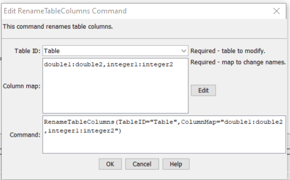

# TSTool / Command / RenameTableColumns #

*   [Overview](#overview)
*   [Command Editor](#command-editor)
*   [Command Syntax](#command-syntax)
*   [Examples](#examples)
*   [Troubleshooting](#troubleshooting)
*   [See Also](#see-also)

-------------------------

## Overview ##

The `RenameTableColumns` command renames table columns.

## Command Editor ##

The command is available in the following TSTool menu:

*   ***Commands(Table) / Manipulate Table Values***

The following dialog is used to edit the command and illustrates the syntax of the command

**<p style="text-align: center;">

</p>**

**<p style="text-align: center;">
`RenameTableColumns` Command Editor (<a href="../RenameTableColumns.png">see also the full-size image</a>)
</p>**

## Command Syntax ##

The command syntax is as follows:

```text
RenameTableColumns(Parameter="Value",...)
```
**<p style="text-align: center;">
Command Parameters
</p>**

| **Parameter**&inbsp;&nbsp;&nbsp;&nbsp;&nbsp;&nbsp;&nbsp;&nbsp;&nbsp;&nbsp;&nbsp;&nbsp;&nbsp;&nbsp;&nbsp;&nbsp;&nbsp;&nbsp;&nbsp;&nbsp;&nbsp;&nbsp;&nbsp;&nbsp;&nbsp;&nbsp;&nbsp;&nbsp;&nbsp;&nbsp;&nbsp;&nbsp;&nbsp;&nbsp; | **Description** | **Default**&nbsp;&nbsp;&nbsp;&nbsp;&nbsp;&nbsp;&nbsp;&nbsp;&nbsp;&nbsp;&nbsp;&nbsp;&nbsp;&nbsp;&nbsp;&nbsp; |
| --------------|-----------------|----------------- |
|`TableID`<br>**required**|The identifier for the table to be modified.  Can be specified using `${Property}.`|None – must be specified.|
|`ColumnMap`<br>**required**|Map of column old and new names, can use `${Property}`, syntax:<br>`OriginalColumnName1:NewColumnName1, OriginalColumnName2:NewColumnName2`|None - must be specified.|

## Examples ##

See the [automated tests](https://github.com/OpenCDSS/cdss-app-tstool-test/tree/master/test/commands/RenameTableColumns).

## Troubleshooting ##

See the main [TSTool Troubleshooting](../../troubleshooting/troubleshooting.md) documentation.

## See Also ##

*   [`DeleteTableColumns`](../DeleteTableColumns/DeleteTableColumns.md) command
