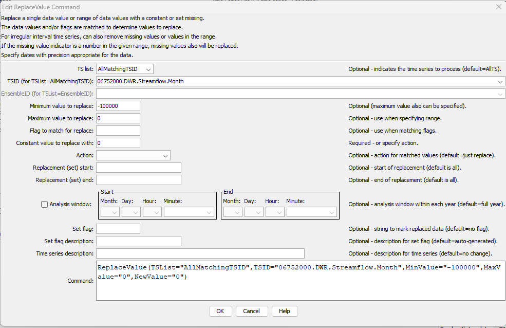

# TSTool / Command / ReplaceValue #

*   [Overview](#overview)
*   [Command Editor](#command-editor)
*   [Command Syntax](#command-syntax)
*   [Examples](#examples)
*   [Troubleshooting](#troubleshooting)
*   [See Also](#see-also)

-------------------------

## Overview ##

The `ReplaceValue` command performs the following tasks:

*  replaces a range of numerical values in a time series with a constant value
*  or sets the values to missing

Irregular interval time series, which store each date/time and value, can also be updated to:

*   remove values matching the numerical range
*   remove missing values

If the missing value indicator is a number in the range (e.g., `-999`), missing values also will be replaced.
The current convention is to use `NaN` for missing, which is handled without specifying a range.

The time series data flag can be checked in place of or addition to checking the numerical values.
This command is useful for filtering out erroneous data values.
See also the [`CheckTimeSeries`](../CheckTimeSeries/CheckTimeSeries.md) command,
which provides for a variety of checks and also allows values to be set to missing or removed.

## Command Editor ##

The command is available in the following TSTool menu:

*   ***Commands / Set Time Series Contents***

The following dialog is used to edit the command and illustrates the syntax of the command.

**<p style="text-align: center;">

</p>**

**<p style="text-align: center;">
`ReplaceValue` Command Editor (<a href="../ReplaceValue.png">see full-size image</a>)
</p>**

## Command Syntax ##

The command syntax is as follows:

```text
ReplaceValue(Parameter="Value",...)
```
**<p style="text-align: center;">
Command Parameters
</p>**

|**Parameter**&nbsp;&nbsp;&nbsp;&nbsp;&nbsp;&nbsp;&nbsp;&nbsp;&nbsp;&nbsp;&nbsp;&nbsp;&nbsp;&nbsp;&nbsp;&nbsp;&nbsp;&nbsp;&nbsp;&nbsp;&nbsp;&nbsp;&nbsp;|**Description**|**Default**&nbsp;&nbsp;&nbsp;&nbsp;&nbsp;&nbsp;&nbsp;&nbsp;&nbsp;&nbsp;&nbsp;&nbsp;&nbsp;&nbsp;&nbsp;&nbsp;&nbsp;&nbsp;&nbsp;&nbsp;&nbsp;&nbsp;&nbsp;&nbsp;&nbsp;&nbsp;&nbsp;|
|--------------|-----------------|-----------------|
|`TSList`|Indicates the list of time series to be processed, one of:<br><ul><li>`AllMatchingTSID` – all time series that match the TSID (single TSID or TSID with wildcards) will be processed.</li><li>`AllTS` – all time series before the command.</li><li>`EnsembleID` – all time series in the ensemble will be processed (see the EnsembleID parameter).</li><li>`FirstMatchingTSID` – the first time series that matches the TSID (single TSID or TSID with wildcards) will be processed.</li><li>`LastMatchingTSID` – the last time series that matches the TSID (single TSID or TSID with wildcards) will be processed.</li><li>`SelectedTS` – the time series are those selected with the [`SelectTimeSeries`](../SelectTimeSeries/SelectTimeSeries.md) command.</li></ul> | `AllTS` |
|`TSID`|The time series identifier or alias for the time series to be processed, using the `*` wildcard character to match multiple time series.  Can be specified using `${Property}`.|Required if `TSList=*TSID`|
|`EnsembleID`|The ensemble to be processed, if processing an ensemble. Can be specified using `${Property}`.|Required if `TSList=*EnsembleID`|
|`MinValue`|The minimum value to replace.  Can be specified using `${Property}`. |The minimum value and/or `MatchFlag` must be specified.|
|`MaxValue`|The maximum value to replace.  Can be specified using `${Property}`. |If not specified, only data values that exactly match the minimum value will be replaced.|
|`MatchFlag`|The flag to match.  Can be specified using `${Property}`.   If specified in addition to `MinValue`, then the value and flag must be matched in order to perform the replacement.  A case-sensitive comparison is made and the data value flag must exactly match MatchFlag.  In the future additional flexibility may be added to match a substring, etc. If `Action=SetMissing`, the original data flag value will remain.  Specifying `SetFlag` will result in the original data flag being modified.|`MinValue` and/or `MatchFlag` must be specified.|
|`NewValue`|The new data value.  Can be specified using `${Property}`. |Required, unless the Action parameter is specified.|
|`Action`|An additional action to take with values that are matched:<ul><li>`Remove` – remove the data points.  This can only be specified for irregular interval time series and will be interpreted as `SetMissing` for regular interval time series.</li><li>`RemoveMissing` - remove missing values.  This can only be specified for irregular interval time series.</li><li>`SetMissing` – set values to missing.</li></ul>|No special action is taken.  The `NewValue` parameter must be specified.|
|`SetStart`|The date/time to start filling, if other than the full time series period.  Can be specified using processor `${Property}`.|Check the full period.|
|`SetEnd`|The date/time to end filling, if other than the full time series period.  Can be specified using processor `${Property}`.|Check the full period.|
|`AnalysisWindowStart`|The starting date/time within the calendar year to replace data.  The window CANNOT cross calendar year boundaries (this may be allowed in the future).  Use multiple commands if necessary.|Process each full year.|
|`AnalysisWindowEnd`|The ending date/time within the calendar year to replace data.|Process each full year.|
|`SetFlag`|A string to assign to data values that are replaced.  Can be specified using `${Property}`. |Do not assign a string flag.|
|`SetFlagDesc`|Description for SetFlag, used for data products.  Can be specified using `${Property}`. |Auto-generate.|
|`Description`|Time series description, to replace the previous description .  Can be specified using `${Property}`. ||

## Examples ##

See the [automated tests](https://github.com/OpenCDSS/cdss-app-tstool-test/tree/master/test/commands/ReplaceValue).

A sample command file to remove negative values from a time series from the
[State of Colorado’s HydroBase database](../../datastore-ref/CO-HydroBase/CO-HydroBase.md)
is as follows:

```text
# 08235700 - ALAMOSA RIVER BELOW CASTLEMAN GULCH NEAR JASPER
08235700.DWR.Streamflow.Month~HydroBase
ReplaceValue(TSList=AllTS,MinValue=-100000,MaxValue=0,NewValue=0)
```

## Troubleshooting ##

See the main [TSTool Troubleshooting](../../troubleshooting/troubleshooting.md) documentation.

## See Also ##

*   [`CheckTimeSeries`](../CheckTimeSeries/CheckTimeSeries.md) command
*   [`SelectTimeSeries`](../SelectTimeSeries/SelectTimeSeries.md) command
*   [`SetConstant`](../SetConstant/SetConstant.md) command
