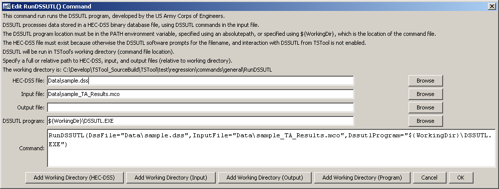

# TSTool / Command / RunDSSUTL #

* [Overview](#overview)
* [Command Editor](#command-editor)
* [Command Syntax](#command-syntax)
* [Examples](#examples)
* [Troubleshooting](#troubleshooting)
* [See Also](#see-also)

-------------------------

## Overview ##

**The DSSUTL software does not appear to be distributed.
This documentation and command are retained for historical purposes and may be removed in the future.
See the [HEC-DSSVue software](https://www.hec.usace.army.mil/software/hec-dssvue/) as an alternative.**

The `RunDSSUTL` command runs the Army Corps of Engineers DSSUTL program and other utility programs,
which are used with HEC-DSS files.
See also the [HEC-DSS Input Type appendix](../../datastore-ref/HEC-DSS/HEC-DSS.md).
This command formats the command line for the program, runs the program, and checks the exit value.
A non-zero exit value will result in a failure status for the command.

TSTool internally maintains a working directory that is used to
convert relative paths to absolute paths in order to locate files.
The working directory is by default the location of the last command file that was opened.
The location of the program being run (e.g., `DSSUTL.EXE`) is determined
by the operating system using the PATH environment variable;
therefore, use the `${WorkingDir}` property in the command line if the program location is not in `PATH`.
Use `\”` in the command line or arguments to surround whitespace.

**It is not clear whether DSSUTL and other program have limits on path or filename length,
but if this appears to be the case, use shorter names.
If a program is not provided with correct input,
it may go into interactive mode, in which case TSTool may appear to stop when running the command.
Currently there is no way to kill the process and TSTool must be stopped and restarted.**

The following table summarizes how the command treats input for various utility programs.
Required arguments are for the `RunDSSUTL` command but may be optional if the program is run on the command line.

**<p style="text-align: center;">
`RunDSSUTL` Command Handling of HEC-DSS Utility Program Input
</p>**

| **Program**&nbsp;&nbsp;&nbsp;&nbsp;&nbsp;&nbsp;&nbsp;&nbsp;&nbsp; | **Description** | **DSSFILE=Argument**&nbsp;&nbsp;&nbsp;&nbsp;&nbsp;&nbsp;&nbsp;&nbsp;&nbsp;&nbsp; | **INPUT=Argument** | **OUTPUT=Argument**|
| --------------|-----------------|----------------- |--|--|
|`DSSUTL`|Data Storage System Utility Program|Required|Required|Optional|
|`DSPLAY`|Data Storage System Graphics Utility|Required|Required|Optional|
|`DSSMATH`|Utility Program for Mathematical Manipulation of HEC-DSS Data|Not used – use `OPEN()` command.|Required|Optional|
|`REPGEN`|Report Generator – **not fully supported due to different command line argument conventions**.||||
|`DSSTS`|Regular Interval|Time-Series Data Entry Program|Required|Required|Optional|
|`DSSITS`|Irregular Interval Time-Series Data Entry Program|Required|Required|Optional|
|`DSSPD`|Paired Data Entry Program|Required|Required|Optional|
|`DSSTXT`|Text Data Entry Program|Required|Required|Optional|
|`DWINDO`|Interactive Data Entry and Editing|This interactive program is not supported by `RunDSSUTL` command.||||
|`WATDSS`|Watstore to DSS Data Entry Program – **not fully supported due to different command line argument conventions**.|Required|Required|Optional|
|`NWSDSS`|National Weather Service to Data Storage System Conversion Utility – **not fully supported due to different command line argument conventions**.|Required|Required|Optional|
|`PREAD`|Functions, Macros, and Screens – not fully supported due to interactive prompts.||||


## Command Editor ##

The following dialog is used to edit the command and illustrates the command syntax.
Note that the `DSSUTL.EXE` location is in this case not included in the `PATH` environment
variable and is specified with the `DssutlProgram` parameter, using `${WorkingDir}`.
The HEC-DSS and input files are relative to the working directory.

**<p style="text-align: center;">

</p>**

**<p style="text-align: center;">
`RunDSSUTL` Command Editor when Specifying Command Line (<a href="../RunDSSUTL.png">see also the full-size image</a>)
</p>**

## Command Syntax ##

The command syntax is as follows:

```text
RunDSSUTL(Parameter="Value",...)
```
**<p style="text-align: center;">
Command Parameters
</p>**

| **Parameter**&nbsp;&nbsp;&nbsp;&nbsp;&nbsp;&nbsp;&nbsp;&nbsp;&nbsp;&nbsp;&nbsp;&nbsp;&nbsp;&nbsp;&nbsp;&nbsp; | **Description** | **Default**&nbsp;&nbsp;&nbsp;&nbsp;&nbsp;&nbsp;&nbsp;&nbsp;&nbsp;&nbsp;&nbsp;&nbsp;&nbsp;&nbsp;&nbsp;&nbsp;&nbsp;&nbsp;&nbsp;&nbsp;&nbsp;&nbsp;&nbsp;&nbsp; |
| --------------|-----------------|----------------- |
|`DssFile`|The HEC-DSS filename as an absolute path or relative to the working directory.  The file must exist because TSTool does not interface with the program interactive mode prompts.  The parameter is passed to the program using the `DSSFILE=` command line argument.|None –  must be specified for most programs.|
|`InputFile`|The DSS utility program command file to run.  The file must exist because TSTool does not interface with the utility program interactive mode prompts.  The input file name is passed to the program using the `INPUT=` command line argument.|None –  must be specified.|
|`OutputFile`|The DSS utility program output file, which contains logging information.  This is passed to the program using the `OUTPUT=` command line argument.  Specifying the argument will cause output to be printed to the file and not the screen.  Note that some utility program commands write to other output files (controlled by the command file or other command line arguments), which should not be confused with the output file for this argument.|Not required – output will be to screen if command shell window is shown.|
|`DssutlProgram`|The DSS utility program to run.  The `PATH` environment variable is used to locate the executable if a full path is not specified.  Specify the specific DSS utility program to run if the default value is not appropriate.|If not specified, `DSSUTL.EXE` will be used and must be located in a directory listed in the `PATH` environment variable.|

## Examples ##

* See the [automated tests](https://github.com/OpenCDSS/cdss-app-tstool-test/tree/master/test/commands/RunDSSUTL).

## Troubleshooting ##

## See Also ##

* [`RunProgram`](../RunProgram/RunProgram.md) command
